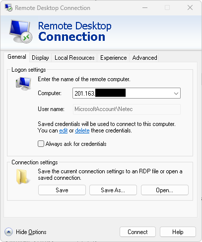
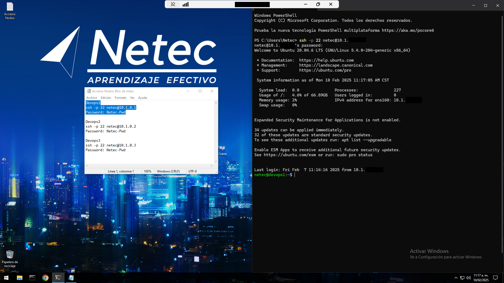

# INTRODUCCIÓN A DEVOPS

## ESTRATEGIA DE LAS ACTIVIDADES

### OBJETIVOS

Al termino de este capítulo, serás capaz de:

- Al finalizar la actividad, conocerás la estrategia de abordamiento
    de los diversos tipos de actividades del curso.

### DURACIÓN

Tiempo aproximado para esta actividad:

- 10 minutos.

### PRERREQUISITOS

Para esta actividad se requiere:

- Acceso a Internet.

### INSTRUCCIONES

#### Tipos de Actividades

En el curso, existirán diferentes tipos de actividades prácticas:

1. Preguntas.
2. Instalación de software.
3. Análisis de código (Java).
4. Ejecución/Despliegue de aplicaciones.
5. Uso de herramientas de CI/CD.
6. Uso de máquinas virtuales & contenedores.

### RESULTADO

En esta actividad se presentó la estrategia de abordamiento de los
diversos tipos de actividades del curso.

## ENTORNO DE TRABAJO

### OBJETIVOS

Al termino de este capítulo, serás capaz de:

- Conocer el entorno para la ejecución de los laboratorios.

### DURACIÓN

Tiempo aproximado para esta actividad:

- 15 minutos.

### PRERREQUISITOS

Para esta actividad se requiere:

- Acceso a Internet.

### INSTRUCCIONES

Con la información provista por tu instructor, realiza las siguientes
actividades.

#### Conexión al escritorio remoto

En esta actividad, se realizará la conexión al escritorio remoto de la
máquina virtual.

1. Abre la aplicación **Escritorio Remoto**.
2. Ingresa la dirección IP de la máquina virtual.
3. Ingresa el usuario y contraseña proporcionados por tu instructor.
4. Haz clic en **Conectar**.



#### Acceso a los equipos de trabajo

En una terminal de comandos ingresa el siguiente comando:

``` shell
ssh -p 22 netec@10.1.0.1
```

Nota Importante:

Recuerda que los datos de conexión serán diferentes para cada
participante y cada equipo.

``` shell
Windows PowerShell
Copyright (C) Microsoft Corporation. Todos los derechos reservados.

Prueba la nueva tecnología PowerShell multiplataforma https://aka.ms/pscore6

PS C:\Users\Netec> ssh -p 22 netec@10.1.0.1
netec@10.1.0.1's password:
Welcome to Ubuntu 24.04.1 LTS (GNU/Linux 6.8.0-49-generic x86_64)

 * Documentation:  https://help.ubuntu.com
 * Management:     https://landscape.canonical.com
 * Support:        https://ubuntu.com/pro

 System information as of Thu Nov 28 05:55:36 PM UTC 2024

  System load:  0.0                Processes:              177
  Usage of /:   41.7% of 10.70GB   Users logged in:        0
  Memory usage: 9%                 IPv4 address for ens33: 10.1.0.1
  Swap usage:   0%

Expanded Security Maintenance for Applications is not enabled.

58 updates can be applied immediately.
To see these additional updates run: apt list --upgradable

Enable ESM Apps to receive additional future security updates.
See https://ubuntu.com/esm or run: sudo pro status


Last login: Wed Nov 27 23:31:08 2024 from 10.1.0.1
netec@devopsX:~$
```

Cada que se requiera el acceso a los equipos de trabajo, se deberá
realizar el paso anterior.

### RESULTADO

En esta actividad se exploró el entorno para la ejecución de los
laboratorios.


