# JIRA

## OBJETIVOS

Al termino de este capítulo, serás capaz de:

- Crear una cuenta en Jira.
- Crear un tablero que permita visualizar el estado de las actividades de laboratorio de este curso.

## DURACIÓN

Tiempo aproximado para esta actividad:

- 60 minutos.

## PRERREQUISITOS

Para esta actividad se requiere:

- Acceso a Internet.

## INSTRUCCIONES

### CREACIÓN DE CUENTA EN JIRA

Jira es una herramienta de gestión de proyectos y seguimiento de incidencias desarrollada por Atlassian. En esta guía aprenderás a crear una cuenta en Jira paso a paso.

#### Acceder al Sitio Web de Jira

1. Abre tu navegador web (Google Chrome, Mozilla Firefox, Microsoft Edge, etc.).
2. Dirígete a la página oficial de Jira:
    <https://www.atlassian.com/software/jira>
3. Haz clic en el botón **"Get it free"** o **"Prueba gratis"** para
    comenzar con una versión gratuita.

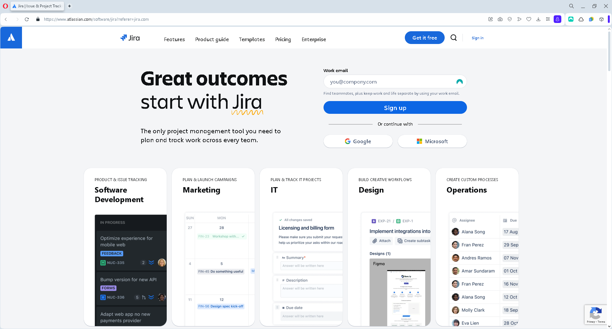

#### Crear una Cuenta en Atlassian

Jira forma parte del ecosistema de Atlassian, por lo que necesitas una cuenta en Atlassian para acceder.

1. En la página de registro, ingresa tu dirección de correo electrónico.
2. Presiona **"Continuar"**.
3. Completa el formulario con la siguiente información:
   1. **Nombre y Apellido**
   2. **Correo electrónico o nombre de usuario**
   3. **Contraseña segura** (usa una combinación de letras, números y caracteres especiales)
4. Haz clic en **"Registrarse"**.

También puedes registrarte con una cuenta de Google o Microsoft haciendo clic en las opciones correspondientes.

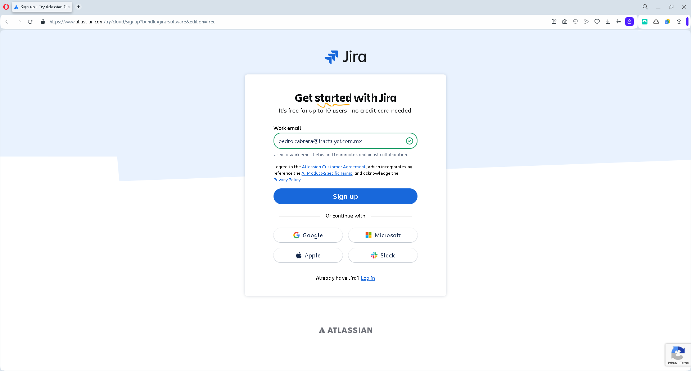

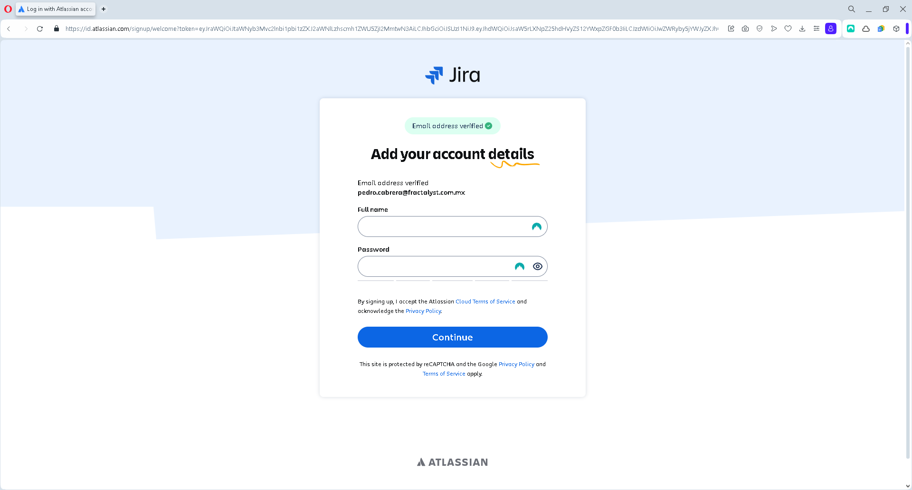

#### Verificación de Cuenta

1. Revisa la bandeja de entrada de tu correo electrónico.
2. Busca un correo de verificación de Atlassian.
3. Haz clic en el enlace de verificación dentro del correo.

Si no encuentras el correo, revisa la carpeta de spam o correos no deseados.

#### Configuración de Jira

1. Después de verificar tu cuenta, Jira te pedirá que configures un nuevo sitio.
2. Elige un nombre único para tu sitio Jira Cloud, por ejemplo: `https://tuequipo.atlassian.net`
   1. Recuerda sustituir "tuequipo" por el nombre de equipo que prefieras.
3. Selecciona el tipo de proyecto que deseas administrar:
   1. ***Jira Software (para desarrollo ágil con Scrum o Kanban)***
4. Presiona **"Continuar"** y espera a que se cree tu entorno.

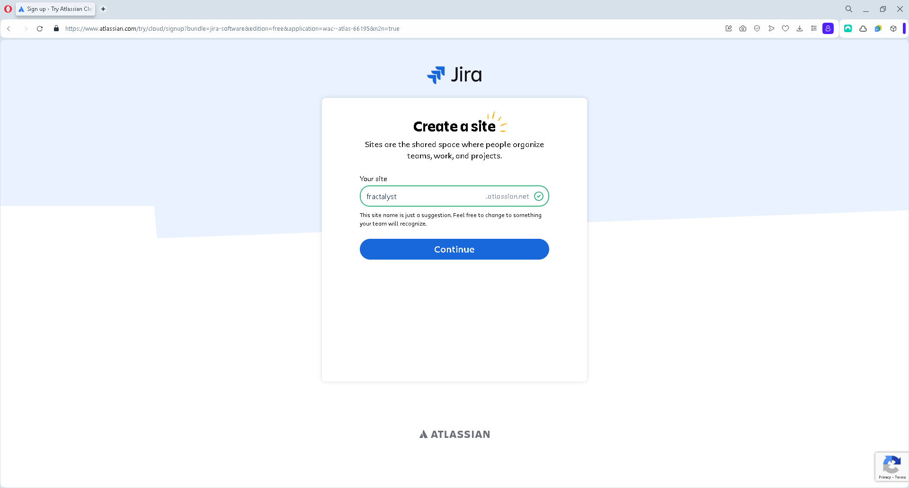

#### Finalizar Configuración y Explorar Jira

1. Atlassian te guiará a través de una serie de preguntas para personalizar tu experiencia en Jira.
2. Puedes elegir entre empezar con una plantilla de Scrum, Kanban u otra opción.
3. Una vez completada la configuración, serás dirigido a tu nuevo tablero de Jira.
4. En algunas ocasiones, Jira te pedirá información adicional para completar la configuración.

¡Listo! Ahora puedes comenzar a gestionar proyectos con Jira.

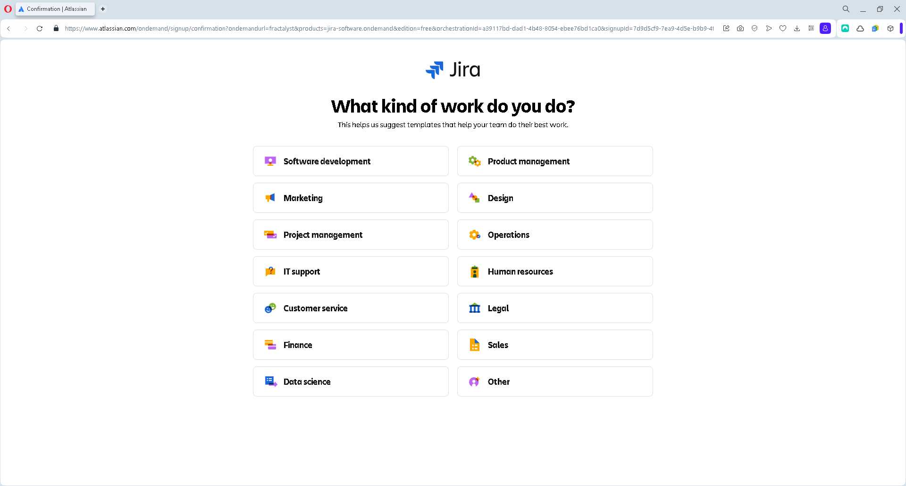

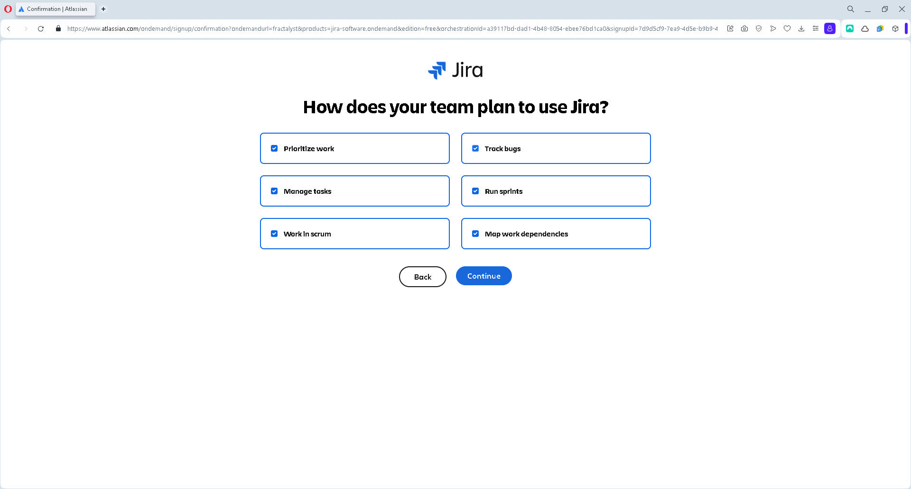

#### Recomendaciones Finales

- Explora la documentación oficial de Atlassian: <https://support.atlassian.com/jira-software-cloud/>
- Si usas la versión gratuita, ten en cuenta las limitaciones, como la cantidad de 10 usuarios.

#### Resultado

En esta actividad se creó una cuenta en Jira.

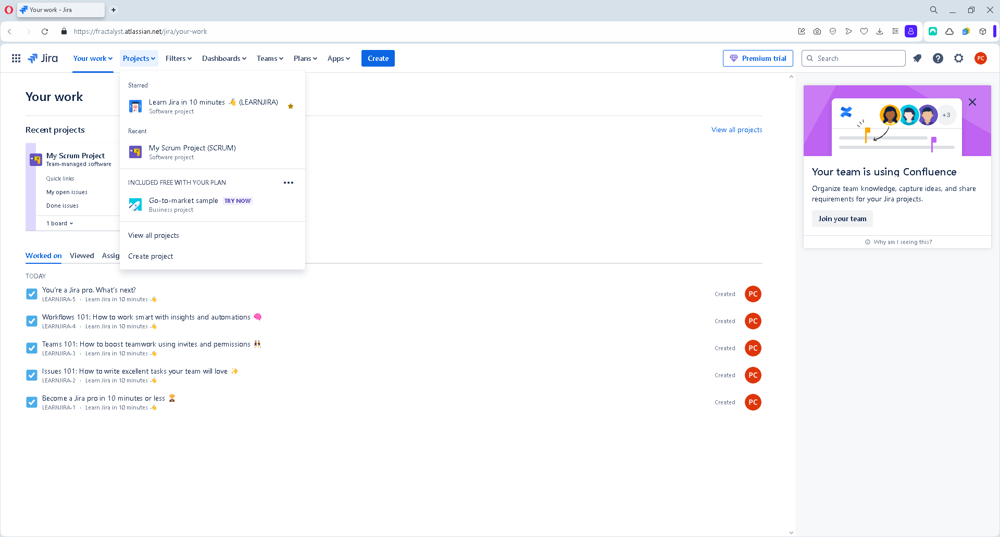

### CREACIÓN DE UN TABLERO KANBAN

Jira es una herramienta de gestión de proyectos ampliamente utilizada en metodologías ágiles como Kanban y Scrum. En esta guía, aprenderás a configurar un tablero Kanban en Jira para gestionar las actividades del laboratorio del curso **DevOps Tools**.

#### Acceder a Jira

1. Abre tu navegador web y accede a tu cuenta de Jira en:
    1. <https://www.atlassian.com/software/jira>
    2. Si aún no tienes una cuenta, sigue la guía de registro realiza la actividad anterior.
2. Una vez dentro de Jira, ve al panel principal.

#### Crear un Nuevo Proyecto Kanban

1. En la barra de navegación lateral, haz clic en **Proyectos** → **Crear Proyecto**.
2. Selecciona la plantilla **Kanban**.
3. En la configuración del proyecto, completa la siguiente información:
   1. **Nombre del Proyecto**: `DevOps Tools - Laboratorio`
   2. **Tipo de Proyecto**: Gestionado por equipo (**Team-managed**).
4. Haz clic en **Crear**.

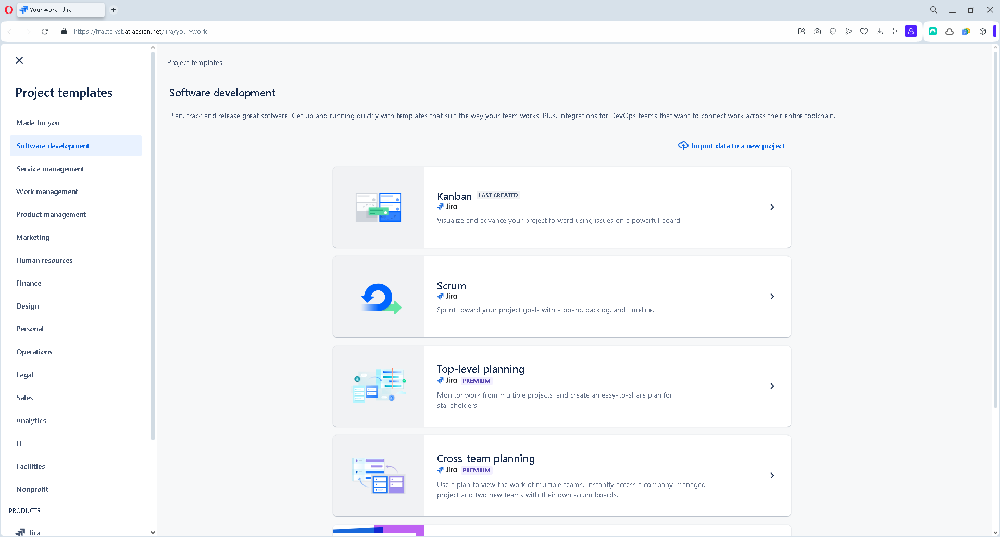

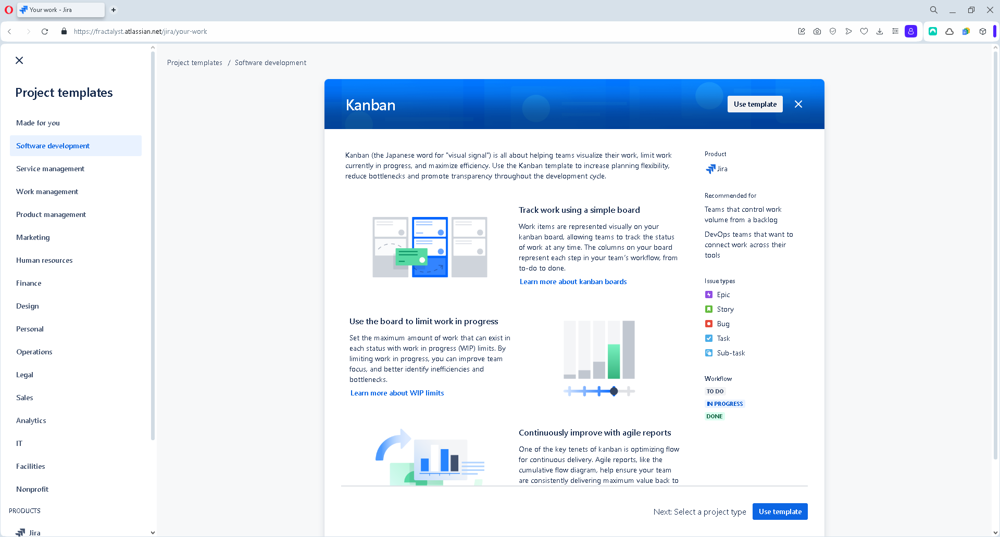

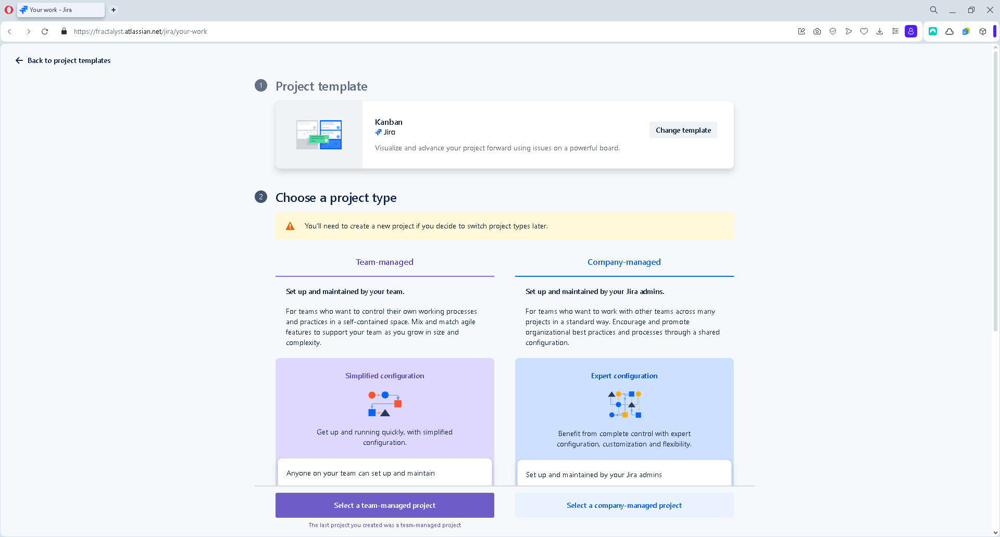

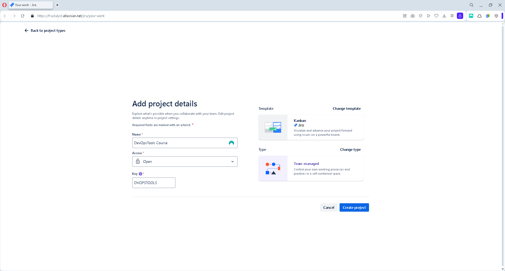

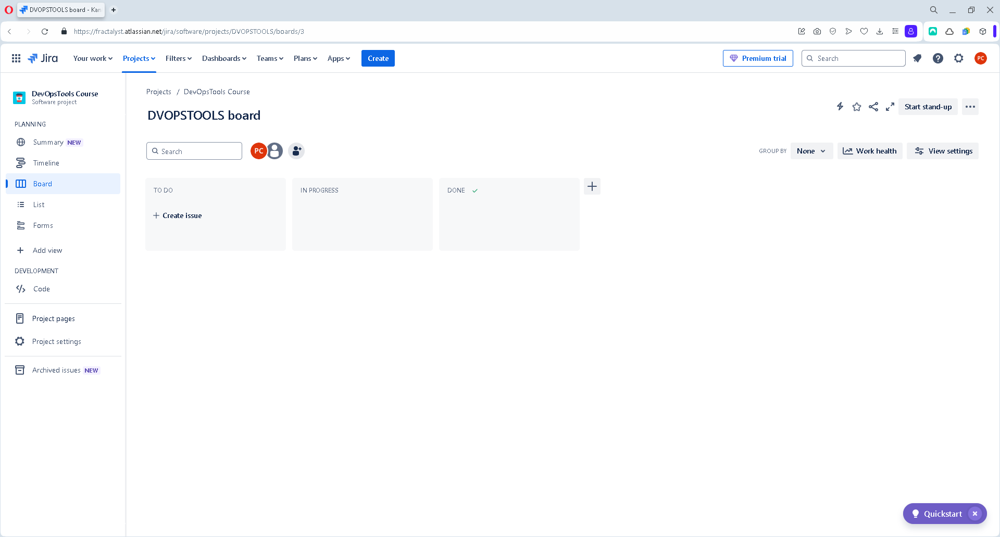

#### Configurar Columnas del Tablero Kanban

1. Accede a tu nuevo proyecto y selecciona **Tablero Kanban**.
2. En la esquina superior derecha, haz clic en **"Configurar Tablero"** o **"Board settings"**.
3. Define las columnas según el flujo de trabajo del laboratorio:
   1. **Pendiente** → Actividades por realizar.
   2. **En Progreso** → Actividades en desarrollo.
   3. **Revisión** → Evaluación de resultados.
   4. **Completado** → Actividades terminadas.

Puedes personalizar los nombres y agregar nuevas columnas según las necesidades del laboratorio.

#### Crear Tareas en el Tablero

Para agregar las prácticas del curso al tablero Kanban:

1. Haz clic en el botón **Crear Tarea** o **Create issue**.
2. Completa la información de la tarea:
   1. **Título**: Nombre de la práctica (Ejemplo: **Instalación de Ansible**).
   2. **Descripción**: Incluir detalles sobre la actividad, objetivos y criterios de aceptación.
   3. **Etiqueta (Labels)**: Usa etiquetas como `laboratorio`, `DevOps`, `ansible`, etc.
   4. **Responsable**: Asigna la tarea a un estudiante o grupo.
3. Haz clic en **Crear**.

Puedes agregar sub tareas dentro de cada práctica para dividir el trabajo en pasos más pequeños.

A continuación, se muestra un ejemplo de estructura para las tareas:

##### Actividades del Curso DevOps Tools

- **CAPÍTULO 1: Introducción a DevOps**
  - **`Práctica 1.1.`** Estrategia
- **CAPÍTULO 2: Gestión de Proyectos con Jira**
  - **`Práctica 2.1.`** Jira
- **CAPÍTULO 3: Automatización de Configuración con Ansible**
  - **`Práctica 3.1.`** Instalación
  - **`Práctica 3.2.`** Despliegue de una App
- **CAPÍTULO 4: Control de Versiones con Git**
  - **`Práctica 4.1.`** Instalación & Configuración Git
  - **`Práctica 4.2.`** Uso Básico Git
  - **`Práctica 4.3.`** Bitbucket
- **CAPÍTULO 5: Integración y Entrega Continua con Jenkins**
  - **`Práctica 5.1.`** Instalación Jenkins
  - **`Práctica 5.2.`** Free Style Job & GitHub
- **CAPÍTULO 6: Análisis de Código con SonarQube**
  - **`Práctica 6.1.`** Instalación
  - **`Práctica 6.2.`** Integración con Jenkins
- **CAPÍTULO 7: Gestión de Artefactos con Artifactory & Nexus**
  - **`Práctica 7.1.`** Instalación de Artifactory
  - **`Práctica 7.2.`** Integración de Jenkins & Artifactory
  - **`Práctica 7.3.`** Instalación de Nexus **(Opcional)**
  - **`Práctica 7.4.`** Integración de Jenkins con Nexus **(Opcional)**
- **CAPÍTULO 8: Contenedores y Virtualización con Docker**
  - **`Práctica 8.1.`** Instalación Docker
  - **`Práctica 8.2.`** PWD \| Killercoda \| Ubuntu
  - **`Práctica 8.3.`** Imágenes Preconstruidas
  - **`Práctica 8.4.`** Entrega Continua
  - **`Práctica 8.5.`** Jenkins & Docker
- **CAPÍTULO 9: Orquestación de Contenedores con Kubernetes**
  - **`Práctica 9.1.`** Instalación Minikube
  - **`Práctica 9.2.`** Pods, Deployment & Services
  - **`Práctica 9.3.`** Kubernetes & Jenkins
- **CAPÍTULO 10: Pruebas Continuas**
  - **`Práctica 10.1.`** Pruebas

#### Monitorear el Avance del Curso

Para hacer seguimiento del progreso del laboratorio:

1. Accede al **Tablero Kanban** y revisa el estado de las tareas.
2. Usa el informe **Control Chart** para analizar tiempos de entrega.
3. Revisa el **Cumulative Flow Diagram** para identificar cuellos de botella.

Revisar estos informes te ayudará a mejorar la gestión de actividades en el laboratorio.

#### Fomentar la Colaboración en el Tablero Kanban

Jira permite que los estudiantes y el instructor trabajen en equipo, asignen tareas y comenten en las actividades. A continuación, te mostramos cómo colaborar dentro del tablero.

##### Asignación de Tareas y Responsabilidades

Cada actividad o práctica del curso puede ser asignada a un estudiante o equipo. Para asignar una tarea:

1. Abre la tarea en el tablero Kanban.
2. En el campo **"Asignado a"** (**Assignee**), selecciona a un estudiante o escribe su nombre.
3. Si la actividad es grupal, usa el campo **Etiquetas** para agregar nombres de los participantes.

Si la actividad no tiene un responsable definido, se recomienda asignartela a ti mismo.

##### Uso de Comentarios para la Comunicación

Los comentarios en Jira permiten que los estudiantes hagan preguntas o compartan avances en cada práctica. Para agregar un comentario:

1. Abre una tarea en el tablero.
2. En la sección de comentarios, escribe tu mensaje o pregunta.
3. Puedes mencionar a alguien escribiendo `@nombre` (ejemplo: `@Juan Pérez ¿Puedes revisar mi avance?`).
4. Haz clic en **Enviar**.

Usa los comentarios para pedir ayuda, dar retroalimentación o actualizar el estado de la tarea. El instructor también puede responder preguntas y dar orientación directamente en los comentarios.

##### Adjuntar Archivos y Evidencias de Trabajo

Para compartir avances o entregar una actividad, los estudiantes pueden adjuntar archivos a la tarea:

1. Abre la tarea en Jira.
2. Haz clic en **Adjuntar archivo** o arrastra un documento al campo de comentarios.
3. Adjunta capturas de pantalla, documentos PDF o archivos de código.
4. Agrega una breve descripción del contenido del archivo.

##### Configuración de Permisos para Colaboración

Para asegurarte de que todos los participantes puedan ver y editar las tareas:

1. Accede a la configuración del proyecto (**Project settings**).
2. Ve a la sección **Acceso**.
3. Asegúrate de que todos los participantes del curso tengan el rol de **Miembro** (**Member**), lo que les permitirá crear, comentar y actualizar tareas.

Si un estudiante no puede acceder al tablero, verifica que haya sido agregado al proyecto por el administrador.

##### Seguimiento y Retroalimentación del Instructor

Se puede dar seguimiento a las actividades y ofrecer retroalimentación utilizando:

- Filtros de búsqueda para ver el estado de cada estudiante.
- Comentarios en cada tarea para indicar correcciones o mejoras.
- Etiquetas para marcar tareas con **"Revisión Necesaria"**, **"Aprobado"** o **"Pendiente de Corrección"**.

##### Notificaciones en Jira para Mantenerse Informado

Jira enviará notificaciones a los participantes cuando:

- Sean mencionados en un comentario.
- Se les asigne una tarea.
- Una tarea cambie de estado.

Los estudiantes pueden revisar sus notificaciones en la esquina superior derecha de Jira o configurar alertas por correo en **Configuración de Usuario** → **Notificaciones**.

Se recomienda que los estudiantes activen las notificaciones para no perderse actualizaciones importantes.

#### Recursos Adicionales

- Documentación oficial de Jira Kanban: <https://support.atlassian.com/jira-software-cloud/docs/what-is-kanban/>
- Tutoriales de automatización en Jira: <https://support.atlassian.com/jira-software-cloud/docs/automate-your-processes-with-rules/>

#### Resultado

Siguiendo estos pasos, has creado un tablero Kanban en Jira para gestionar las actividades del laboratorio del curso **DevOps Tools**. Este método permitirá un flujo de trabajo visual y optimizado, ayudando a los estudiantes a completar sus tareas de manera eficiente.

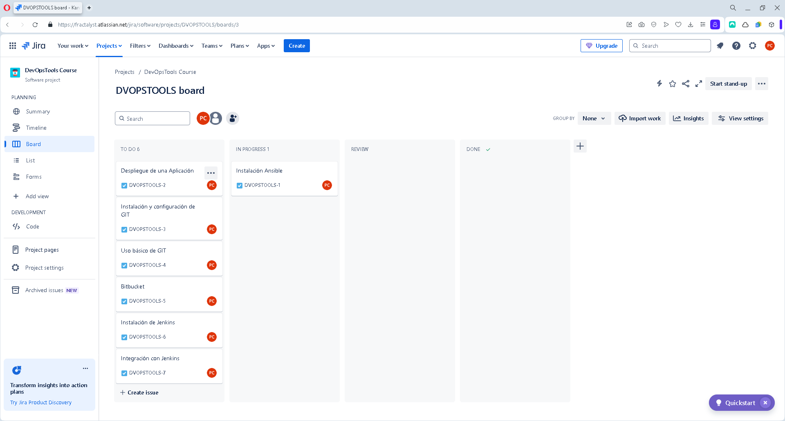
