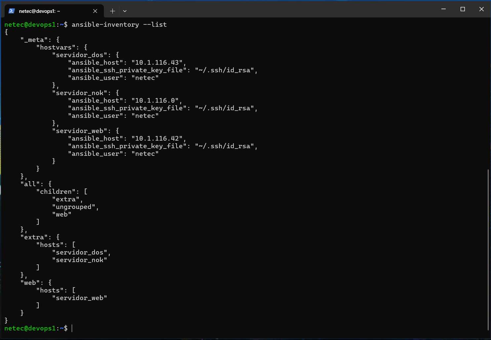

# ANSIBLE

## INSTALACIÓN

### OBJETIVOS

Al termino de este capítulo, serás capaz de:

- Configurar un equipo Linux como nodo de control en la arquitectura Ansible.

### DURACIÓN

Tiempo aproximado para esta actividad:

- 20 minutos.

### PRERREQUISITOS

Para esta actividad se requiere:

- Acceso a Internet.

- Acceso mediante SSH a un servidor Linux.

### INSTRUCCIONES

En esta actividad se instala y configura el nodo de control y un nodo gestionado de Ansible, una herramienta de automatización de TI que permite la gestión de configuraciones y el despliegue de aplicaciones.

#### PRERREQUISITOS

En esta actividad se valida el cumplimiento de los prerrequisitos para la instalación y configuración de los nodos de control y los administrados en la arquitectura de Ansible.

##### Esperados

- Hardware

  - 8 GB+ de RAM.

  - 2 procesadores+.

  - Linux: Red Hat Enterprise, CentOs, Fedora, Debian o Ubuntu, etcétera.

- Software

  - Python versión 3.8 o superior.

  - Python PIP: Paquete de instalación de Python.

  - Módulo SSH debe estar instalado.

- Otros
  - Privilegios de administrador.
    - Requerido en ciertas tareas de instalación/configuración.
  - Acceso a Internet.

Los prerrequisitos esperados para los nodos administrados dependen de las tareas que se deseen realizar. En este caso, se espera que los nodos administrados cumplan con los mismos prerrequisitos que el nodo de control.

##### Memoria RAM

Para determinar la memoria existente en el equipo, se puede ejecutar el comando `free --human`, el cuál muestra un resumen de la memoria RAM disponible y su uso en un formato legible para humanos:

``` sh
free --human
```

La salida de la ejecución debe ser similar a:

``` sh
              total        used        free      shared  buff/cache   available
Mem:          9.7Gi       220Mi       5.8Gi       0.0Ki       3.8Gi       9.2Gi
Swap:         975Mi          0B       975Mi
```

En caso de no cumplir con el mínimo requerido, se debe agregar memoria RAM al equipo o en su defecto, tener en cuenta posibles retardos o respuestas inesperadas.

##### Procesadores

PAra determinar la cantidad de procesadores disponibles en el equipo, se puede ejecutar el comando `nproc`, el cuál muestra el número de procesadores disponibles en el equipo:

``` sh
nproc
```

La salida de la ejecución debe ser similar a:

``` sh
4
```

##### Sistema Operativo

El sistema operativo en este caso es **Ubuntu 20.04 LTS**, el cuál es compatible con la mayoría de las herramientas y servicios utilizados en la actividad.

``` sh
cat /etc/os-release
```

La salida de la ejecución debe ser similar a:

``` sh
NAME="Ubuntu"
VERSION="20.04.6 LTS (Focal Fossa)"
ID=ubuntu
ID_LIKE=debian
PRETTY_NAME="Ubuntu 20.04.6 LTS"
VERSION_ID="20.04"
HOME_URL="https://www.ubuntu.com/"
SUPPORT_URL="https://help.ubuntu.com/"
BUG_REPORT_URL="https://bugs.launchpad.net/ubuntu/"
PRIVACY_POLICY_URL="https://www.ubuntu.com/legal/terms-and-policies/privacy-policy"
VERSION_CODENAME=focal
UBUNTU_CODENAME=focal
```

##### Python

Para verificar la versión de Python instalada en el equipo, se puede ejecutar el comando `python3 --version`, el cuál muestra la versión de Python instalada en el equipo:

``` sh
python3 --version
```

La salida de la ejecución debe ser similar a:

``` sh
Python 3.8.10
```

##### Python PIP

Para verificar la versión de Python PIP instalada en el equipo, se puede ejecutar el comando `pip3 --version`, el cuál muestra la versión de Python PIP instalada en el equipo:

``` sh
pip3 --version
```

La salida de la ejecución debe ser similar a:

``` sh
pip 20.0.2 from /usr/lib/python3/dist-packages/pip (python 3.8)
```

###### Instalación

En caso de no tener instalado Python PIP, se puede instalar con el siguiente comando:

``` sh
sudo apt update
sudo apt install python3-pip -y
```

La salida de la ejecución debe ser similar a:

``` sh
[sudo] password for netec:
Reading package lists... Done
Building dependency tree
Reading state information... Done
...
```

##### Módulo SSH

Para verificar la instalación del módulo SSH, se puede ejecutar el comando `ssh -V`, el cuál muestra la versión del módulo SSH instalado en el equipo:

``` sh
ssh -V
```

La salida de la ejecución debe ser similar a:

``` sh
OpenSSH_8.2p1 Ubuntu-4ubuntu0.1, OpenSSL 1.1.1f  31 Mar 2020
```

##### Privilegios de Administrador

Para verificar los privilegios de administrador, se puede ejecutar el comando `sudo --validate`, el cuál verifica si el usuario tiene privilegios de administrador:

``` sh
sudo --validate
```

La salida de la ejecución debe ser similar a:

``` sh
[sudo] password for netec:
```

Recuerda que el usuario debe tener privilegios de administrador para realizar ciertas tareas de instalación y configuración. Por lo que usamos este comando para verificar que el usuario tenga los privilegios necesarios.

##### Acceso a Internet

Para verificar el acceso a Internet, se puede ejecutar el comando `ping -c 4 google.com`, el cuál verifica la conectividad a Internet:

``` sh
ping -c 4 google.com
```

La salida de la ejecución debe ser similar a:

``` sh
PING google.com (142.250.115.113) 56(84) bytes of data.
64 bytes from rq-in-f113.1e100.net (142.250.115.113): icmp_seq=1 ttl=59 time=31.4 ms
64 bytes from rq-in-f113.1e100.net (142.250.115.113): icmp_seq=2 ttl=59 time=31.6 ms
64 bytes from rq-in-f113.1e100.net (142.250.115.113): icmp_seq=3 ttl=59 time=31.5 ms
64 bytes from rq-in-f113.1e100.net (142.250.115.113): icmp_seq=4 ttl=59 time=31.4 ms

--- google.com ping statistics ---
4 packets transmitted, 4 received, 0% packet loss, time 3005ms
rtt min/avg/max/mdev = 31.409/31.473/31.569/0.061 ms
```

#### INSTALACIÓN DE ANSIBLE EN EL NODO DE CONTROL

En esta actividad se instala y configura el nodo de control de Ansible, una herramienta de automatización de TI que permite la gestión de configuraciones y el despliegue de aplicaciones.

##### Instalación

Para instalar Ansible, se deben seguir los siguientes pasos:

1.  Actualizar el índice de paquetes de la máquina con el comando `sudo apt update`.

``` sh
sudo apt update
```

La salida de la ejecución debe ser similar a:

``` sh
Hit:1 http://security.ubuntu.com/ubuntu focal-security InRelease
Hit:2 http://mx.archive.ubuntu.com/ubuntu focal InRelease
Hit:3 http://mx.archive.ubuntu.com/ubuntu focal-updates InRelease
Hit:4 http://mx.archive.ubuntu.com/ubuntu focal-backports InRelease
Reading package lists... Done
Building dependency tree
Reading state information... Done
...
```

- Instalar Ansible con el comando `sudo apt install ansible -y`.

``` sh
sudo apt install ansible -y
```

La salida de la ejecución debe ser similar a:

``` sh
Reading package lists... Done
Building dependency tree
Reading state information... Done
The following additional packages will be installed:
  ieee-data python3-argcomplete python3-crypto python3-dnspython python3-jinja2 python3-jmespath python3-kerberos python3-libcloud python3-lockfile
  python3-markupsafe python3-netaddr python3-ntlm-auth python3-requests-kerberos python3-requests-ntlm python3-selinux python3-winrm python3-xmltodict
Suggested packages:
  cowsay sshpass python-jinja2-doc python-lockfile-doc ipython3 python-netaddr-docs
The following NEW packages will be installed:
  ansible ieee-data python3-argcomplete python3-crypto python3-dnspython python3-jinja2 python3-jmespath python3-kerberos python3-libcloud
  python3-lockfile python3-markupsafe python3-netaddr python3-ntlm-auth python3-requests-kerberos python3-requests-ntlm python3-selinux python3-winrm
  python3-xmltodict
0 upgraded, 18 newly installed, 0 to remove and 15 not upgraded.
Need to get 9,754 kB of archives.
After this operation, 90.7 MB of additional disk space will be used.
Get:1 http://mx.archive.ubuntu.com/ubuntu focal/main amd64 python3-markupsafe amd64 1.1.0-1build2 [13.9 kB]
Get:2 http://mx.archive.ubuntu.com/ubuntu focal-updates/main amd64 python3-jinja2 all 2.10.1-2ubuntu0.3 [96.0 kB]
Get:3 http://mx.archive.ubuntu.com/ubuntu focal/main amd64 python3-crypto amd64 2.6.1-13ubuntu2 [237 kB]
...
Setting up python3-argcomplete (1.8.1-1.3ubuntu1) ...
Setting up python3-requests-ntlm (1.1.0-1) ...
Setting up python3-libcloud (2.8.0-1) ...
Setting up python3-netaddr (0.7.19-3ubuntu1) ...
Setting up python3-winrm (0.3.0-2) ...
Setting up ansible (2.9.6+dfsg-1) ...
Processing triggers for man-db (2.9.1-1) ...
```

- Verificar la instalación de Ansible con el comando `ansible --version`.

``` sh
ansible --version
```

La salida de la ejecución debe ser similar a:

``` sh
ansible 2.9.6
  config file = /etc/ansible/ansible.cfg
  configured module search path = ['/home/netec/.ansible/plugins/modules', '/usr/share/ansible/plugins/modules']
  ansible python module location = /usr/lib/python3/dist-packages/ansible
  executable location = /usr/bin/ansible
  python version = 3.8.10 (default, Jan 17 2025, 14:40:23) [GCC 9.4.0]
```

###### Inventario

Adiciona al archivo `/etc/ansible/hosts` los nodos administrados. Puedes hacerlo con el siguiente comando:

```shell
sudo vi /etc/ansible/hosts
```

Añade tus hosts al archivo. Aquí tienes un ejemplo básico:

``` ini
[nodos_administrados]
nodo_admin_1 ansible_host=10.1.116.42 ansible_port=22 ansible_user=netec ansible_ssh_private_key_file=~/.ssh/id_rsa
nodo_admin_2 ansible_host=10.1.116.43 ansible_port=22 ansible_user=netec ansible_ssh_private_key_file=~/.ssh/id_rsa

[web]
servidor_web ansible_host=10.1.116.42 ansible_port=22 ansible_user=netec ansible_ssh_private_key_file=~/.ssh/id_rsa

[extra]
servidor_dos ansible_host=10.1.116.43 ansible_port=22 ansible_user=netec ansible_ssh_private_key_file=~/.ssh/id_rsa

[nook]
servidor_nook ansible_host=10.1.116.40 ansible_port=22 ansible_user=netec ansible_ssh_private_key_file=~/.ssh/id_rsa
```

Guarda el archivo y ciérralo.

##### Versión 2.10+

A partir de Ansible 2.10, la instalación predeterminada de Ansible no incluye el archivo `/etc/ansible/hosts`. En lugar de eso, se espera que los usuarios creen su propio archivo de inventario según sea necesario.

Para crear el archivo de inventario, puedes seguir estos pasos:

###### Inventario

Crea el archivo `/etc/ansible/hosts` y añade tus hosts. Puedes hacerlo con el siguiente comando:

```shell
sudo mkdir -p /etc/ansible
sudo vi /etc/ansible/hosts
```

Añade tus hosts al archivo. Aquí tienes un ejemplo básico:

``` ini
[nodos_administrados]
nodo_admin_1 ansible_host=10.1.116.42 ansible_port=22 ansible_user=netec ansible_ssh_private_key_file=~/.ssh/id_rsa
nodo_admin_2 ansible_host=10.1.116.43 ansible_port=22 ansible_user=netec ansible_ssh_private_key_file=~/.ssh/id_rsa

[web]
servidor_web ansible_host=10.1.116.42 ansible_port=22 ansible_user=netec ansible_ssh_private_key_file=~/.ssh/id_rsa

[extra]
servidor_dos ansible_host=10.1.116.43 ansible_port=22 ansible_user=netec ansible_ssh_private_key_file=~/.ssh/id_rsa

[nook]
servidor_nook ansible_host=10.1.116.40 ansible_port=22 ansible_user=netec ansible_ssh_private_key_file=~/.ssh/id_rsa
```

Guarda el archivo y ciérralo.

Si prefieres tener un inventario predeterminadamente crea el archivo `/etc/ansible/ansible.cfg` con el contenido:

``` ini
[defaults]
inventory = /etc/ansible/hosts
```

Guarda el archivo y ciérralo.

###### Verificar la configuración

```shell
ansible --version
```

Deberías ver algo como `config file = /etc/ansible/ansible.cfg` si has configurado un archivo de configuración, o puedes especificar el archivo de inventario directamente en tus comandos de Ansible:

La salida de la ejecución debe ser similar a:

``` sh
ansible 2.10.8
  config file = /etc/ansible/ansible.cfg
  configured module search path = ['/home/netec/.ansible/plugins/modules', '/usr/share/ansible/plugins/modules']
  ansible python module location = /usr/lib/python3/dist-packages/ansible
  executable location = /usr/bin/ansible
  python version = 3.10.12 (main, Jan 17 2025, 14:35:34) [GCC 11.4.0]
```

#### CONFIGURACIÓN DE NODOS (DEPENDE DE LA ARQUITECTURA DE LABORATORIOS)

En esta actividad se configuran los nodos (de control y administrado) de Ansible, una herramienta de automatización de TI que permite la gestión de configuraciones y el despliegue de aplicaciones.

##### Llaves SSH

Para verificar la existencia de las llaves SSH **en el nodo administrado**, se puede ejecutar el comando `ls ~/.ssh/`, el cuál muestra las llaves SSH existentes:

``` sh
ls ~/.ssh/
```

La salida de la ejecución debe ser similar a:

``` sh
ls: cannot access '/home/netec/.ssh/': No such file or directory
```

###### Creación de llaves SSH

Tanto en el **nodo de control como en los nodos administrados** se deben crear las llaves SSH que serán utilizadas para la comunicación. En todos los nodos se debe ejecutar `ssh-keygen`:

``` sh
ssh-keygen
```

Al ejecutar este comando solicitará información, por conveniencia se puede presionar `Enter` para aceptar los valores por defecto en cada paso.

La salida de la ejecución debe ser similar a:

``` sh
Generating public/private rsa key pair.
Enter file in which to save the key (/home/netec/.ssh/id_rsa):
Created directory '/home/netec/.ssh'.
Enter passphrase (empty for no passphrase):
Enter same passphrase again:
Your identification has been saved in /home/netec/.ssh/id_rsa
Your public key has been saved in /home/netec/.ssh/id_rsa.pub
The key fingerprint is:
SHA256:/G3VXDndKpxbeM2QiVrlb9ENEBgogl7c6gqfhcpB3cU netec@devops1
The key's randomart image is:
+---[RSA 3072] ---+
|   o ..  ..oooo  |
|  . + oE. .  + +*|
| ....o..    o =+*|
| ..... .   + o O+|
|.  o    S . = = B|
|... o    . . * . |
|.+.+      . +    |
|..+        .     |
|                 |
+--- [SHA256]  ---+
```

###### Copia de llaves SSH

Después de crear las llaves SSH, se deben copiar a los nodos administrados. Para ello, **en el nodo de control** se debe ejecutar el comando `ssh-copy-id`:

``` sh
ssh-copy-id netec@10.1.116.42
```

Nota: Recuerda que debes sustituir `10.1.116.42` por la dirección IP de tu nodo administrado.

- La ejecución de este comando solicitará el mecanismo de autenticación a utilizar, se debe responder con `yes`. Posteriormente solicitará la contraseña del usuario `netec` del nodo administrado.

La salida de la ejecución debe ser similar a:

``` sh
/usr/bin/ssh-copy-id: INFO: Source of key(s) to be installed: "/home/netec/.ssh/id_rsa.pub"
The authenticity of host '10.1.116.42 (10.1.116.42)' can't be established.
ECDSA key fingerprint is SHA256:GEWWSV9LrQqzGi7pIhhRVxpi1gcW+oPHafxMhk/2yhs.
Are you sure you want to continue connecting (yes/no/[fingerprint])? yes
/usr/bin/ssh-copy-id: INFO: attempting to log in with the new key(s), to filter out any that are already installed
/usr/bin/ssh-copy-id: INFO: 1 key(s) remain to be installed -- if you are prompted now it is to install the new keys
netec@10.1.116.42's password:

Number of key(s) added: 1

Now try logging into the machine, with:   "ssh 'netec@10.1.116.42'"
and check to make sure that only the key(s) you wanted were added.
```

###### Verificación

Para verificar la existencia de las llaves SSH en el **nodo administrado**, se puede ejecutar el comando `ls ~/.ssh/`, el cuál muestra las llaves SSH existentes en el nodo administrado:

``` sh
ls ~/.ssh/
```

La salida de la ejecución debe ser similar a:

``` sh
total 12
-rw....... 1 netec netec  567 Jan 29 15:33 authorized_keys
-rw....... 1 netec netec 2602 Jan 29 15:31 id_rsa
-rw-r--r-- 1 netec netec  567 Jan 29 15:31 id_rsa.pub
```

###### Verificación de la conexión

Para verificar la conexión con el nodo administrado, se puede ejecutar el comando `ssh netec@10.1.116.42` desde el nodo de control:

``` sh
ssh netec@10.1.116.42
```

Nota: Recuerda que debes sustituir `10.1.116.42` por la dirección IP de tu nodo administrado.

La salida de la ejecución debe ser similar a:

``` sh
Welcome to Ubuntu 20.04.6 LTS (GNU/Linux 5.4.0-42-generic x86_64)

 * Documentation:  https://help.ubuntu.com
 * Management:     https://landscape.canonical.com
 * Support:        https://ubuntu.com/pro

 System information as of Wed 29 Jan 2025 03:36:06 PM CST

  System load:  0.0               Processes:               238
  Usage of /:   5.3% of 66.94GB   Users logged in:         1
  Memory usage: 5%                IPv4 address for ens160: 10.1.116.42
  Swap usage:   0%

 * Strictly confined Kubernetes makes edge and IoT secure. Learn how MicroK8s
   just raised the bar for easy, resilient and secure K8s cluster deployment.

   https://ubuntu.com/engage/secure-kubernetes-at-the-edge

Expanded Security Maintenance for Applications is not enabled.

20 updates can be applied immediately.
19 of these updates are standard security updates.
To see these additional updates run: apt list --upgradable

Enable ESM Apps to receive additional future security updates.
See https://ubuntu.com/esm or run: sudo pro status

New release '22.04.5 LTS' available.
Run 'do-release-upgrade' to upgrade to it.

*** System restart required ***
Last login: Wed Jan 29 15:26:35 2025 from 10.1.116.40
```

Validada la conexión, termina la sesión SSH con el comando `exit`:

``` sh
exit
```

La salida de la ejecución debe ser similar a:

``` sh
logout
Connection to 10.1.116.42 closed.
```

NOTA: Si algún comando solicita confirmación del tipo de autenticación utilizado, se debe responder con `yes`.

``` sh
The authenticity of host '10.1.116.43 (10.1.116.43)' can't be established.
ECDSA key fingerprint is SHA256:bSKFmIv0SHvGsgEo7N6scPGbCIM6GEsKAhKKf4qbpU4.
Are you sure you want to continue connecting (yes/no/[fingerprint])? yes
```

##### Comunicación a los nodos

Para verificar la configuración del inventario, se puede ejecutar el comando `ansible-inventory --list`:

``` sh
ansible-inventory --list
```

La salida de la ejecución debe ser similar a:

``` json
{
    "_meta": {
        "hostvars": {
            "nodo_admin_1": {
                "ansible_host": "10.1.116.42",
                "ansible_port": 22,
                "ansible_ssh_private_key_file": "~/.ssh/id_rsa",
                "ansible_user": "netec"
            },
            "nodo_admin_2": {
                "ansible_host": "10.1.116.43",
                "ansible_port": 22,
                "ansible_ssh_private_key_file": "~/.ssh/id_rsa",
                "ansible_user": "netec"
            },
            "servidor_dos": {
                "ansible_host": "10.1.116.43",
                "ansible_port": 22,
                "ansible_ssh_private_key_file": "~/.ssh/id_rsa",
                "ansible_user": "netec"
            },
            "servidor_nook": {
                "ansible_host": "10.1.116.40",
                "ansible_port": 22,
                "ansible_ssh_private_key_file": "~/.ssh/id_rsa",
                "ansible_user": "netec"
            },
            "servidor_web": {
                "ansible_host": "10.1.116.42",
                "ansible_port": 22,
                "ansible_ssh_private_key_file": "~/.ssh/id_rsa",
                "ansible_user": "netec"
            }
        }
    },
    "all": {
        "children": [
            "extra",
            "nodos_administrados",
            "nook",
            "ungrouped",
            "web"
        ]
    },
    "extra": {
        "hosts": [
            "servidor_dos"
        ]
    },
    "nodos_administrados": {
        "hosts": [
            "nodo_admin_1",
            "nodo_admin_2"
        ]
    },
    "nook": {
        "hosts": [
            "servidor_nook"
        ]
    },
    "web": {
        "hosts": [
            "servidor_web"
        ]
    }
}
```

Y para verificar la comunicación con los nodos administrados, se puede ejecutar el comando `ansible all -m ping`:

``` sh
ansible all -m ping
```

La salida de la ejecución debe ser similar a:

``` javascript
servidor_dos | SUCCESS => {
    "ansible_facts": {
        "discovered_interpreter_python": "/usr/bin/python3"
    },
    "changed": false,
    "ping": "pong"
}
nodo_admin_1 | SUCCESS => {
    "ansible_facts": {
        "discovered_interpreter_python": "/usr/bin/python3"
    },
    "changed": false,
    "ping": "pong"
}
servidor_web | SUCCESS => {
    "ansible_facts": {
        "discovered_interpreter_python": "/usr/bin/python3"
    },
    "changed": false,
    "ping": "pong"
}
nodo_admin_2 | SUCCESS => {
    "ansible_facts": {
        "discovered_interpreter_python": "/usr/bin/python3"
    },
    "changed": false,
    "ping": "pong"
}
servidor_nook | UNREACHABLE! => {
    "changed": false,
    "msg": "Failed to connect to the host via ssh: ssh: connect to host 10.1.116.40 port 22: Connection timed out",
    "unreachable": true
}
```

Para indicar el inventario a utilizar se indica la opción `-i` como se muestra en el comando:

```shell
ansible all -i /etc/ansible/hosts -m ping
```

La salida de la ejecución debe ser similar a la del comando anterior.

Esto debería permitirte utilizar Ansible con tu propio archivo de inventario personalizado.

Note que en la salida se muestran cinco nodos administrados, cuatro con estado `SUCCESS` y otro con estado `UNREACHABLE`. Ya que la conexión con el nodo `servidor_nook` no se pudo establecer, se debe verificar la configuración de las llaves SSH y la dirección IP del nodo administrado.

### RESULTADO

En esta actividad se instaló y configuró un equipo Linux como nodo de control en la arquitectura Ansible.


