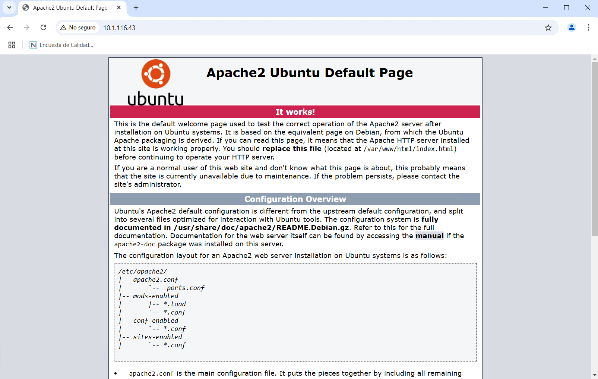
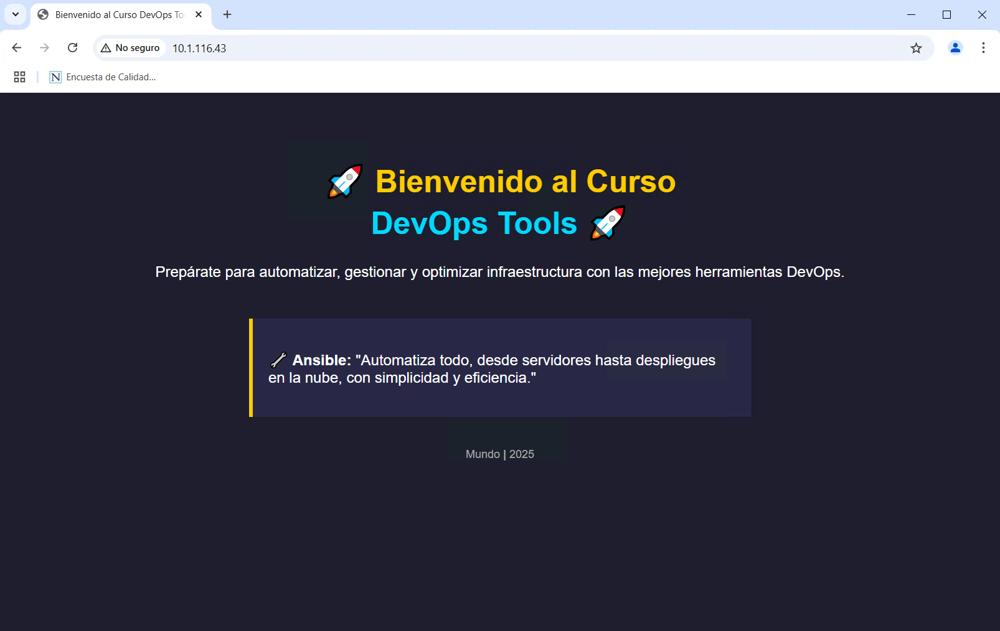

# ANSIBLE

## INSTALACIÓN Y PUBLICACIÓN DE UNA SITIO WEB

### OBJETIVOS

Al termino de este capítulo, serás capaz de:

-   Utilizar Ansible para instalar y configurar un servidor web en un nodo administrado.

### DURACIÓN

Tiempo aproximado para esta actividad:

-   20 minutos.

### PRERREQUISITOS

Para esta actividad se requiere:

-   Acceso a Internet.

-   Nodo de control con Ansible y acceso a un nodo administrado via SSH.

### INSTRUCCIONES

En esta actividad se instala y configura un sitio web en un nodo administrado utilizando Ansible.

#### SUDOERS

Algunas tareas de instalación y configuración requieren permisos de _superusuario_. Existen diversas maneras para que ansible pueda ejecutar comandos como superusuario.

En este caso, se configurará el usuario `netec` para que pueda ejecutar comandos como _superusuario_ sin necesidad de ingresar una contraseña.

En el/los **servidor administrado** en el que se requiera aplicar el playbook (servidor_dos), ejecuta:

``` sh
sudo vi /etc/sudoers
```

Y adiciona **con mucha precaución** la siguiente línea al final del archivo:

``` text
netec ALL=(ALL) NOPASSWD: ALL
```

El archivo debe quedar de la siguiente manera:

``` text
#
# This file MUST be edited with the 'visudo' command as root.
#
# Please consider adding local content in /etc/sudoers.d/ instead of
# directly modifying this file.
#
# See the man page for details on how to write a sudoers file.
#
Defaults        env_reset
Defaults        mail_badpass
Defaults        secure_path="/usr/local/sbin:/usr/local/bin:/usr/sbin:/usr/bin:/sbin:/bin:/snap/bin"
Defaults        use_pty

# This preserves proxy settings from user environments of root
# equivalent users (group sudo)
#Defaults:%sudo env_keep += "http_proxy https_proxy ftp_proxy all_proxy no_proxy"

# This allows running arbitrary commands, but so does ALL, and it means
# different sudoers have their choice of editor respected.
#Defaults:%sudo env_keep += "EDITOR"

# Completely harmless preservation of a user preference.
#Defaults:%sudo env_keep += "GREP_COLOR"

# While you shouldn't normally run git as root, you need to with etckeeper
#Defaults:%sudo env_keep += "GIT_AUTHOR_* GIT_COMMITTER_*"

# Per-user preferences; root won't have sensible values for them.
#Defaults:%sudo env_keep += "EMAIL DEBEMAIL DEBFULLNAME"

# "sudo scp" or "sudo rsync" should be able to use your SSH agent.
#Defaults:%sudo env_keep += "SSH_AGENT_PID SSH_AUTH_SOCK"

# Ditto for GPG agent
#Defaults:%sudo env_keep += "GPG_AGENT_INFO"

# Host alias specification

# User alias specification

# Cmnd alias specification

# User privilege specification
root    ALL=(ALL:ALL) ALL

# Members of the admin group may gain root privileges
%admin ALL=(ALL) ALL

# Allow members of group sudo to execute any command
%sudo   ALL=(ALL:ALL) ALL

netec ALL=(ALL) NOPASSWD: ALL

# See sudoers(5) for more information on "@include" directives:
```

1.  Ventajas:

    1.  Permite que Ansible ejecute sudo sin necesidad de ingresar la contraseña.

    2.  Evita tener que usar --ask-become-pass o guardar la contraseña en el inventario.

2.  Desventaja:

    1.  Permite que ubuntu ejecute sudo sin contraseña, lo que puede ser un riesgo de seguridad en entornos de producción.

#### Apache no instalado

Para verificar que Apache no esté instalado en el servidor administrado (servidor_dos).

##### Ansible

En el nodo de control, ejecuta el siguiente comando:

``` sh
ansible servidor_dos -m command -a "apache2 -v"
```

Si Apache no está instalado, el resultado será:

``` sh
servidor_dos | FAILED | rc=2 >>
[Errno 2] No such file or directory: b'apache2'
```

##### Paquetes

En el servidor administrado (servidor_dos), ejecuta:

``` sh
dpkg -l | grep apache2
```

Si Apache no está instalado, el resultado será vacío.

También puedes verificar si Apache no está instalado con el siguiente comando:

``` sh
apache2 -v
```

Si Apache no está instalado, el resultado será:

``` sh
Command 'apache2' not found, but can be installed with:

sudo apt install apache2-bin
```

#### Playbook

Para instalar y configurar el servidor web Apache en el servidor administrado (p.e. servidor_dos), crea un archivo llamado `apache.yaml` con el siguiente contenido correspondiente a un playbook de Ansible:

``` yaml
- name: Instalar Apache en servidor_dos (Ubuntu)
  hosts: servidor_dos
  become: yes
  tasks:
    - name: Actualizar lista de paquetes
      apt:
        update_cache: yes
    - name: Instalar Apache
      apt:
        name: apache2
        state: present
    - name: Iniciar y habilitar apache2 en el arranque
      systemd:
        name: apache2
        state: started
        enabled: yes
```

##### Ejecución

Para ejecutar el playbook, en el nodo de control, ejecuta:

``` sh
ansible-playbook apache.yaml
```

El resultado será similar a:

``` txt
PLAY [Instalar Apache en servidor_dos (Ubuntu)] ****************************************************************************************

TASK [Gathering Facts] *****************************************************************************************************************
ok: [servidor_dos]

TASK [Actualizar lista de paquetes] ****************************************************************************************************
changed: [servidor_dos]

TASK [Instalar Apache] *****************************************************************************************************************
changed: [servidor_dos]

TASK [Iniciar y habilitar apache2 en el arranque] **************************************************************************************
ok: [servidor_dos]

PLAY RECAP *****************************************************************************************************************************
servidor_dos               : ok=4    changed=2    unreachable=0    failed=0    skipped=0    rescued=0    ignored=0
```

#### Apache instalado

Para verificar que Apache esté instalado en el servidor administrado (servidor_dos).

##### Ansible

En el **nodo de control**, ejecuta el siguiente comando:

``` sh
ansible servidor_dos -m command -a "apache2 -v"
```

Si Apache está instalado, el resultado será:

``` sh
servidor_dos | CHANGED | rc=0 >>
Server version: Apache/2.4.41 (Ubuntu)
Server built:   2024-07-17T18:58:09
```

##### Paquetes

En el **servidor administrado** (servidor_dos), ejecuta:

``` sh
dpkg -l | grep apache2
```

Si Apache está instalado, el resultado será:

``` sh
ii  apache2                               2.4.41-4ubuntu3.21                amd64        Apache HTTP Server
ii  apache2-bin                           2.4.41-4ubuntu3.21                amd64        Apache HTTP Server (modules and other binary files)
ii  apache2-data                          2.4.41-4ubuntu3.21                all          Apache HTTP Server (common files)
ii  apache2-utils                         2.4.41-4ubuntu3.21                amd64        Apache HTTP Server (utility programs for web servers)
```

También puedes verificar si Apache está instalado con el siguiente comando:

``` sh
apache2 -v
```

Si Apache está instalado, el resultado será:

``` sh
Server version: Apache/2.4.41 (Ubuntu)
Server built:   2024-07-17T18:58:09
```

#### Sitio web

Predeterminadamente, Apache instala un sitio web de prueba en la ruta `/var/www/html/index.html`. Para verificar que el sitio web esté disponible, abre un navegador web y accede a la dirección IP de tu servidor administrado (servidor_dos).

-   En este caso, la dirección IP del servidor administrado es `10.1.116.43`.



##### Nuestra página de bienvenida

Para reemplazar el sitio web predeterminado por uno personalizado, crea un archivo (en el nodo de control) llamado `index.html` con el siguiente contenido:

``` html
<!DOCTYPE html>
<html lang="es">
<head>
    <meta charset="UTF-8">
    <meta name="viewport" content="width=device-width, initial-scale=1.0">
    <title>Bienvenido al Curso DevOps Tools</title>
    <style>
        body {
            font-family: Arial, sans-serif;
            background-color: #1e1e2f;
            color: #ffffff;
            text-align: center;
            padding: 50px;
        }
        h1 {
            color: #ffcc00;
            font-size: 2.5em;
        }
        p {
            font-size: 1.2em;
        }
        .ansible-quote {
            margin-top: 30px;
            padding: 20px;
            background-color: #282846;
            border-left: 5px solid #ffcc00;
            display: inline-block;
            text-align: left;
            max-width: 600px;
        }
        .footer {
            margin-top: 40px;
            font-size: 0.9em;
            color: #aaaaaa;
        }
    </style>
</head>
<body>

    <h1>🚀 Bienvenido al Curso <br> <span style="color:#00d9ff;">DevOps Tools</span> 🚀</h1>

    <p>Prepárate para automatizar, gestionar y optimizar infraestructura con las mejores herramientas DevOps.</p>

    <div class="ansible-quote">
        <p><strong>🔧 Ansible:</strong> "Automatiza todo, desde servidores hasta despliegues en la nube, con simplicidad y eficiencia."</p>
    </div>

    <p class="footer">Mundo <strong>|</strong> 2025</p>

</body>
</html>
```

#### Actualizar sitio web

Para actualizar el sitio web predeterminado por el personalizado, en el nodo de control, modifica el playbook `apache.yml` para copiar el archivo `index.html` al servidor administrado (servidor_dos).

``` yaml
- name: Instalar Apache en servidor_dos (Ubuntu)
  hosts: servidor_dos
  become: yes
  tasks:
    - name: Actualizar lista de paquetes
      apt:
        update_cache: yes
    - name: Instalar Apache
      apt:
        name: apache2
        state: present
    - name: Iniciar y habilitar apache2 en el arranque
      systemd:
        name: apache2
        state: started
        enabled: yes
    - name: Copiar página de bienvenida a /var/www/html/
      copy:
        src: index.html
        dest: /var/www/html/index.html
        owner: www-data
        group: www-data
        mode: '0644'
    - name: Reiniciar Apache para aplicar cambios
      service:
        name: apache2
        state: restarted
```

Explicación del Playbook:

1.  Instala Apache (apache2) en el servidor remoto.

2.  Copia el archivo `index.html` desde la máquina de Ansible al directorio web `/var/www/html/`.

    1.  `src`: `index.html` → Archivo local que será copiado.

    2.  `dest`: `/var/www/html/index.html` → Ruta remota donde se guardará.

    3.  `owner`: `www-data` → Define a `www-data` como propietario (usuario de Apache).

    4.  `group`: `www-data` → Grupo al que pertenece el archivo.

    5.  `mode`: '0644' → Permisos adecuados para lectura y escritura.

3.  Reinicia Apache para aplicar los cambios.

Ahora, ejecuta el playbook `apache.yaml` para actualizar el sitio web.

``` sh
ansible-playbook apache.yaml
```

El resultado será similar a:

``` txt
PLAY [Instalar Apache en servidor_dos (Ubuntu)] *******************************************************************

TASK [Gathering Facts] ********************************************************************************************
ok: [servidor_dos]

TASK [Actualizar lista de paquetes] *******************************************************************************
changed: [servidor_dos]

TASK [Instalar Apache] ********************************************************************************************
ok: [servidor_dos]

TASK [Iniciar y habilitar apache2 en el arranque] *****************************************************************
ok: [servidor_dos]

TASK [Copiar página de bienvenida a /var/www/html/] ***************************************************************
changed: [servidor_dos]

TASK [Reiniciar Apache para aplicar cambios]***********************************************************************
changed: [servidor_dos]

PLAY RECAP ********************************************************************************************************
servidor_dos               : ok=6    changed=3    unreachable=0    failed=0    skipped=0    rescued=0    ignored=0
```

Con lo que ha quedado actualizado el sitio web.

Para consultarlo se puede visitar nuevamente el URL en el navegador o realizar una consulta con el comando:

``` shell
curl http://10.1.116.43/
```

Recuerda que debe ser la IP de tu servidor administrado (servidor_dos).

Lo que genera una salida similar a:

``` html
<!DOCTYPE html>
<html lang="es">
<head>
    <meta charset="UTF-8">
    <meta name="viewport" content="width=device-width, initial-scale=1.0">
    <title>Bienvenido al Curso DevOps Tools</title>
    <style>
        body {
            font-family: Arial, sans-serif;
            background-color: #1e1e2f;
            color: #ffffff;
            text-align: center;
            padding: 50px;
        }
        h1 {
            color: #ffcc00;
            font-size: 2.5em;
        }
        p {
            font-size: 1.2em;
        }
        .ansible-quote {
            margin-top: 30px;
            padding: 20px;
            background-color: #282846;
            border-left: 5px solid #ffcc00;
            display: inline-block;
            text-align: left;
            max-width: 600px;
        }
        .footer {
            margin-top: 40px;
            font-size: 0.9em;
            color: #aaaaaa;
        }
    </style>
</head>
<body>

    <h1>🚀 Bienvenido al Curso <br> <span style="color:#00d9ff;">DevOps Tools</span> 🚀</h1>

    <p>Prepárate para automatizar, gestionar y optimizar infraestructura con las mejores herramientas DevOps.</p>

    <div class="ansible-quote">
        <p><strong>🔧 Ansible:</strong> "Automatiza todo, desde servidores hasta despliegues en la nube, con simplicidad y eficiencia."</p>
    </div>

    <p class="footer">Mundo <strong>|</strong> 2025</p>

</body>
</html>
```

### RESULTADO

En esta actividad se instaló y configuró un servidor web en un nodo administrado utilizando Ansible.



### RESTABLECIMIENTO

Para restablecer el servidor administrado, se debe detener y desinstalar el servidor web, así como eliminar el directorio `/var/www/html`.

#### Playbook de restablecimiento

En el nodo de control, se debe crear un nuevo archivo de playbook llamado `desinstalar_sitio_web.yaml` con el siguiente contenido:

``` yaml
- name: Desinstalar Apache en servidor_dos (Ubuntu)
  hosts: servidor_dos
  become: yes
  tasks:
    - name: Detener Apache2
      systemd:
        name: apache2
        state: stopped
        enabled: no

    - name: Eliminar la página de bienvenida
      file:
        path: /var/www/html/index.html
        state: absent

    - name: Desinstalar Apache2
      apt:
        name: apache2
        state: absent
        purge: yes
        autoremove: yes

    - name: Limpiar archivos de configuración de Apache
      file:
        path: /etc/apache2
        state: absent
```

Explicación del Playbook:

- `systemd state=stopped enabled=no`
  - Detiene Apache y evita que se inicie automáticamente.
- `file state=absent`
  - Borra la página index.html.
- `apt state=absent purge=yes autoremove=yes`
  - Desinstala Apache.
  - `Purge`: Elimina archivos de configuración.
  - `Autoremove`: Elimina dependencias no necesarias.
- `file path=/etc/apache2 state=absent`
  - Elimina completamente la configuración de Apache.

Para ejecutar el playbook, se debe utilizar el comando:

``` shell
ansible-playbook desinstalar_sitio_web.yaml
```

La salida debe ser similar a la siguiente:

``` shell
PLAY [Desinstalar Apache en servidor_dos (Ubuntu)] ****************************************************************

TASK [Gathering Facts] ********************************************************************************************
ok: [servidor_dos]

TASK [Detener Apache2] ********************************************************************************************
changed: [servidor_dos]

TASK [Eliminar la página de bienvenida] ***************************************************************************
changed: [servidor_dos]

TASK [Desinstalar Apache2] ****************************************************************************************
changed: [servidor_dos]

TASK [Limpiar archivos de configuración de Apache] ****************************************************************
ok: [servidor_dos]

PLAY RECAP ********************************************************************************************************
servidor_dos               : ok=5    changed=3    unreachable=0    failed=0    skipped=0    rescued=0    ignored=0
```

Luego de ejecutar el playbook, se debe verificar que el servidor web haya sido desinstalado y que el directorio `/var/www/html` haya sido eliminado y no pueda ser accedido.
