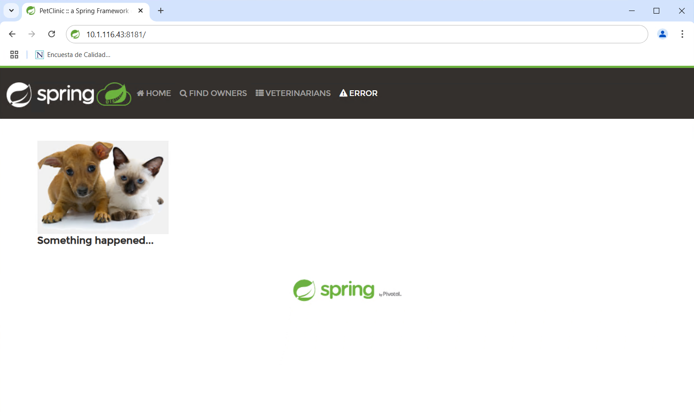

# ANSIBLE

## DESPLIEGUE DE UNA APLICACIÓN WEB

### OBJETIVOS

Al termino de este capítulo, serás capaz de:

- Utilizar Ansible para disponibilizar una aplicación web desarrollada en SpringBoot.

### DURACIÓN

Tiempo aproximado para esta actividad:

- 25 minutos.

### PRERREQUISITOS

Para esta actividad se requiere:

- Acceso a Internet.
- Nodo de control con Ansible y acceso a un nodo administrado via SSH.

### INSTRUCCIONES

#### Estructura

Crear un directorio llamado `spc_ansible` en la ruta de trabajo.

Al avanzar en la actividad se ira armando la siguiente estructura:

``` text
spc_ansible/
├── inventory
├── requirements.yml
├── deploy_spc.yml
├── revert_spc.yml
├── spring-petclinic-2.7.3.jar
└── roles/
```

Donde:

1. `inventory`
    1. Define tu(s) host(s).
2. `requirements.yml`
    1. Especifica el rol de Galaxy que instalaremos.
3. `deploy_petclinic.yml`:
    1. El playbook que instalará Java y configurará Spring PetClinic como servicio.
4. `roles/`
    1. Carpeta donde se instalarán los roles descargados de Galaxy.

#### Descargar Spring PetClinic

Descarga el archivo JAR de Spring PetClinic versión 2.7.3 desde el siguiente enlace de github:

- <https://github.com/Netec-Mx/DevOps_Tools/blob/main/cap03/mm/spring-petclinic-2.7.3.jar>

Ahora "súbelo" a la carpeta `spc_ansible` en tu máquina de control ejecutando el siguiente comando:

``` shell
scp spring-petclinic-2.7.3.jar netec@10.1.116.41:/home/netec/ansible_labs/spc_ansible
```

Donde:

1. `spring-petclinic-2.7.3.jar` es el archivo JAR descargado.
2. `netec` es el usuario remoto.
3. `10.1.116.41` es la dirección IP del host remoto.
4. `/home/netec/ansible_labs/spc_ansible` es la ruta donde se guardará el archivo.

- Nota: en algunas configuraciones es posible obtener el archivo directamente con el comando: `wget https://github.com/Netec-Mx/DevOps_Tools/raw/refs/heads/main/cap03/mm/spring-petclinic-2.7.3.jar`
  - Este debe ser ejecutado en el equipo del proyecto ansible.

#### Rol

Usaremos el rol `geerlingguy.java` de Ansible Galaxy, muy popular en la comunidad para instalar diferentes versiones de Java.

Crea o modifica tu archivo `requirements.yml`:

``` yaml
# requirements.yml
- name: geerlingguy.java
  version: 2.5.0
```

Ajusta la versión según tus necesidades, 2.5.0 es la última al momento de la realización de esta guía.

- <https://galaxy.ansible.com/ui/standalone/roles/geerlingguy/java/versions/>

##### Instalar el rol

Desde la terminal en la carpeta `spc_ansible`, ejecuta el siguiente comando:

``` shell
ansible-galaxy install -r requirements.yml --roles-path roles/
```

Donde:

1. `-r requirements.yml`
    1. Instala los roles especificados en el archivo `requirements.yml`.
2. `--roles-path roles/`
    1. Indica la carpeta donde se instalarán los roles.

La salida debe ser similar a la siguiente:

``` shell
- downloading role 'java', owned by geerlingguy
- downloading role from https://github.com/geerlingguy/ansible-role-java/archive/2.5.0.tar.gz
- extracting geerlingguy.java to /home/netec/ansible_labs/spc_ansible/roles/geerlingguy.java
- geerlingguy.java (2.5.0) was installed successfully
```

Muestra que el rol `geerlingguy.java` se instaló correctamente.

``` shell
ls --recursive --human roles
```

La salida debe ser similar a la siguiente:

``` shell
roles:
geerlingguy.java

roles/geerlingguy.java:
defaults  LICENSE  meta  molecule  README.md  tasks  templates  vars

roles/geerlingguy.java/defaults:
main.yml

roles/geerlingguy.java/meta:
main.yml

roles/geerlingguy.java/molecule:
default

roles/geerlingguy.java/molecule/default:
converge.yml  molecule.yml

roles/geerlingguy.java/tasks:
main.yml  setup-Amazon.yml  setup-Debian.yml  setup-FreeBSD.yml  setup-RedHat.yml

roles/geerlingguy.java/templates:
java_home.sh.j2

roles/geerlingguy.java/vars:
Amazon-2023.yml  Debian-10.yml  Debian-12.yml  Debian-9.yml  FreeBSD.yml   RedHat-8.yml  Ubuntu-12.yml  Ubuntu-16.yml  Ubuntu-20.yml  Ubuntu-24.yml
Amazon-2.yml     Debian-11.yml  Debian-8.yml   Fedora.yml    RedHat-7.yml  RedHat-9.yml  Ubuntu-14.yml  Ubuntu-18.yml  Ubuntu-22.yml
```

Lo que muestra que el rol `geerlingguy.java` se instaló correctamente.

#### Inventario

Ahora se debe crear un archivo de inventario con el nombre de *host* `spc`.

Crea un archivo llamado `inventory` en la carpeta `spc_ansible` con el siguiente contenido:

``` ini
# inventory
[spc]
spc_aas ansible_host=10.1.116.43 ansible_port=22 ansible_user=netec ansible_ssh_private_key_file=~/.ssh/id_rsa
```

<div class="note">
Ajusta la <strong>IP</strong> y el <strong>ansible_user</strong> según tu entorno.
</div>

Donde:

1. `# inventory`
    1. Es un comentario que describe el archivo o indica que aquí se define un inventario.
2. `[spc]`
    1. Define el nombre del grupo de hosts en Ansible. Todos los hosts que aparezcan debajo de este encabezado pertenecen al grupo `spc`.
    2. Un playbook puede hacer referencia a todos los hosts de este grupo usando: `hosts: spc`
3. `spc_aas`
    1. Es el alias o nombre lógico del host para Ansible.
4. `ansible_host=10.1.116.43`
    1. Indica la dirección IP (o nombre de dominio) que Ansible usará para conectarse por SSH.
5. `ansible_user=netec`
    1. Especifica el usuario remoto con el que se realizará la conexión.
6. `ansible_ssh_private_key_file=~/.ssh/id_rsa`
    1. Ruta al archivo de clave privada SSH para autenticarte en el host remoto, en vez de usar una contraseña.

#### Playbook de despliegue

Ahora se crea un playbook llamado `deploy_spc.yml` con el siguiente contenido:

``` yaml
# deploy_spc.yml
- name: Desplegar PetClinic como servicio en spc_aas
  hosts: spc_aas
  become: yes

  # Instalar Java 11 con el rol de Ansible Galaxy
  roles:
    - role: geerlingguy.java
      vars:
        java_packages:
          - openjdk-11-jdk  # Para Ubuntu/Debian
          # - java-11-openjdk-devel  # Para CentOS/RHEL, si fuera el caso

  # Tareas para desplegar la aplicación
  tasks:
    - name: Crear directorio para PetClinic
      file:
        path: /opt/petclinic
        state: directory
        owner: root
        group: root
        mode: '0755'

    - name: Copiar el jar de PetClinic al servidor
      copy:
        src: spring-petclinic-2.7.3.jar
        dest: /opt/petclinic/spring-petclinic-2.7.3.jar
        mode: '0755'

    - name: Crear archivo de servicio systemd
      copy:
        dest: /etc/systemd/system/petclinic.service
        content: |
          [Unit]
          Description=Spring PetClinic
          After=network.target

          [Service]
          User=root
          WorkingDirectory=/opt/petclinic
          ExecStart=/usr/bin/java -jar /opt/petclinic/spring-petclinic-2.7.3.jar
          SuccessExitStatus=143
          Restart=on-failure

          [Install]
          WantedBy=multi-user.target
      notify:
        - daemon_reload

    - name: Habilitar y arrancar el servicio
      systemd:
        name: petclinic
        enabled: yes
        state: started

  handlers:
    - name: daemon_reload
      systemd:
        daemon_reload: yes
```

El *playbook* `deploy_spc.yml` define los pasos para instalar `Java 11` y desplegar la aplicación **Spring PetClinic** como servicio en el *host* `spc_aas`.

A continuación se detallan sus componentes:

##### Encabezado y Hosts

``` yaml
- name: Desplegar PetClinic como servicio en spc_aas
  hosts: spc_aas
  become: yes
```

Donde:

1. `name`: describe la finalidad de este *play* (desplegar PetClinic).
2. `hosts: spc_aas`: indica que se ejecutará en el host llamado `spc_aas` (definido en el inventario).
3. `become: yes`: permite la elevación de privilegios (sudo) para tareas que requieren permisos de root.

##### Rol para Instalar Java 11

``` yaml
roles:
  - role: geerlingguy.java
    vars:
      java_packages:
        - openjdk-11-jdk
```

Donde:

1. `role: geerlingguy.java`: llama al rol `geerlingguy.java`, descargado de Ansible Galaxy.
2. Sobrescribe la variable `java_packages` con el valor `openjdk-11-jdk`, asegurando que se instale Java 11 en sistemas Ubuntu/Debian.
    1. Si fuera CentOS/RHEL, se usaría `java-11-openjdk-devel` en lugar de `openjdk-11-jdk`.

##### Tareas para Desplegar la Aplicación

Crea la carpeta `/opt/petclinic` con los permisos adecuados para alojar la aplicación.

``` yaml
- name: Crear directorio para PetClinic
  file:
    path: /opt/petclinic
    state: directory
    owner: root
    group: root
    mode: '0755'
```

Sube el archivo JAR de PetClinic (versión 2.7.3) desde la máquina local al directorio `/opt/petclinic/` del servidor, asignándole permisos de ejecución.

``` yaml
- name: Copiar el jar de PetClinic al servidor
  copy:
    src: spring-petclinic-2.7.3.jar
    dest: /opt/petclinic/spring-petclinic-2.7.3.jar
    mode: '0755'
```

Genera un archivo de unidad `systemd` en `/etc/systemd/system/petclinic.service` que describe cómo iniciar PetClinic:

``` yaml
- name: Crear archivo de servicio systemd
  copy:
    dest: /etc/systemd/system/petclinic.service
    content: |
      [Unit]
      Description=Spring PetClinic
      After=network.target

      [Service]
      User=root
      WorkingDirectory=/opt/petclinic
      ExecStart=/usr/bin/java -jar /opt/petclinic/spring-petclinic-2.7.3.jar
      SuccessExitStatus=143
      Restart=on-failure

      [Install]
      WantedBy=multi-user.target
  notify:
    - daemon_reload
```

Donde:

1. `copy`
    1. Copia el contenido del bloque a `/etc/systemd/system/petclinic.service`.
2. `[Unit]`
    1. Sección de metadatos del servicio.
    2. `Description=Spring PetClinic`: Descripción del servicio.
        1. `After=network.target`: Indica que el servicio se inicia después de que la red esté disponible.
3. `[Service]`
    1. Define cómo ejecutar el servicio.
    2. `User=root`: Ejecuta el servicio como *root*.
    3. `WorkingDirectory=/opt/petclinic`: Establece el directorio de trabajo.
    4. `ExecStart`: Llama a `/usr/bin/java -jar /opt/petclinic/spring-petclinic-2.7.3.jar` para levantar la aplicación.
    5. `Restart=on-failure`: Reinicia automáticamente si el proceso falla.
4. `[Install]`
    1. Define cómo instalar el servicio.
    2. `WantedBy=multi-user.target`: El servicio se iniciará en modo multiusuario.
5. `notify: daemon_reload`
    1. Incluye una notificación para recargar el demonio tras crear o modificar el archivo de servicio.

##### Habilitar e iniciar el servicio

``` yaml
- name: Habilitar y arrancar el servicio
  systemd:
    name: petclinic
    enabled: yes
    state: started
```

Esto activa el servicio *petclinic* para que inicie automáticamente al arrancar el sistema.

##### Handlers

``` yaml
handlers:
  - name: daemon_reload
    systemd:
      daemon_reload: yes
```

Define la acción a ejecutar cuando se “notifique” (`daemon_reload`), lo que recarga la configuración de `systemd`, de modo que reconozca el nuevo archivo de servicio.

##### Ejecutar el Playbook

Para ejecutar el *playbook*, se debe utilizar el comando:

``` shell
ansible-playbook -i inventory deploy_spc.yml
```

La salida debe ser similar a la siguiente:

``` shell
PLAY [Desplegar PetClinic como servicio en spc_aas] ****************************************************************************************************************************

TASK [Gathering Facts] *********************************************************************************************************************************************************
ok: [spc_aas]

TASK [geerlingguy.java : Include OS-specific variables for Fedora or FreeBSD.] *************************************************************************************************
skipping: [spc_aas]

TASK [geerlingguy.java : Include OS-specific variables for Amazon.] ************************************************************************************************************
skipping: [spc_aas]

TASK [geerlingguy.java : Include version-specific variables for CentOS/RHEL.] **************************************************************************************************
skipping: [spc_aas]

TASK [geerlingguy.java : Include version-specific variables for Ubuntu.] *******************************************************************************************************
ok: [spc_aas]

TASK [geerlingguy.java : Include version-specific variables for Debian.] *******************************************************************************************************
ok: [spc_aas]

TASK [geerlingguy.java : Define java_packages.] ********************************************************************************************************************************
skipping: [spc_aas]

TASK [geerlingguy.java : include_tasks] ****************************************************************************************************************************************
skipping: [spc_aas]

TASK [geerlingguy.java : include_tasks] ****************************************************************************************************************************************
skipping: [spc_aas]

TASK [geerlingguy.java : include_tasks] ****************************************************************************************************************************************
included: /home/netec/ansible_labs/spc_ansible/roles/geerlingguy.java/tasks/setup-Debian.yml for spc_aas

TASK [geerlingguy.java : Ensure 'man' directory exists.] ***********************************************************************************************************************
ok: [spc_aas]

TASK [geerlingguy.java : Ensure Java is installed.] ****************************************************************************************************************************
changed: [spc_aas]

TASK [geerlingguy.java : include_tasks] ****************************************************************************************************************************************
skipping: [spc_aas]

TASK [geerlingguy.java : Set JAVA_HOME if configured.] *************************************************************************************************************************
skipping: [spc_aas]

TASK [Crear directorio para PetClinic] *****************************************************************************************************************************************
changed: [spc_aas]

TASK [Copiar el jar de PetClinic al servidor] **********************************************************************************************************************************
changed: [spc_aas]

TASK [Crear archivo de servicio systemd] ***************************************************************************************************************************************
changed: [spc_aas]

TASK [Habilitar y arrancar el servicio] ****************************************************************************************************************************************
changed: [spc_aas]

RUNNING HANDLER [daemon_reload] ************************************************************************************************************************************************
ok: [spc_aas]

PLAY RECAP *********************************************************************************************************************************************************************
spc_aas                    : ok=11   changed=5    unreachable=0    failed=0    skipped=8    rescued=0    ignored=0
```

La salida muestra que el *playbook* se ejecutó correctamente y que se realizaron cambios en el servidor `spc_aas`.

Es oportuno hacer notar que la salida en su equipo puede variar ligeramente dependiendo de la configuración de su entorno.

#### Verificar el Servicio

Una vez finalice la ejecución exitosa del *playbook*, conéctate por SSH al servidor `spc_aas` y ejecuta:

``` shell
systemctl status petclinic
```

Debería mostrar el servicio activo (active (running)).

``` shell
● petclinic.service - Spring PetClinic
     Loaded: loaded (/etc/systemd/system/petclinic.service; enabled; vendor preset: enabled)
     Active: active (running) since Tue 2025-02-11 09:18:08 CST; 5min ago
   Main PID: 169802 (java)
      Tasks: 38 (limit: 11829)
     Memory: 407.2M
     CGroup: /system.slice/petclinic.service
             └─169802 /usr/bin/java -jar /opt/petclinic/spring-petclinic-2.7.3.jar

Feb 11 09:18:17 devops3 java[169802]: 2025-02-11 09:18:17.717  INFO 169802 --- [           main] o.hibernate.annotations.common.Version   : HCANN000001: Hibernate Commons Annotations {5.1.2.Final}
Feb 11 09:18:17 devops3 java[169802]: 2025-02-11 09:18:17.995  INFO 169802 --- [           main] org.hibernate.dialect.Dialect            : HHH000400: Using dialect: org.hibernate.dialect.H2Dialect
Feb 11 09:18:19 devops3 java[169802]: 2025-02-11 09:18:19.786  INFO 169802 --- [           main] o.h.e.t.j.p.i.JtaPlatformInitiator       : HHH000490: Using JtaPlatform implementation: [org.hibernate.engine.transaction.jta>
Feb 11 09:18:19 devops3 java[169802]: 2025-02-11 09:18:19.807  INFO 169802 --- [           main] j.LocalContainerEntityManagerFactoryBean : Initialized JPA EntityManagerFactory for persistence unit 'default'
Feb 11 09:18:22 devops3 java[169802]: 2025-02-11 09:18:22.443  INFO 169802 --- [           main] o.s.b.a.e.web.EndpointLinksResolver      : Exposing 13 endpoint(s) beneath base path '/actuator'
Feb 11 09:18:22 devops3 java[169802]: 2025-02-11 09:18:22.564  INFO 169802 --- [           main] o.s.b.w.embedded.tomcat.TomcatWebServer  : Tomcat started on port(s): 8181 (http) with context path ''
Feb 11 09:18:22 devops3 java[169802]: 2025-02-11 09:18:22.594  INFO 169802 --- [           main] o.s.s.petclinic.PetClinicApplication     : Started PetClinicApplication in 13.145 seconds (JVM running for 14.496)
Feb 11 09:19:59 devops3 java[169802]: 2025-02-11 09:19:59.176  INFO 169802 --- [nio-8181-exec-1] o.a.c.c.C.[Tomcat].[localhost].[/]       : Initializing Spring DispatcherServlet 'dispatcherServlet'
Feb 11 09:19:59 devops3 java[169802]: 2025-02-11 09:19:59.179  INFO 169802 --- [nio-8181-exec-1] o.s.web.servlet.DispatcherServlet        : Initializing Servlet 'dispatcherServlet'
Feb 11 09:19:59 devops3 java[169802]: 2025-02-11 09:19:59.186  INFO 169802 --- [nio-8181-exec-1] o.s.web.servlet.DispatcherServlet        : Completed initialization in 7 ms
```

#### Consumo

Para acceder a la aplicación, abre un navegador web y accede a la dirección IP del servidor `spc_aas` en el puerto 8181:

- [http://\<IP_servidor\>:8181/](http://<IP_servidor>:8181/)



La aplicación Spring PetClinic debería cargarse en tu navegador.

Felicitaciones, has desplegado exitosamente la aplicación Spring PetClinic en el servidor `spc_aas` utilizando Ansible.

### RESULTADO

En esta actividad se disponibilizó una aplicación web desarrollada en SpringBoot en un nodo administrado utilizando Ansible.


### RESTABLECIMIENTO

Para restablecer el servidor administrado, se debe detener y deshabilitar el servicio de PetClinic, eliminar el archivo de servicio, la carpeta de PetClinic y desinstalar Java 11.

#### Playbook de restablecimiento

En el nodo de control, se debe crear un nuevo archivo de playbook llamado `revert_spc.yml` con el siguiente contenido:

``` yaml
# revert_spc.yml
- name: Revertir despliegue de PetClinic
  hosts: spc_aas
  become: yes

  # Llamamos al rol geerlingguy.java para desinstalar Java 11
  roles:
    - role: geerlingguy.java
      vars:
        java_packages:
          - openjdk-11-jdk
          - openjdk-11-jdk-headless
          - openjdk-11-jre
          - openjdk-11-jre-headless
        java_packages_state: absent  # Indica que se desinstalen los paquetes

  # Tareas para detener y eliminar PetClinic
  tasks:
    - name: Detener y deshabilitar servicio PetClinic
      systemd:
        name: petclinic
        state: stopped
        enabled: no
      ignore_errors: yes  # Para que no falle si el servicio no existe

    - name: Eliminar archivo de servicio
      file:
        path: /etc/systemd/system/petclinic.service
        state: absent
      notify:
        - daemon_reload

    - name: Eliminar carpeta de PetClinic
      file:
        path: /opt/petclinic
        state: absent

    - name: Desinstalar Java 11 (openjdk-11-jdk)
      package:
        name:
          - openjdk-11-jdk
          - openjdk-11-jdk-headless
          - openjdk-11-jre
          - openjdk-11-jre-headless
        state: absent
      ignore_errors: yes  # Evita error si no estaba instalado
  handlers:
    - name: daemon_reload
      systemd:
        daemon_reload: yes
```

El las siguientes secciones se describe el contenido del *playbook*.

##### Encabezado

``` yaml
- name: Revertir despliegue de PetClinic
  hosts: spc_aas
  become: yes
```

1. `name`: describe el nombre del play: “Revertir despliegue de PetClinic”.
2. `hosts: spc_aas`: indica que el play se ejecutará contra el host definido como `spc_aas` en el inventario.
3. `become: yes`: requiere elevación de privilegios (*sudo*) para tareas que necesiten permisos de *root*.

##### Rol para desinstalar Java 11

Llama al rol `geerlingguy.java`, indicándole que ponga en estado `absent` los paquetes listados (*openjdk-11-jdk*, etc.). De esta forma, se fuerza al rol a eliminar (desinstalar) Java 11 y sus variantes.

``` yaml
roles:
  - role: geerlingguy.java
    vars:
      java_packages:
        - openjdk-11-jdk
        - openjdk-11-jdk-headless
        - openjdk-11-jre
        - openjdk-11-jre-headless
      java_packages_state: absent
```

##### Tareas para revertir PetClinic

###### Detener y deshabilitar el servicio PetClinic

Apaga el servicio si está corriendo y evita que se inicie automáticamente en el arranque. E `ignore_errors: yes` para que, si el servicio no existía, no se produzca un error.

``` yaml
- name: Detener y deshabilitar servicio PetClinic
  systemd:
    name: petclinic
    state: stopped
    enabled: no
  ignore_errors: yes
```

###### Eliminar el archivo de servicio

Borra el archivo `petclinic.service` de `systemd` y lanza la notificación `daemon_reload` al borrarse, de modo que `systemd` recargue su configuración.

``` yaml
- name: Eliminar archivo de servicio
  file:
    path: /etc/systemd/system/petclinic.service
    state: absent
  notify:
    - daemon_reload
```

###### Eliminar la carpeta de PetClinic

Elimina por completo el directorio `/opt/petclinic` que contenía el `.jar`.

``` yaml
- name: Eliminar carpeta de PetClinic
  file:
    path: /opt/petclinic
    state: absent
```

##### Desinstalar Java 11 (módulo package)

Se realiza también una desinstalación directa con el módulo de Ansible *package*, listando los mismos paquetes relacionados con Java 11.

``` yaml
- name: Desinstalar Java 11 (openjdk-11-jdk)
  package:
    name:
      - openjdk-11-jdk
      - openjdk-11-jdk-headless
      - openjdk-11-jre
      - openjdk-11-jre-headless
    state: absent
  ignore_errors: yes
```

`ignore_errors: yes` evita fallar si alguno de ellos no está instalado.

##### Handlers

Define la acción a ejecutar cuando se “notifique” `daemon_reload`, en este caso; recargar el *daemon* de `systemd` para que este deje de reconocer el servicio borrado (`petclinic.service`).

``` yaml
handlers:
  - name: daemon_reload
    systemd:
      daemon_reload: yes
```

#### Ejecución del Playbook

Para ejecutar el playbook, se debe utilizar el comando:

``` shell
ansible-playbook -i inventory revert_spc.yml
```

La salida debe ser similar a la siguiente:

``` shell
PLAY [Revertir despliegue de PetClinic] ***************************************************************************

TASK [Gathering Facts] ********************************************************************************************
ok: [spc_aas]

TASK [geerlingguy.java : Include OS-specific variables for Fedora or FreeBSD.] ************************************
skipping: [spc_aas]

TASK [geerlingguy.java : Include OS-specific variables for Amazon.] ***********************************************
skipping: [spc_aas]

TASK [geerlingguy.java : Include version-specific variables for CentOS/RHEL.] *************************************
skipping: [spc_aas]

TASK [geerlingguy.java : Include version-specific variables for Ubuntu.] ******************************************
ok: [spc_aas]

TASK [geerlingguy.java : Include version-specific variables for Debian.] ******************************************
ok: [spc_aas]

TASK [geerlingguy.java : Define java_packages.] *******************************************************************
skipping: [spc_aas]

TASK [geerlingguy.java : include_tasks] ***************************************************************************
skipping: [spc_aas]

TASK [geerlingguy.java : include_tasks] ***************************************************************************
skipping: [spc_aas]

TASK [geerlingguy.java : include_tasks] ***************************************************************************
included: /home/netec/ansible_labs/spc_ansible/roles/geerlingguy.java/tasks/setup-Debian.yml for spc_aas

TASK [geerlingguy.java : Ensure 'man' directory exists.] **********************************************************
ok: [spc_aas]

TASK [geerlingguy.java : Ensure Java is installed.] ***************************************************************
ok: [spc_aas]

TASK [geerlingguy.java : include_tasks] ***************************************************************************
skipping: [spc_aas]

TASK [geerlingguy.java : Set JAVA_HOME if configured.] ************************************************************
skipping: [spc_aas]

TASK [Detener y deshabilitar servicio PetClinic] ******************************************************************
changed: [spc_aas]

TASK [Eliminar archivo de servicio] *******************************************************************************
changed: [spc_aas]

TASK [Eliminar carpeta de PetClinic] ******************************************************************************
changed: [spc_aas]

TASK [Desinstalar Java 11 (openjdk-11-jdk)] ***********************************************************************
changed: [spc_aas]

RUNNING HANDLER [daemon_reload] ***********************************************************************************
ok: [spc_aas]

PLAY RECAP ********************************************************************************************************
spc_aas                    : ok=11   changed=4    unreachable=0    failed=0    skipped=8    rescued=0    ignored=0
```

Después de ejecutar el playbook, el servidor administrado quedará en el estado en el que se encontraba antes de desplegar PetClinic, por lo que ya no estará disponible la aplicación web.

Puede ir al nodo administrado y verificar que el servicio de PetClinic ya no está corriendo, que el archivo de servicio y la carpeta de PetClinic ya no existen y que Java 11 ha sido desinstalado.

``` shell
systemctl status petclinic
```

La salida debe ser similar a la siguiente:

``` shell
Unit petclinic.service could not be found
```
