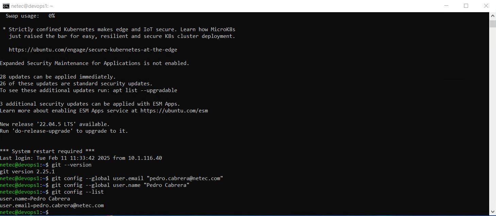

# GIT

## INSTALACIÓN Y CONFIGURACIÓN DE GIT

### OBJETIVOS

Al termino de este capítulo, serás capaz de:

- Al finalizar serás capaz de instalar y configurar Git para el control de versiones de archivos.

### DURACIÓN

Tiempo aproximado para esta actividad:

- 15 minutos.

### PRERREQUISITOS

Para esta actividad se requiere:

- Acceso a Internet.
- Acceso mediante SSH a un servidor Linux.

### INSTRUCCIONES

En esta actividad se descarga e instala *Git* en su equipo de trabajo.

#### VALIDACIÓN

En la actualidad, *Git* es una herramienta muy popular y se encuentra disponible en la mayoría de los sistemas operativos. Por lo que es común que ya esté instalado en tu sistema.

Puedes validar la instalación ejecutando el comando `git` (en una consola/terminal) que obtiene la versión instalada:

``` shell
git --version
```

La salida será similar a:

``` shell
git version 2.25.1
```

#### INSTALACIÓN

**En caso de no tener *Git* instalado en tu equipo**, sigue las instrucciones correspondientes a tu sistema operativo.

##### Ubuntu Linux

Para un sistema operativo basado en Linux se recomienda utilizar el gestor de paquetes de la distribución correspondiente.

Para los sistemas basados en *Debian* utiliza:

``` shell
sudo apt install git
```

En caso de requerirse ingrese `Y` cuando se lo solicite.

Con una salida semejante a:

``` shell
[sudo] password for usuario:
Reading package lists... Done
Building dependency tree... Done
Reading state information... Done
The following additional packages will be installed:
  git-man liberror-perl
Suggested packages:
  git-daemon-run | git-daemon-sysvinit git-doc git-email git-gui gitk gitweb git-cvs git-mediawiki git-svn
The following NEW packages will be installed:
  git git-man liberror-perl
0 upgraded, 3 newly installed, 0 to remove and 3 not upgraded.
Need to get 4 147 kB of archives.
After this operation, 21.0 MB of additional disk space will be used.
Do you want to continue? [Y/n] Y
Get:1 http://mx.archive.ubuntu.com/ubuntu jammy/main amd64 liberror-perl all 0.17029-1 [26.5 kB]
Get:2 http://mx.archive.ubuntu.com/ubuntu jammy-updates/main amd64 git-man all 1:2.34.1-1ubuntu1.10 [954 kB]
Get:3 http://mx.archive.ubuntu.com/ubuntu jammy-updates/main amd64 git amd64 1:2.34.1-1ubuntu1.10 [3 166 kB]
Fetched 4 147 kB in 10s (430 kB/s)
Selecting previously unselected package liberror-perl.
(Reading database ... 249038 files and directories currently installed.)
Preparing to unpack .../liberror-perl_0.17029-1_all.deb ...
Unpacking liberror-perl (0.17029-1) ...
Selecting previously unselected package git-man.
Preparing to unpack .../git-man_1%3a2.34.1-1ubuntu1.10_all.deb ...
Unpacking git-man (1:2.34.1-1ubuntu1.10) ...
Selecting previously unselected package git.
Preparing to unpack .../git_1%3a2.34.1-1ubuntu1.10_amd64.deb ...
Unpacking git (1:2.34.1-1ubuntu1.10) ...
Setting up liberror-perl (0.17029-1) ...
Setting up git-man (1:2.34.1-1ubuntu1.10) ...
Setting up git (1:2.34.1-1ubuntu1.10) ...
Processing triggers for man-db (2.10.2-1) ...
```

##### Windows

Para un sistema operativo basado en Windows, se puede descargar el instalador (correspondiente a su plataforma) desde la página oficial de *Git* en la siguiente dirección: <https://git-scm.com/download/win>

Una vez descargado el instalador, ejecútelo y siga las instrucciones del asistente de instalación.

- Durante la instalación, se recomienda seleccionar la opción de "Git Bash Here" para tener acceso a una terminal de *Git* desde el explorador de archivos.

###### winget

Si posee la herramienta `winget`, puede instalar *Git* ejecutando el siguiente comando:

``` shell
winget install --id Git.Git -e --source winget
```

##### macOS

Para un sistema operativo basado en macOS, se puede descargar el instalador desde la página oficial de *Git* en la siguiente dirección: <https://git-scm.com/download/mac>

Una vez descargado el instalador, ejecútelo y siga las instrucciones del asistente de instalación.

###### Homebrew

Si posee la herramienta `Homebrew`, puede instalar *Git* ejecutando el siguiente comando:

``` shell
brew install git
```

#### CONFIGURACIÓN INICIAL

Lo primero que se debe hacer es configurar el nombre de usuario y dirección de correo electrónico. Esto es importante debido a que cada confirmación (`commit`) de *Git* incorpora esta información en las confirmaciones.

En los siguientes comandos se proporciona el nombre y correo electrónico.

***DEBE INGRESAR SU INFORMACIÓN. LOS DATOS MOSTRADOS SON DE EJEMPLO.***

``` shell
git config --global user.name "Pedro Cabrera"
git config --global user.email "pedro.cabrera@netec.com"
```

Para verificar la configuración ejecuta el comando siguiente. El resultado mostrará los valores recién configurados.

``` shell
git config --list
```

La salida será similar a:

``` shell
user.name=Pedro Cabrera
user.email=pedro.cabrera@netec.com
```

### RESULTADO

Al finalizar esta actividad, serás capaz de instalar y configurar Git para el control de versiones de archivos.


