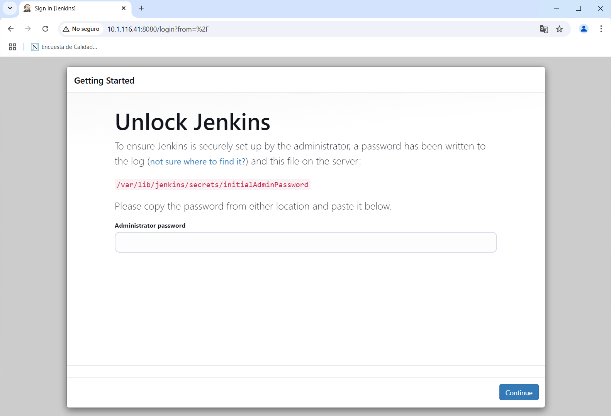
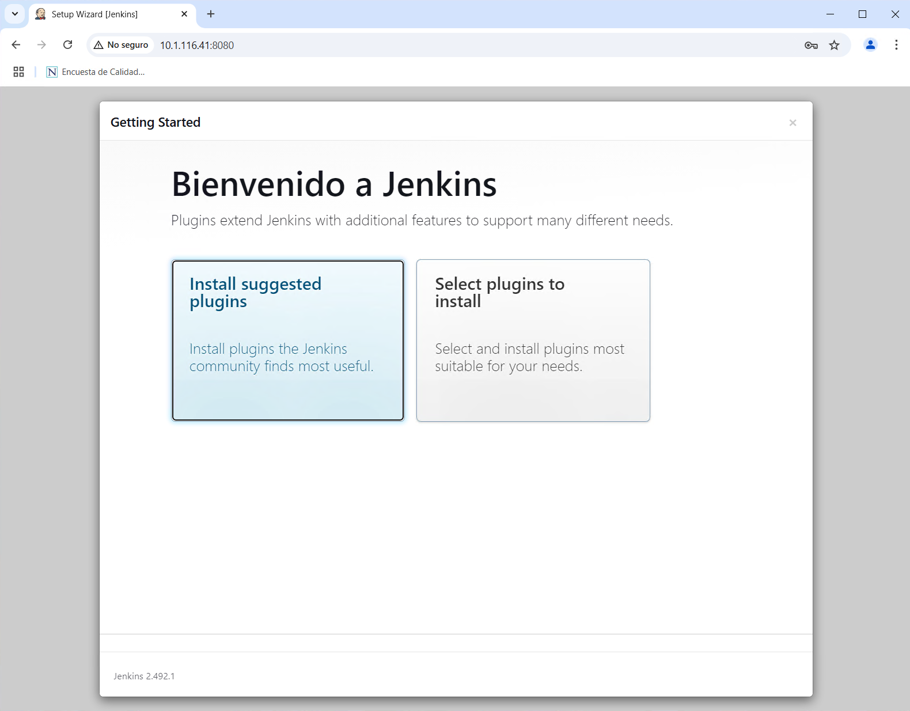
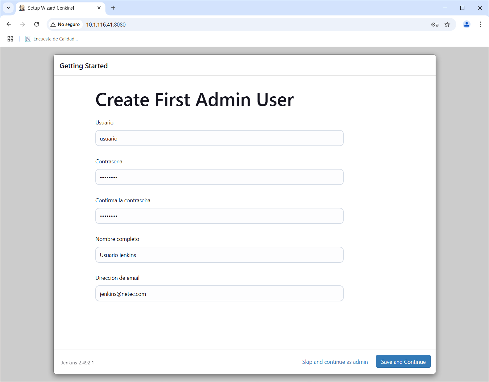
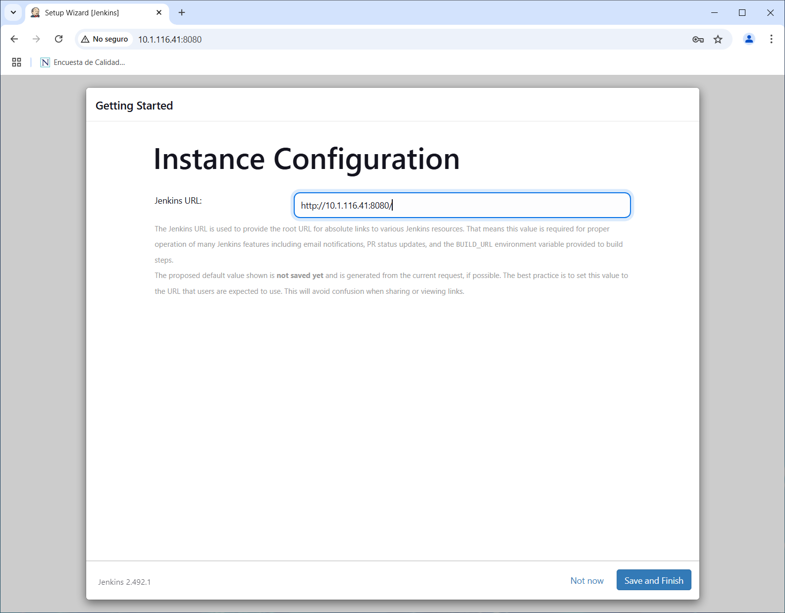
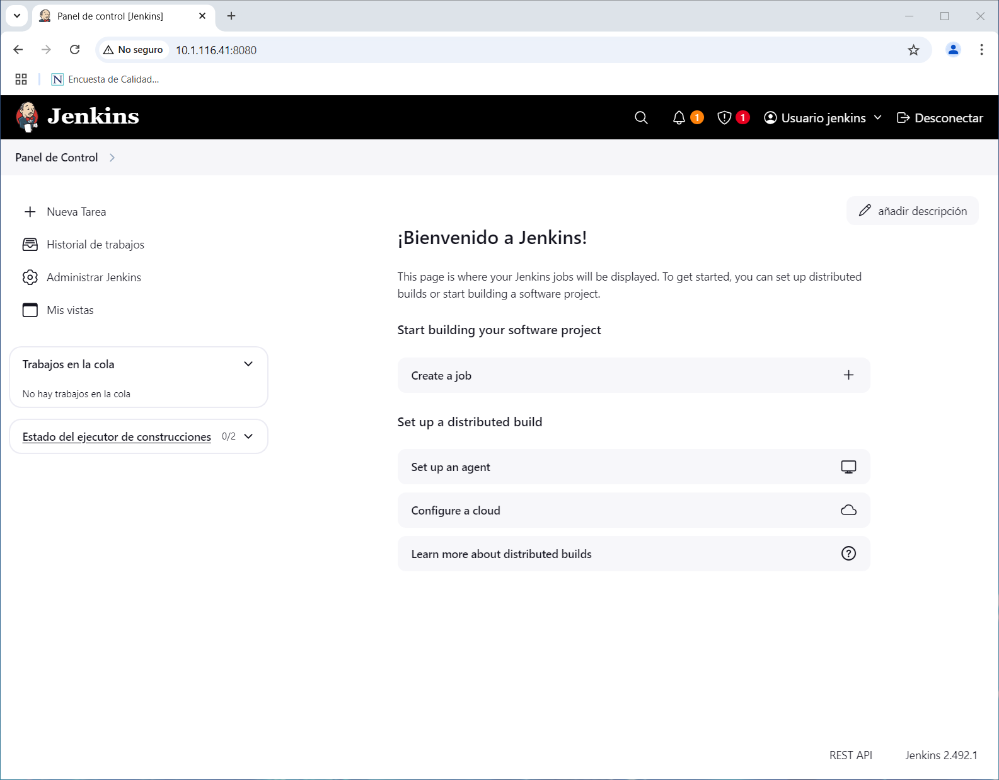

# JENKINS

## INSTALACIÓN Y CONFIGURACIÓN DE JENKINS

### OBJETIVOS

Al termino de este capítulo, serás capaz de:

- Al finalizar serás capaz de instalar y configurar Jenkins en sistemas basados en Linux Ubuntu.

### DURACIÓN

Tiempo aproximado para esta actividad:

- 20 minutos.

### PRERREQUISITOS

Para esta actividad se requiere:

- Acceso a Internet.
- Acceso mediante SSH a un servidor Linux.

### INSTRUCCIONES

En esta actividad se instalará y configurará Jenkins en un servidor Linux Ubuntu.

#### SOFTWARE

##### JAVA DEVELOPMENT KIT (JDK)

Para determinar si es necesaria la instalación, realiza lo indicado en la sección de **VALIDACIÓN** localizada más adelante.

De no resultar exitosa la validación procede a la instalación como se indica en la siguiente sección.

###### INSTALACIÓN

Para la actualización de los repositorios, ejecuta en una terminal de comandos lo siguiente:

``` shell
sudo apt update
```

La salida de la ejecución debe ser similar a:

``` shell
[sudo] password for netec:
Get:1 http://security.ubuntu.com/ubuntu focal-security InRelease [128 kB]
Hit:2 http://mx.archive.ubuntu.com/ubuntu focal InRelease
Get:3 http://mx.archive.ubuntu.com/ubuntu focal-updates InRelease [128 kB]
Get:4 http://mx.archive.ubuntu.com/ubuntu focal-backports InRelease [128 kB]
Fetched 383 kB in 2s (244 kB/s)
Reading package lists... Done
```

Para la instalación, ejecuta:

``` shell
sudo apt install openjdk-17-jdk openjdk-17-jre -y
```

- *Aceptar cualquier confirmación solicitada.*

La salida de la ejecución debe ser similar a:

``` shell
Reading package lists... Done
Building dependency tree
Reading state information... Done
The following additional packages will be installed:
  adwaita-icon-theme at-spi2-core ca-certificates-java fontconfig fontconfig-config fonts-dejavu-core fonts-dejavu-extra gtk-update-icon-cache hicolor-icon-theme
  humanity-icon-theme java-common libatk-bridge2.0-0 libatk-wrapper-java libatk-wrapper-java-jni libatk1.0-0 libatk1.0-data libatspi2.0-0 libavahi-client3
  libavahi-common-data libavahi-common3 libcairo-gobject2 libcairo2 libcups2 libdatrie1 libdrm-amdgpu1 libdrm-intel1 libdrm-nouveau2 libdrm-radeon1 libfontconfig1 libfontenc1
  libgail-common libgail18 libgdk-pixbuf2.0-0 libgdk-pixbuf2.0-bin libgdk-pixbuf2.0-common libgif7 libgl1 libgl1-mesa-dri libglapi-mesa libglvnd0 libglx-mesa0 libglx0
  libgraphite2-3 libgtk2.0-0 libgtk2.0-bin libgtk2.0-common libharfbuzz0b libice-dev libice6 libjbig0 libjpeg-turbo8 libjpeg8 liblcms2-2 libllvm12 libpango-1.0-0
  libpangocairo-1.0-0 libpangoft2-1.0-0 libpciaccess0 libpcsclite1 libpixman-1-0 libpthread-stubs0-dev librsvg2-2 librsvg2-common libsensors-config libsensors5 libsm-dev
  libsm6 libthai-data libthai0 libtiff5 libvulkan1 libwayland-client0 libwebp6 libx11-dev libx11-xcb1 libxau-dev libxaw7 libxcb-dri2-0 libxcb-dri3-0 libxcb-glx0
  libxcb-present0 libxcb-randr0 libxcb-render0 libxcb-shape0 libxcb-shm0 libxcb-sync1 libxcb-xfixes0 libxcb1-dev libxcomposite1 libxcursor1 libxdamage1 libxdmcp-dev
  libxfixes3 libxft2 libxi6 libxinerama1 libxkbfile1 libxmu6 libxpm4 libxrandr2 libxrender1 libxshmfence1 libxt-dev libxt6 libxtst6 libxv1 libxxf86dga1 libxxf86vm1
  mesa-vulkan-drivers openjdk-17-jdk-headless openjdk-17-jre-headless ubuntu-mono x11-common x11-utils x11proto-core-dev x11proto-dev xorg-sgml-doctools xtrans-dev
Suggested packages:
  default-jre cups-common gvfs libice-doc liblcms2-utils pcscd librsvg2-bin lm-sensors libsm-doc libx11-doc libxcb-doc libxt-doc openjdk-17-demo openjdk-17-source visualvm
  libnss-mdns fonts-ipafont-gothic fonts-ipafont-mincho fonts-wqy-microhei | fonts-wqy-zenhei fonts-indic mesa-utils
The following NEW packages will be installed:
  adwaita-icon-theme at-spi2-core ca-certificates-java fontconfig fontconfig-config fonts-dejavu-core fonts-dejavu-extra gtk-update-icon-cache hicolor-icon-theme
  humanity-icon-theme java-common libatk-bridge2.0-0 libatk-wrapper-java libatk-wrapper-java-jni libatk1.0-0 libatk1.0-data libatspi2.0-0 libavahi-client3
  libavahi-common-data libavahi-common3 libcairo-gobject2 libcairo2 libcups2 libdatrie1 libdrm-amdgpu1 libdrm-intel1 libdrm-nouveau2 libdrm-radeon1 libfontconfig1 libfontenc1
  libgail-common libgail18 libgdk-pixbuf2.0-0 libgdk-pixbuf2.0-bin libgdk-pixbuf2.0-common libgif7 libgl1 libgl1-mesa-dri libglapi-mesa libglvnd0 libglx-mesa0 libglx0
  libgraphite2-3 libgtk2.0-0 libgtk2.0-bin libgtk2.0-common libharfbuzz0b libice-dev libice6 libjbig0 libjpeg-turbo8 libjpeg8 liblcms2-2 libllvm12 libpango-1.0-0
  libpangocairo-1.0-0 libpangoft2-1.0-0 libpciaccess0 libpcsclite1 libpixman-1-0 libpthread-stubs0-dev librsvg2-2 librsvg2-common libsensors-config libsensors5 libsm-dev
  libsm6 libthai-data libthai0 libtiff5 libvulkan1 libwayland-client0 libwebp6 libx11-dev libx11-xcb1 libxau-dev libxaw7 libxcb-dri2-0 libxcb-dri3-0 libxcb-glx0
  libxcb-present0 libxcb-randr0 libxcb-render0 libxcb-shape0 libxcb-shm0 libxcb-sync1 libxcb-xfixes0 libxcb1-dev libxcomposite1 libxcursor1 libxdamage1 libxdmcp-dev
  libxfixes3 libxft2 libxi6 libxinerama1 libxkbfile1 libxmu6 libxpm4 libxrandr2 libxrender1 libxshmfence1 libxt-dev libxt6 libxtst6 libxv1 libxxf86dga1 libxxf86vm1
  mesa-vulkan-drivers openjdk-17-jdk openjdk-17-jdk-headless openjdk-17-jre openjdk-17-jre-headless ubuntu-mono x11-common x11-utils x11proto-core-dev x11proto-dev
  xorg-sgml-doctools xtrans-dev
0 upgraded, 120 newly installed, 0 to remove and 23 not upgraded.
Need to get 172 MB of archives.
...
```

###### VALIDACIÓN

Para validar la correcta instalación desde la línea de comandos ejecuta lo siguiente:

``` shell
javac --version
```

La salida de la ejecución debe ser similar a:

``` shell
javac 17.0.14
```

### INSTALACIÓN DE JENKINS

#### REPOSITORIOS

En esta guía de instalación se utiliza el gestor de paquetes `apt` de ubuntu, por lo que se necesita adicionar los repositorios oficiales de Jenkins.

Adicionar llaves:

``` shell
sudo wget -O /usr/share/keyrings/jenkins-keyring.asc https://pkg.jenkins.io/debian-stable/jenkins.io-2023.key
```

Con una salida similar a:

``` shell
--2025-02-11 17:19:23--  https://pkg.jenkins.io/debian-stable/jenkins.io-2023.key
Resolving pkg.jenkins.io (pkg.jenkins.io)... 151.101.114.133, 2a04:4e42:1b::645
Connecting to pkg.jenkins.io (pkg.jenkins.io)|151.101.114.133|:443... connected.
HTTP request sent, awaiting response... 200 OK
Length: 3175 (3.1K) [application/pgp-keys]
Saving to: ‘/usr/share/keyrings/jenkins-keyring.asc’

/usr/share/keyrings/jenkins-keyring.asc     100%[===========================================================================================>]   3.10K  --.-KB/s    in 0s

2025-02-11 17:19:23 (13.6 MB/s) - ‘/usr/share/keyrings/jenkins-keyring.asc’ saved [3175/3175]
```

Adicionar repositorio:

``` shell
echo deb [signed-by=/usr/share/keyrings/jenkins-keyring.asc] https://pkg.jenkins.io/debian-stable binary/ | sudo tee /etc/apt/sources.list.d/jenkins.list > /dev/null
```

Sí los comandos anteriores se ejecutan exitosamente **no muestran salida en la consola**.

``` shell
sudo apt update
```

Con una salida similar a:

``` shell
Hit:1 http://mx.archive.ubuntu.com/ubuntu focal InRelease
Hit:2 http://mx.archive.ubuntu.com/ubuntu focal-updates InRelease
Ign:3 https://pkg.jenkins.io/debian-stable binary/ InRelease
Get:4 https://pkg.jenkins.io/debian-stable binary/ Release [2,044 B]
Hit:5 http://mx.archive.ubuntu.com/ubuntu focal-backports InRelease
Hit:6 http://security.ubuntu.com/ubuntu focal-security InRelease
Get:7 https://pkg.jenkins.io/debian-stable binary/ Release.gpg [833 B]
Get:8 https://pkg.jenkins.io/debian-stable binary/ Packages [28.5 kB]
Fetched 31.4 kB in 2s (20.0 kB/s)
Reading package lists... Done
Building dependency tree
Reading state information... Done
23 packages can be upgraded. Run 'apt list --upgradable' to see them.
```

#### PAQUETES

Para instalar Jenkins en sistemas basados en Linux Ubuntu, se necesita adicionar los repositorios oficiales de Jenkins. Los que ya se han adicionado en el paso anterior.

Ahora el comando que solicita la instalación de `Jenkins`.

- *De solicitar alguna confirmación, indica `Y`.*

``` shell
sudo apt install jenkins -y
```

Con una salida similar a:

``` shell
Reading package lists... Done
Building dependency tree
Reading state information... Done
The following NEW packages will be installed:
  jenkins
0 upgraded, 1 newly installed, 0 to remove and 23 not upgraded.
Need to get 94.8 MB of archives.
After this operation, 96.8 MB of additional disk space will be used.
Get:1 https://pkg.jenkins.io/debian-stable binary/ jenkins 2.492.1 [94.8 MB]
Fetched 94.8 MB in 7s (14.2 MB/s)
Selecting previously unselected package jenkins.
(Reading database ... 140147 files and directories currently installed.)
Preparing to unpack .../jenkins_2.492.1_all.deb ...
Unpacking jenkins (2.492.1) ...
Setting up jenkins (2.492.1) ...
Created symlink /etc/systemd/system/multi-user.target.wants/jenkins.service → /lib/systemd/system/jenkins.service.
Processing triggers for systemd (245.4-4ubuntu3.24) ...
```

#### CONFIGURACIÓN INICIAL

Para completar la instalación se requiere realizar los siguientes pasos:

- En un navegador de internet abre el enlace: [http://10.1.116.41:8080](http://10.1.116.41:8080/)

- Reemplaza `10.1.116.41` por la dirección IP del servidor donde se instaló Jenkins.



- Para recuperar la contraseña inicial copia el resultado de ejecutar el comando:

``` shell
sudo cat /var/lib/jenkins/secrets/initialAdminPassword
#salida: 13e9c243f4134b1e8055e4feb875a3b5
```

- Ingresa la contraseña y da clic en continuar.

- A continuación, selecciona la opción de **Install suggested plugins** y espera un momento hasta que culmine la instalación.



- Ahora, ingrese los siguientes datos en la pantalla de creación de usuario administrador
- Nombre de usuario: `usuario`
- Contraseña: `Usu_2012`
- Confirmación de contraseña: `Usu_2012`
- Nombre completo: `Usuario Jenkins`
- Correo electrónico: `jenkins@netec.com`

De clic en `Save and Continue`



- En la siguiente pantalla se muestra la dirección en la que Jenkins estará funcionando.
- De manera predeterminada es: <http://10.1.116.41:8080>
- La dirección será diferente si se instaló en cada servidor.



- En la última pantalla da clic en el botón: **Start using Jenkins**

#### PROCESO

**Estos pasos son informativos. En el entorno de laboratorios no es requerido realizarlos.**

Para comprobar la configuración y el estado de Jenkins ejecuta:

``` shell
sudo systemctl status jenkins
```

Produce una salida similar a:

``` shell
● jenkins.service - Jenkins Continuous Integration Server
     Loaded: loaded (/lib/systemd/system/jenkins.service; enabled; vendor preset: enabled)
     Active: active (running) since Tue 2025-02-11 17:24:51 CST; 20min ago
   Main PID: 175009 (java)
      Tasks: 47 (limit: 11829)
     Memory: 1.0G
     CGroup: /system.slice/jenkins.service
             └─175009 /usr/bin/java -Djava.awt.headless=true -jar /usr/share/java/jenkins.war --webroot=/var/cache/jenkins/war --httpPort=8080

Feb 11 17:35:00 devops1 jenkins[175009]: 2025-02-11 23:35:00.128+0000 [id=241]        INFO        jenkins.InitReactorRunner$1#onAttained: Listed all plugins
Feb 11 17:35:00 devops1 jenkins[175009]: 2025-02-11 23:35:00.128+0000 [id=241]        INFO        jenkins.InitReactorRunner$1#onAttained: Prepared all plugins
Feb 11 17:35:00 devops1 jenkins[175009]: 2025-02-11 23:35:00.152+0000 [id=238]        INFO        jenkins.InitReactorRunner$1#onAttained: Started all plugins
Feb 11 17:35:00 devops1 jenkins[175009]: 2025-02-11 23:35:00.155+0000 [id=238]        INFO        jenkins.InitReactorRunner$1#onAttained: Augmented all extensions
Feb 11 17:35:00 devops1 jenkins[175009]: 2025-02-11 23:35:00.168+0000 [id=244]        INFO        jenkins.InitReactorRunner$1#onAttained: System config loaded
Feb 11 17:35:00 devops1 jenkins[175009]: 2025-02-11 23:35:00.169+0000 [id=244]        INFO        jenkins.InitReactorRunner$1#onAttained: System config adapted
Feb 11 17:35:00 devops1 jenkins[175009]: 2025-02-11 23:35:00.334+0000 [id=244]        INFO        jenkins.InitReactorRunner$1#onAttained: Loaded all jobs
Feb 11 17:35:00 devops1 jenkins[175009]: 2025-02-11 23:35:00.335+0000 [id=243]        INFO        jenkins.InitReactorRunner$1#onAttained: Configuration for all jobs updated
Feb 11 17:35:00 devops1 jenkins[175009]: 2025-02-11 23:35:00.810+0000 [id=239]        INFO        jenkins.InitReactorRunner$1#onAttained: Completed initialization
Feb 11 17:35:00 devops1 jenkins[175009]: 2025-02-11 23:35:00.813+0000 [id=87]        INFO        h.m.UpdateCenter$CompleteBatchJob#run: Completed installation of 88 plugins in>
lines 1-19/19 (END)
```

##### INICIAR

Para iniciar **Jenkins** se debe ejecutar:

``` shell
sudo systemctl start jenkins
```

##### DETENER

Para detener **Jenkins** se debe ejecutar:

``` shell
sudo systemctl stop jenkins
```

##### DESACTIVAR

Para que Jenkins no se inicie con el equipo se debe ejecutar:

``` shell
sudo systemctl disable jenkins
```

#### JENKINS HOME

Para validar la correcta instalación de Jenkins se debe abrir el enlace <http://10.1.116.41:8080> en un navegador web, ingresar con los datos de usuario:

- Nombre de usuario: `usuario`
- Contraseña: `Usu_2012`

## RESULTADO

Al finalizar esta actividad, serás capaz de instalar y configurar Jenkins en sistemas basados en Linux Ubuntu.


