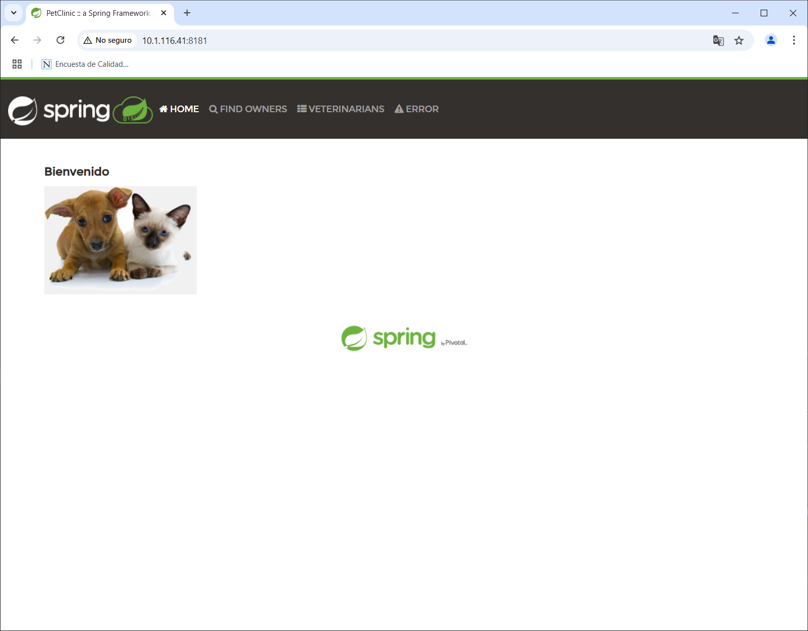
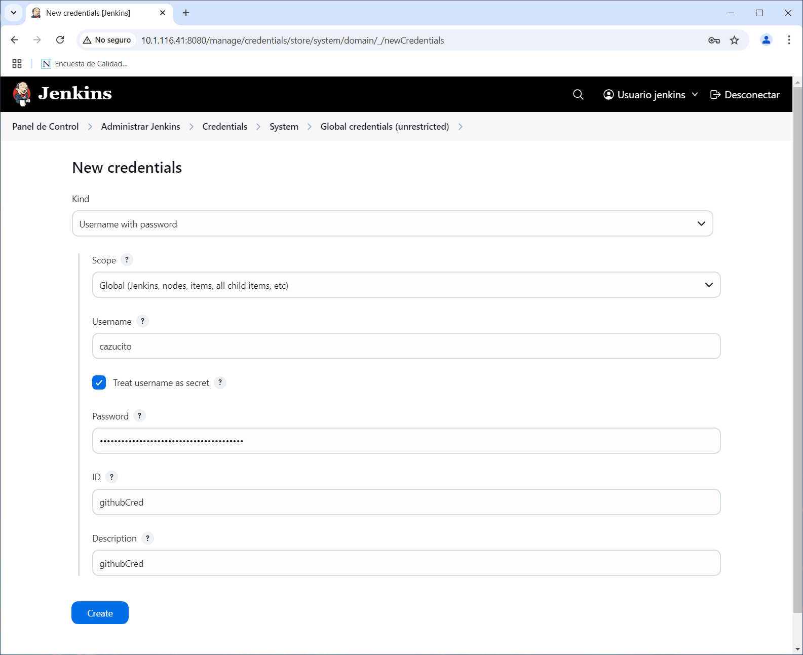

# JENKINS / FREE STYLE JOB & GITHUB

## OBJETIVOS

Al termino de este capítulo, serás capaz de:

- Al finalizar serás capaz crear y ejecutar un Free Style Job en Jenkins que se integre con un repositorio de GitHub.

## DURACIÓN

Tiempo aproximado para esta actividad:

- 55 minutos.

## PRERREQUISITOS

Para esta actividad se requiere:

- Acceso a Internet.
- Acceso mediante SSH a un servidor Linux.
- Actividad anterior completada.

## INSTRUCCIONES

En esta actividad se instalará y configurará Jenkins en un servidor Linux Ubuntu.

## PASOS PREVIOS

### JAVA DEVELOPMENT KIT (JDK)

Para validar la correcta instalación desde la línea de comandos ejecuta lo siguiente:

``` shell
javac --version
```

La salida de la ejecución debe ser similar a:

``` shell
javac 17.0.14
```

### APACHE MAVEN

Para determinar si es necesaria la instalación, realiza lo indicado en la sección de **VALIDACIÓN** localizada más adelante.

De no resultar exitosa la validación procede a la instalación como se indica en la siguiente sección.

#### INSTALACIÓN

Para la actualización de los repositorios, ejecuta en una terminal de comandos lo siguiente:

``` shell
sudo apt update
```

La salida de la ejecución debe ser similar a:

``` shell
[sudo] password for netec:
Get:1 http://security.ubuntu.com/ubuntu focal-security InRelease [128 kB]
Ign:2 https://pkg.jenkins.io/debian-stable binary/ InRelease
Hit:3 https://pkg.jenkins.io/debian-stable binary/ Release
Hit:4 http://mx.archive.ubuntu.com/ubuntu focal InRelease
Get:6 http://mx.archive.ubuntu.com/ubuntu focal-updates InRelease [128 kB]
Get:7 http://mx.archive.ubuntu.com/ubuntu focal-backports InRelease [128 kB]
Fetched 383 kB in 2s (255 kB/s)
Reading package lists... Done
Building dependency tree
Reading state information... Done
23 packages can be upgraded. Run 'apt list --upgradable' to see them.
```

Para la instalación, ejecuta:

``` shell
sudo apt install maven -y
```

- *Aceptar cualquier confirmación solicitada.*

La salida de la ejecución debe ser similar a:

``` shell
Reading package lists... Done
Building dependency tree
Reading state information... Done
The following additional packages will be installed:
  libaopalliance-java libapache-pom-java libatinject-jsr330-api-java libcdi-api-java libcommons-cli-java libcommons-io-java libcommons-lang3-java libcommons-parent-java
  libgeronimo-annotation-1.3-spec-java libgeronimo-interceptor-3.0-spec-java libguava-java libguice-java libhawtjni-runtime-java libjansi-java libjansi-native-java
  libjsr305-java libmaven-parent-java libmaven-resolver-java libmaven-shared-utils-java libmaven3-core-java libplexus-cipher-java libplexus-classworlds-java
  libplexus-component-annotations-java libplexus-interpolation-java libplexus-sec-dispatcher-java libplexus-utils2-java libsisu-inject-java libsisu-plexus-java libslf4j-java
  libwagon-file-java libwagon-http-shaded-java libwagon-provider-api-java
Suggested packages:
  libaopalliance-java-doc libatinject-jsr330-api-java-doc libservlet3.1-java libcommons-io-java-doc libcommons-lang3-java-doc libasm-java libcglib-java libjsr305-java-doc
  libmaven-shared-utils-java-doc liblogback-java libplexus-cipher-java-doc libplexus-classworlds-java-doc libplexus-sec-dispatcher-java-doc libplexus-utils2-java-doc junit4
  testng libcommons-logging-java liblog4j1.2-java
The following NEW packages will be installed:
  libaopalliance-java libapache-pom-java libatinject-jsr330-api-java libcdi-api-java libcommons-cli-java libcommons-io-java libcommons-lang3-java libcommons-parent-java
  libgeronimo-annotation-1.3-spec-java libgeronimo-interceptor-3.0-spec-java libguava-java libguice-java libhawtjni-runtime-java libjansi-java libjansi-native-java
  libjsr305-java libmaven-parent-java libmaven-resolver-java libmaven-shared-utils-java libmaven3-core-java libplexus-cipher-java libplexus-classworlds-java
  libplexus-component-annotations-java libplexus-interpolation-java libplexus-sec-dispatcher-java libplexus-utils2-java libsisu-inject-java libsisu-plexus-java libslf4j-java
  libwagon-file-java libwagon-http-shaded-java libwagon-provider-api-java maven
0 upgraded, 33 newly installed, 0 to remove and 23 not upgraded.
Need to get 9,657 kB of archives.
After this operation, 12.6 MB of additional disk space will be used.
...
Setting up libmaven3-core-java (3.6.3-1ubuntu0.1) ...
Setting up maven (3.6.3-1ubuntu0.1) ...
update-alternatives: using /usr/share/maven/bin/mvn to provide /usr/bin/mvn (mvn) in auto mode
```

#### VALIDACIÓN

Para validar la correcta instalación desde la línea de comandos ejecuta lo siguiente:

``` shell
mvn --version
```

La salida de la ejecución debe ser similar a:

``` shell
Apache Maven 3.6.3
Maven home: /usr/share/maven
Java version: 17.0.14, vendor: Ubuntu, runtime: /usr/lib/jvm/java-17-openjdk-amd64
Default locale: en_US, platform encoding: UTF-8
OS name: "linux", version: "5.4.0-204-generic", arch: "amd64", family: "unix"
```

### REPOSITORIO DE CÓDIGO FUENTE

Para la realización de esta actividad es necesario contar con un repositorio de código fuente en GitHub.

En este paso se clona, analiza y ejecuta el código fuente de la aplicación `spring-petclinic` con el fin de tener una mejor comprensión de la estructura, funcionamiento de la aplicación y la forma en que se despliega.

#### CLONACIÓN DEL REPOSITORIO

Para clonar el repositorio ejecuta:

``` shell
git clone https://github.com/Netec-Mx/DevOps_Tools.git
```

La salida de la ejecución debe ser similar a:

``` shell
Cloning into 'DevOps_Tools'...
remote: Enumerating objects: 301, done.
remote: Counting objects: 100% (216/216), done.
remote: Compressing objects: 100% (160/160), done.
remote: Total 301 (delta 46), reused 207 (delta 39), pack-reused 85 (from 1)
Receiving objects: 100% (301/301), 49.67 MiB | 14.01 MiB/s, done.
Resolving deltas: 100% (68/68), done.
```

Cámbiate al directorio del repositorio clonado con el comando `cd DevOps_Tools`.

Dentro de la carpeta `DevOps_Tools` posicionate en la rama de la actividad ejecutando:

``` shell
git switch labs/spring-petclinic
```

La salida de la ejecución debe ser similar a:

``` shell
Branch 'labs/spring-petclinic' set up to track remote branch 'labs/spring-petclinic' from 'origin'.
Switched to a new branch 'labs/spring-petclinic'
```

#### ANÁLISIS DEL CÓDIGO FUENTE

Utilizando algún editor de texto o IDE de tu preferencia, analiza el proyecto `spring-petclinic`. Revisa la estructura de directorios, archivos, dependencias, configuraciones y código fuente.


#### EJECUCIÓN DE LA APLICACIÓN

Después de analizar el proyecto `spring-petclinic`, ejecuta la aplicación con el siguiente comando:

``` shell
mvn spring-boot:run
```

- La primera vez que se ejecute la aplicación, Maven descargará las dependencias necesarias para compilar y ejecutar la aplicación. Por lo que el proceso puede tardar varios minutos.

La salida de la ejecución debe ser similar a:

``` shell
[INFO] Scanning for projects...
...

              |\      _,,,--,,_
             /,`.-'`'   ._  \-;;,_
  _______ __|,4-  ) )_   .;.(__`'-'__     ___ __    _ ___ _______
 |       | '---''(_/._)-'(_\_)   |   |   |   |  |  | |   |       |
 |    _  |    ___|_     _|       |   |   |   |   |_| |   |       | __ _ _
 |   |_| |   |___  |   | |       |   |   |   |       |   |       | \ \ \ \
 |    ___|    ___| |   | |      _|   |___|   |  _    |   |      _|  \ \ \ \
 |   |   |   |___  |   | |     |_|       |   | | |   |   |     |_    ) ) ) )
 |___|   |_______| |___| |_______|_______|___|_|  |__|___|_______|  / / / /
 ==================================================================/_/_/_/

:: Built with Spring Boot :: 2.7.3


2025-02-11 18:58:15.802  INFO 182469 --- [  restartedMain] o.s.s.petclinic.PetClinicApplication     : Starting PetClinicApplication using Java 17.0.14 on devops1 with PID 182469 (/home/netec/jenkins/DevOps_Tools/target/classes started by netec in /home/netec/jenkins/DevOps_Tools)
...
2025-02-11 18:58:23.687  INFO 182469 --- [  restartedMain] o.s.b.a.e.web.EndpointLinksResolver      : Exposing 13 endpoint(s) beneath base path '/actuator'
2025-02-11 18:58:23.790  INFO 182469 --- [  restartedMain] o.s.b.w.embedded.tomcat.TomcatWebServer  : Tomcat started on port(s): 8181 (http) with context path ''
2025-02-11 18:58:23.826  INFO 182469 --- [  restartedMain] o.s.s.petclinic.PetClinicApplication     : Started PetClinicApplication in 8.606 seconds (JVM running for 9.4)
2025-02-11 18:58:51.987  INFO 182469 --- [nio-8181-exec-1] o.a.c.c.C.[Tomcat].[localhost].[/]       : Initializing Spring DispatcherServlet 'dispatcherServlet'
2025-02-11 18:58:51.988  INFO 182469 --- [nio-8181-exec-1] o.s.web.servlet.DispatcherServlet        : Initializing Servlet 'dispatcherServlet'
2025-02-11 18:58:51.991  INFO 182469 --- [nio-8181-exec-1] o.s.web.servlet.DispatcherServlet        : Completed initialization in 2 ms
...
```

Para acceder a la aplicación, abre un navegador de internet y escribe la dirección: `http://10.1.116.41:8181`.

- Reemplaza la dirección IP `10.1.116.41:8181` por la dirección IP del servidor donde se ejecuta la aplicación.



Dedica unos minutos a explorar la aplicación y familiarizarte con su funcionamiento.

#### DETENCIÓN DE LA APLICACIÓN

Para detener la aplicación presiona `Ctrl + C` en la terminal donde se ejecutó la aplicación.

## FREE STYLE JOB & GITHUB

En esta actividad, crearás un Free Style Job en Jenkins que se integre con un repositorio de GitHub para la descarga y construcción del código fuente de la aplicación Spring Petclinic.

### CONFIGURACIÓN

#### GitHub

Para la creación del *job* se requiere que *Jenkins* interactúe con *GitHub* por lo que necesitamos crear un *Personal access token* en el siguiente enlace: <https://github.com/settings/tokens>

En la pantalla mostrada se debe dar clic en el botón `Generate new token` y seleccionar de la lista de opciones la nombrada con `Generate new token (classic)`.

Ingresa las siguientes opciones:

- Note: `ghToken2Jenkins`
- Expiration: `30 días`
- Select scopes: `Selecciona todas las opciones`
  - NOTA: *Por simplicidad se seleccionan todos los permisos, en el día a día no es común hacer esto.*


Con esas opciones dar clic en el botón `Generate token`.


- **Guarda el token en un lugar seguro ya que no se mostrará nuevamente.**

#### Jenkins

Para que Jenkins pueda construir el `jar` de la aplicación Spring Petclinic, necesita tener acceso a las herramientas Java y Maven. Para ello, es necesario configurar las herramientas de Jenkins.

##### Java Development Kit (JDK) y Apache Maven

En la ventana de configuración de herramientas globales (<http://10.1.116.41:8080/manage/configureTools/>) realizar la siguiente configuración:

- JDK installations (Add JDK)
  - Name: `default`
  - JAVA_HOME: `/usr/lib/jvm/java-17-openjdk-amd64`
- Maven installations (Add Maven)
  - Name: `default`
  - MAVEN_HOME: `/usr/share/maven`


##### Credenciales

Como se trabajará con un repositorio en *GitHub* se debe crear una credencial para que *Jenkins* pueda acceder.

De cic en el botón `Add Credentials` en la siguiente pantalla en *Jenkins*: <http://10.1.116.41:8080/manage/credentials/store/system/domain/_/>


- Kind: `Username with password`
  - Username: `cazucito` (SU NOMBRE DE USUARIO EN GITHUB)
  - Treat username as secret: `Seleccionado`
  - Secret: `PEGAR EL TOKEN DE PASO ANTERIOR`
  - ID: `githubCred`
  - Description: `githubCred`
  - Clic en el botón `Create`



Ahora puede verse la credencial recién creada.


### FREE STYLE JOB

Para la creación del *job* se debe realizar lo siguiente:

1.  En el *Dashboard* de *Jenkins* dar clic en el botón `New Item`.
2.  Ingresar el nombre del *job* como `SpringPetclinic` y seleccionar la opción `Freestyle project`.
3.  Dar clic en el botón `OK`.


En la pantalla de configuración del *job* realizar lo siguiente:

- **General**
  - Description: `Descarga y construcción del código fuente de la aplicación Spring Petclinic.`
- **Source Code Management**
  - Repository URL: `https://github.com/Netec-Mx/DevOps_Tools.git`
  - Credentials: `githubCred`
  - Branches to build: `labs/spring-petclinic`
- **Build**
  - Add build step: `Invoke top-level Maven targets`
    - Goals: `clean package`
- **Post-build Actions**
  - Add post-build action: `Archive the artifacts`
    - Files to archive: `target/*.jar`
- **Save**
  - Clic en el botón `Save`


Al finalizar la configuración se puede observar la pantalla principal del *job*.


### EJECUCIÓN DEL JOB

Desde la página principal del job recién creado da clic en la opción Build now y observa el resultado.


<div class="note">
La primera ocasión que se ejecuta este job descarga en el repositorio local de Maven todas las dependencias requeridas, por lo que puede tardar un poco.
</div>

Al revisar la consola de salida del job, se puede observar el proceso de descarga y construcción del código fuente de la aplicación Spring Petclinic.

``` shell
Started by user Usuario jenkins
Running as SYSTEM
Building in workspace /var/lib/jenkins/workspace/SpringPetclinic
The recommended git tool is: NONE
using credential githubCred
Cloning the remote Git repository
Cloning repository https://github.com/Netec-Mx/DevOps_Tools.git
 > git init /var/lib/jenkins/workspace/SpringPetclinic # timeout=10
Fetching upstream changes from https://github.com/Netec-Mx/DevOps_Tools.git
 > git --version # timeout=10
 > git --version # 'git version 2.25.1'
using GIT_ASKPASS to set credentials githubCred
 > git fetch --tags --force --progress -- https://github.com/Netec-Mx/DevOps_Tools.git +refs/heads/*:refs/remotes/origin/* # timeout=10
 > git config remote.origin.url https://github.com/Netec-Mx/DevOps_Tools.git # timeout=10
 > git config --add remote.origin.fetch +refs/heads/*:refs/remotes/origin/* # timeout=10
Avoid second fetch
 > git rev-parse refs/remotes/origin/labs/spring-petclinic^{commit} # timeout=10
 > git rev-parse labs/spring-petclinic^{commit} # timeout=10
Checking out Revision 5b0cfe8d95a56e5d361e26769ae425ecb0b3cb87 (refs/remotes/origin/labs/spring-petclinic)
 > git config core.sparsecheckout # timeout=10
 > git checkout -f 5b0cfe8d95a56e5d361e26769ae425ecb0b3cb87 # timeout=10
Commit message: "Initial commit"
First time build. Skipping changelog.
[SpringPetclinic] $ /usr/share/maven/bin/mvn clean package
[INFO] Scanning for projects...

...

[INFO]Building jar: /var/lib/jenkins/workspace/SpringPetclinic/target/spring-petclinic-2.7.3.jar
[INFO]
[INFO] ---  spring-boot-maven-plugin:2.7.3:repackage   (repackage)  @ spring-petclinic ---
[INFO]Replacing main artifact with repackaged archive
[INFO] ------------------------------------------------------------------------
[INFO] BUILD SUCCESS
[INFO] ------------------------------------------------------------------------
[INFO]Total time:  18:13 min
[INFO]Finished at: 2025-02-11T20:14:41-06:00
[INFO] ------------------------------------------------------------------------
Archiving artifacts
Finished: SUCCESS
```

### ARTEFACTOS

Al finalizar la ejecución del *job* se puede observar el archivo `spring-petclinic-2.7.3.jar` en la sección `Last Successful Artifacts`.


Con esto se ha completado la creación de un *Free Style Job* en *Jenkins* que se integra con un repositorio de *GitHub* para la descarga y construcción del código fuente de la aplicación Spring Petclinic.

### SIGUIENTES PASOS

Ya con el artefacto generado, el siguiente paso es desplegar la aplicación, para lo cual existen diversas opciones, entre ellas:

- Despliegue manual en un servidor de aplicaciones.

- Despliegue con Ansible (Como se mostró en una actividad anterior).

- Despliegue en un contenedor Docker.

- Despliegue en un servicio de Kubernetes.

- Despliegue en un servicio de AWS, Azure, Google Cloud, etc.

Se ira extendiendo la funcionalidad en actividades posteriores.

## RESULTADO

Al finalizar esta actividad, serás capaz de crear y ejecutar un Free Style Job en Jenkins que se integre con un repositorio de GitHub.


