# JENKINS | GITHUB WEBHOOK

## OBJETIVOS

Al termino de este capítulo, serás capaz de:

- Al finalizar serás capaz crear y ejecutar un proyecto en Jenkins que escuche \_webhooks\_ de GitHub.

## DURACIÓN

Tiempo aproximado para esta actividad:

- 20 minutos.

## PRERREQUISITOS

Para esta actividad se requiere:

- Acceso a Internet.
- Acceso mediante SSH a un servidor Linux.
- Actividades anteriores del capítulo completadas.

## INSTRUCCIONES

En este paso se bifurcará el repositorio de GitHub utilizado para notificar a Jenkins cuando se realicen cambios en el código fuente.

### FLUJO DE BIFURCACIÓN

#### Bifurcación de Repositorio

Realiza una bifurcación del repositorio localizado en GitHub <https://github.com/Netec-Mx/DevOps_Tools>.

Haga clic en el botón **Fork** ubicado en la zona de la esquina superior derecha como se muestra a continuación:

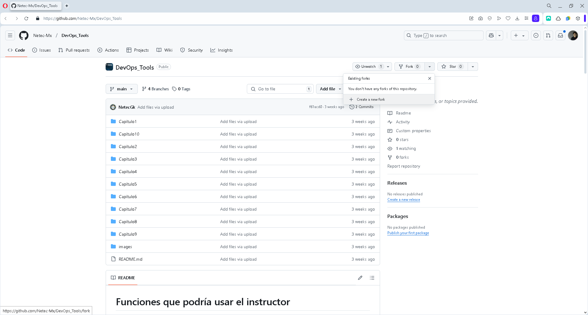

En la ventana, después de llenar con la información que se muestra, da clic en `Create Fork`:

- Repository name: `DevOps_Tools_cazucito`
  - Donde el nombre se construye con la cadena "NOMBRE-ACTUAL-DEL-REPOSITORIO" y "\_TU-NOMBRE-DE-USUARIO"
- **Copy the main branch only: `SIN SELECCIONAR`**

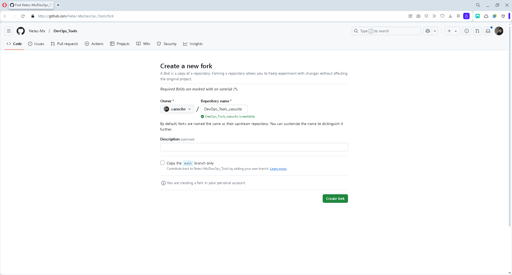

#### Clonado del Repositorio

Para tener una copia local de trabajo, clona el repositorio recién creado por la bifurcación. La dirección de clonado puede localizarse en el botón `Code` de la pantalla inicial del repositorio.

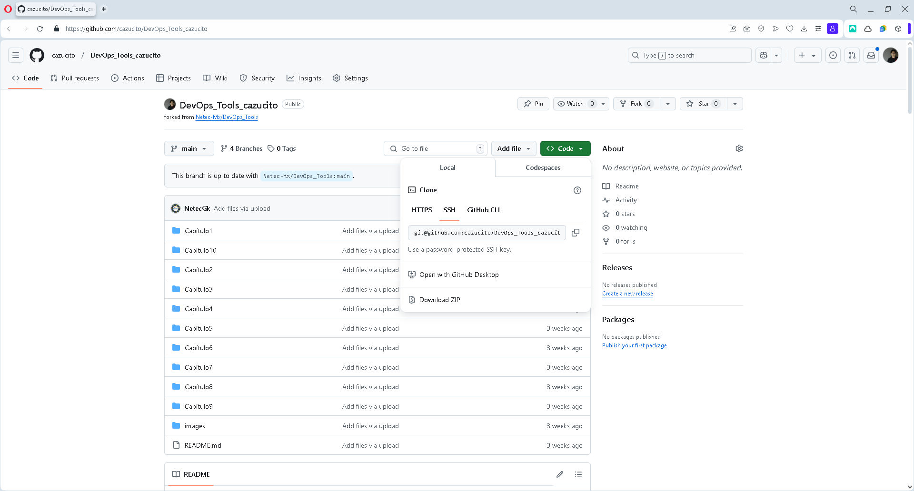

- Tu dirección debe ser similar a: `git@github.com:cazucito/DevOps_Tools_cazucito.git`

Ejecuta el siguiente comando (en tu carpeta de trabajo) para crear la copia local del repositorio de trabajo.

``` shell
git clone git@github.com:cazucito/DevOps_Tools_cazucito.git
```

- **Recuerda sustituir la dirección de tu repositorio.**

La salida debe ser similar a:

``` shell
Cloning into 'DevOps_Tools_cazucito'...
Warning: Permanently added the ECDSA host key for IP address '140.82.114.4' to the list of known hosts.
remote: Enumerating objects: 301, done.
remote: Counting objects: 100% (216/216), done.
remote: Compressing objects: 100% (160/160), done.
remote: Total 301 (delta 46), reused 207 (delta 39), pack-reused 85 (from 1)
Receiving objects: 100% (301/301), 49.67 MiB | 19.71 MiB/s, done.
Resolving deltas: 100% (68/68), done.
```

##### Ramas de Trabajo

En la carpeta del repositorio recién clonado ubícate en la rama de trabajo: `labs/spring-petclinic`.

``` shell
git switch labs/spring-petclinic
```

La salida debe ser similar a:

``` shell
Branch 'labs/spring-petclinic' set up to track remote branch 'labs/spring-petclinic' from 'origin'.
Switched to a new branch 'labs/spring-petclinic'
```

Creando una nueva rama de trabajo, se asegura que los cambios realizados no afecten la rama principal.

``` shell
git checkout -b labs/spring-petclinic_cazucito
```

Recuerda que el sufijo `_cazucito` debe ser sustituido por el nombre de tu usuario en GitHub.

La salida debe ser similar a:

``` shell
Switched to a new branch 'labs/spring-petclinic_cazucito'
```

#### Análisis del Proyecto

Ya en la rama del proyecto, analiza el contenido del directorio.

- Para esto puede abrir el proyecto en VSCode.

##### Ejecución de Pruebas Unitarias

Para ejecutar las pruebas unitarias (estando ubicado en la carpeta principal del proyecto), necesitas ejecutar el comando siguiente:

``` shell
mvn test
```

La salida debe ser similar a:

``` shell
...

              |\      _,,,--,,_
             /,`.-'`'   ._  \-;;,_
  _______ __|,4-  ) )_   .;.(__`'-'__     ___ __    _ ___ _______
 |       | '---''(_/._)-'(_\_)   |   |   |   |  |  | |   |       |
 |    _  |    ___|_     _|       |   |   |   |   |_| |   |       | __ _ _
 |   |_| |   |___  |   | |       |   |   |   |       |   |       | \ \ \ \
 |    ___|    ___| |   | |      _|   |___|   |  _    |   |      _|  \ \ \ \
 |   |   |   |___  |   | |     |_|       |   | | |   |   |     |_    ) ) ) )
 |___|   |_______| |___| |_______|_______|___|_|  |__|___|_______|  / / / /
 ==================================================================/_/_/_/

:: Built with Spring Boot :: 2.7.3


2025-02-12 12:24:36.305  INFO 214702 --- [           main] o.s.s.p.owner.VisitControllerTests       : Starting VisitControllerTests using Java 17.0.14 on devops1 with PID 214702 (started by netec in /home/netec/jenkins/DevOps_Tools_cazucito)
2025-02-12 12:24:36.306  INFO 214702 --- [           main] o.s.s.p.owner.VisitControllerTests       : No active profile set, falling back to 1 default profile: "default"
2025-02-12 12:24:37.336  INFO 214702 --- [           main] o.s.b.t.m.w.SpringBootMockServletContext : Initializing Spring TestDispatcherServlet ''
2025-02-12 12:24:37.337  INFO 214702 --- [           main] o.s.t.web.servlet.TestDispatcherServlet  : Initializing Servlet ''
2025-02-12 12:24:37.338  INFO 214702 --- [           main] o.s.t.web.servlet.TestDispatcherServlet  : Completed initialization in 1 ms
2025-02-12 12:24:37.365  INFO 214702 --- [           main] o.s.s.p.owner.VisitControllerTests       : Started VisitControllerTests in 1.122 seconds (JVM running for 42.029)
[INFO] Tests run: 3, Failures: 0, Errors: 0, Skipped: 0, Time elapsed: 1.342 s - in org.springframework.samples.petclinic.owner.VisitControllerTests
[INFO] Running org.springframework.samples.petclinic.model.ValidatorTests
[INFO] Tests run: 1, Failures: 0, Errors: 0, Skipped: 0, Time elapsed: 0.016 s - in org.springframework.samples.petclinic.model.ValidatorTests
2025-02-12 12:24:38.337  INFO 214702 --- [ionShutdownHook] j.LocalContainerEntityManagerFactoryBean : Closing JPA EntityManagerFactory for persistence unit 'default'
2025-02-12 12:24:38.346  INFO 214702 --- [ionShutdownHook] com.zaxxer.hikari.HikariDataSource       : HikariPool-1 - Shutdown initiated...
2025-02-12 12:24:38.355  INFO 214702 --- [ionShutdownHook] com.zaxxer.hikari.HikariDataSource       : HikariPool-1 - Shutdown completed.
2025-02-12 12:24:38.396  INFO 214702 --- [ionShutdownHook] j.LocalContainerEntityManagerFactoryBean : Closing JPA EntityManagerFactory for persistence unit 'default'
2025-02-12 12:24:38.409  INFO 214702 --- [ionShutdownHook] org.ehcache.core.EhcacheManager          : Cache 'vets' removed from EhcacheManager.
2025-02-12 12:24:38.419  INFO 214702 --- [ionShutdownHook] com.zaxxer.hikari.HikariDataSource       : HikariPool-2 - Shutdown initiated...
2025-02-12 12:24:38.424  INFO 214702 --- [ionShutdownHook] com.zaxxer.hikari.HikariDataSource       : HikariPool-2 - Shutdown completed.
[INFO]
[INFO] Results:
[INFO]
[WARNING] Tests run: 41, Failures: 0, Errors: 0, Skipped: 1
[INFO]
[INFO] ------------------------------------------------------------------------
[INFO] BUILD SUCCESS
[INFO] ------------------------------------------------------------------------
[INFO] Total time:  01:42 min
[INFO] Finished at: 2025-02-12T12:24:38-06:00
[INFO] ------------------------------------------------------------------------
```

***NOTA: De encontrar algún error en la ejecución intente ejecutándolo nuevamente.***

Como se observa en la salida, se han ejecutado de manera exitosa las pruebas unitarias.

##### Construcción del Proyecto

Para generar el artefacto *jar* de la aplicación utiliza el siguiente comando:

``` shell
mvn clean package
```

***NOTA: La primera ocasión que se ejecuta el comando puede tardar algunos minutos.***

La salida debe ser similar a:

``` shell
              |\      _,,,--,,_
             /,`.-'`'   ._  \-;;,_
  _______ __|,4-  ) )_   .;.(__`'-'__     ___ __    _ ___ _______
 |       | '---''(_/._)-'(_\_)   |   |   |   |  |  | |   |       |
 |    _  |    ___|_     _|       |   |   |   |   |_| |   |       | __ _ _
 |   |_| |   |___  |   | |       |   |   |   |       |   |       | \ \ \ \
 |    ___|    ___| |   | |      _|   |___|   |  _    |   |      _|  \ \ \ \
 |   |   |   |___  |   | |     |_|       |   | | |   |   |     |_    ) ) ) )
 |___|   |_______| |___| |_______|_______|___|_|  |__|___|_______|  / / / /
 ==================================================================/_/_/_/

:: Built with Spring Boot :: 2.7.3


2025-02-12 12:30:54.240  INFO 215331 --- [           main] o.s.s.p.owner.VisitControllerTests       : Starting VisitControllerTests using Java 17.0.14 on devops1 with PID 215331 (started by netec in /home/netec/jenkins/DevOps_Tools_cazucito)
2025-02-12 12:30:54.241  INFO 215331 --- [           main] o.s.s.p.owner.VisitControllerTests       : No active profile set, falling back to 1 default profile: "default"
2025-02-12 12:30:55.037  INFO 215331 --- [           main] o.s.b.t.m.w.SpringBootMockServletContext : Initializing Spring TestDispatcherServlet ''
2025-02-12 12:30:55.037  INFO 215331 --- [           main] o.s.t.web.servlet.TestDispatcherServlet  : Initializing Servlet ''
2025-02-12 12:30:55.038  INFO 215331 --- [           main] o.s.t.web.servlet.TestDispatcherServlet  : Completed initialization in 1 ms
2025-02-12 12:30:55.057  INFO 215331 --- [           main] o.s.s.p.owner.VisitControllerTests       : Started VisitControllerTests in 0.879 seconds (JVM running for 33.808)
[INFO] Tests run: 3, Failures: 0, Errors: 0, Skipped: 0, Time elapsed: 1.066 s - in org.springframework.samples.petclinic.owner.VisitControllerTests
[INFO] Running org.springframework.samples.petclinic.model.ValidatorTests
[INFO] Tests run: 1, Failures: 0, Errors: 0, Skipped: 0, Time elapsed: 0.009 s - in org.springframework.samples.petclinic.model.ValidatorTests
2025-02-12 12:30:55.293  INFO 215331 --- [ionShutdownHook] j.LocalContainerEntityManagerFactoryBean : Closing JPA EntityManagerFactory for persistence unit 'default'
2025-02-12 12:30:55.297  INFO 215331 --- [ionShutdownHook] com.zaxxer.hikari.HikariDataSource       : HikariPool-1 - Shutdown initiated...
2025-02-12 12:30:55.321  INFO 215331 --- [ionShutdownHook] com.zaxxer.hikari.HikariDataSource       : HikariPool-1 - Shutdown completed.
2025-02-12 12:30:55.964  INFO 215331 --- [ionShutdownHook] j.LocalContainerEntityManagerFactoryBean : Closing JPA EntityManagerFactory for persistence unit 'default'
2025-02-12 12:30:55.976  INFO 215331 --- [ionShutdownHook] org.ehcache.core.EhcacheManager          : Cache 'vets' removed from EhcacheManager.
2025-02-12 12:30:56.002  INFO 215331 --- [ionShutdownHook] com.zaxxer.hikari.HikariDataSource       : HikariPool-2 - Shutdown initiated...
2025-02-12 12:30:56.012  INFO 215331 --- [ionShutdownHook] com.zaxxer.hikari.HikariDataSource       : HikariPool-2 - Shutdown completed.
[INFO]
[INFO] Results:
[INFO]
[WARNING] Tests run: 41, Failures: 0, Errors: 0, Skipped: 1
[INFO]
[INFO]
[INFO] --- jacoco-maven-plugin:0.8.7:report (report) @ spring-petclinic ---
[INFO] Loading execution data file /home/netec/jenkins/DevOps_Tools_cazucito/target/jacoco.exec
[INFO] Analyzed bundle 'petclinic' with 20 classes
[INFO]
[INFO] --- maven-jar-plugin:3.2.2:jar (default-jar) @ spring-petclinic ---
[INFO] Building jar: /home/netec/jenkins/DevOps_Tools_cazucito/target/spring-petclinic-2.7.3.jar
[INFO]
[INFO] --- spring-boot-maven-plugin:2.7.3:repackage (repackage) @ spring-petclinic ---
[INFO] Replacing main artifact with repackaged archive
[INFO] ------------------------------------------------------------------------
[INFO] BUILD SUCCESS
[INFO] ------------------------------------------------------------------------
[INFO] Total time:  50.217 s
[INFO] Finished at: 2025-02-12T12:30:58-06:00
[INFO] ------------------------------------------------------------------------
```

- *Es posible que se descarguen algunas dependencias.*

##### Ejecución de la Aplicación

Para iniciar la aplicación debes ejecutar el comando `java -jar …​` como se muestra adelante. La terminal se quedará en uso hasta que decidas detener la aplicación.

``` shell
java -jar target/spring-petclinic-2.7.3.jar
```

La salida debe ser similar a:

``` shell
              |\      _,,,--,,_
             /,`.-'`'   ._  \-;;,_
  _______ __|,4-  ) )_   .;.(__`'-'__     ___ __    _ ___ _______
 |       | '---''(_/._)-'(_\_)   |   |   |   |  |  | |   |       |
 |    _  |    ___|_     _|       |   |   |   |   |_| |   |       | __ _ _
 |   |_| |   |___  |   | |       |   |   |   |       |   |       | \ \ \ \
 |    ___|    ___| |   | |      _|   |___|   |  _    |   |      _|  \ \ \ \
 |   |   |   |___  |   | |     |_|       |   | | |   |   |     |_    ) ) ) )
 |___|   |_______| |___| |_______|_______|___|_|  |__|___|_______|  / / / /
 ==================================================================/_/_/_/

:: Built with Spring Boot :: 2.7.3


2025-02-12 12:31:52.309  INFO 215520 --- [           main] o.s.s.petclinic.PetClinicApplication     : Starting PetClinicApplication v2.7.3 using Java 17.0.14 on devops1 with PID 215520 (/home/netec/jenkins/DevOps_Tools_cazucito/target/spring-petclinic-2.7.3.jar started by netec in /home/netec/jenkins/DevOps_Tools_cazucito)
2025-02-12 12:31:52.316  INFO 215520 --- [           main] o.s.s.petclinic.PetClinicApplication     : No active profile set, falling back to 1 default profile: "default"
2025-02-12 12:31:54.940  INFO 215520 --- [           main] .s.d.r.c.RepositoryConfigurationDelegate : Bootstrapping Spring Data JPA repositories in DEFAULT mode.
2025-02-12 12:31:55.072  INFO 215520 --- [           main] .s.d.r.c.RepositoryConfigurationDelegate : Finished Spring Data repository scanning in 111 ms. Found 2 JPA repository interfaces.
2025-02-12 12:31:56.745  INFO 215520 --- [           main] o.s.b.w.embedded.tomcat.TomcatWebServer  : Tomcat initialized with port(s): 8181 (http)
2025-02-12 12:31:56.771  INFO 215520 --- [           main] o.apache.catalina.core.StandardService   : Starting service [Tomcat]
2025-02-12 12:31:56.771  INFO 215520 --- [           main] org.apache.catalina.core.StandardEngine  : Starting Servlet engine: [Apache Tomcat/9.0.65]
2025-02-12 12:31:56.955  INFO 215520 --- [           main] o.a.c.c.C.[Tomcat].[localhost].[/]       : Initializing Spring embedded WebApplicationContext
2025-02-12 12:31:56.955  INFO 215520 --- [           main] w.s.c.ServletWebServerApplicationContext : Root WebApplicationContext: initialization completed in 4517 ms
2025-02-12 12:31:58.140  INFO 215520 --- [           main] org.ehcache.core.EhcacheManager          : Cache 'vets' created in EhcacheManager.
2025-02-12 12:31:58.167  INFO 215520 --- [           main] org.ehcache.jsr107.Eh107CacheManager     : Registering Ehcache MBean javax.cache:type=CacheStatistics,CacheManager=urn.X-ehcache.jsr107-default-config,Cache=vets
2025-02-12 12:31:58.240  INFO 215520 --- [           main] com.zaxxer.hikari.HikariDataSource       : HikariPool-1 - Starting...
2025-02-12 12:31:58.785  INFO 215520 --- [           main] com.zaxxer.hikari.HikariDataSource       : HikariPool-1 - Start completed.
2025-02-12 12:31:59.115  INFO 215520 --- [           main] o.hibernate.jpa.internal.util.LogHelper  : HHH000204: Processing PersistenceUnitInfo [name: default]
2025-02-12 12:31:59.233  INFO 215520 --- [           main] org.hibernate.Version                    : HHH000412: Hibernate ORM core version 5.6.10.Final
2025-02-12 12:31:59.642  INFO 215520 --- [           main] o.hibernate.annotations.common.Version   : HCANN000001: Hibernate Commons Annotations {5.1.2.Final}
2025-02-12 12:31:59.989  INFO 215520 --- [           main] org.hibernate.dialect.Dialect            : HHH000400: Using dialect: org.hibernate.dialect.H2Dialect
2025-02-12 12:32:01.679  INFO 215520 --- [           main] o.h.e.t.j.p.i.JtaPlatformInitiator       : HHH000490: Using JtaPlatform implementation: [org.hibernate.engine.transaction.jta.platform.internal.NoJtaPlatform]
2025-02-12 12:32:01.697  INFO 215520 --- [           main] j.LocalContainerEntityManagerFactoryBean : Initialized JPA EntityManagerFactory for persistence unit 'default'
2025-02-12 12:32:04.494  INFO 215520 --- [           main] o.s.b.a.e.web.EndpointLinksResolver      : Exposing 13 endpoint(s) beneath base path '/actuator'
2025-02-12 12:32:04.612  INFO 215520 --- [           main] o.s.b.w.embedded.tomcat.TomcatWebServer  : Tomcat started on port(s): 8181 (http) with context path ''
2025-02-12 12:32:04.642  INFO 215520 --- [           main] o.s.s.petclinic.PetClinicApplication     : Started PetClinicApplication in 13.541 seconds (JVM running for 14.572)
```

Para acceder a la aplicación, abre un navegador de internet y escribe la dirección: `http://10.1.116.41:8181`.

- Reemplaza la dirección IP `10.1.116.41:8181` por la dirección IP del servidor donde se ejecuta la aplicación.

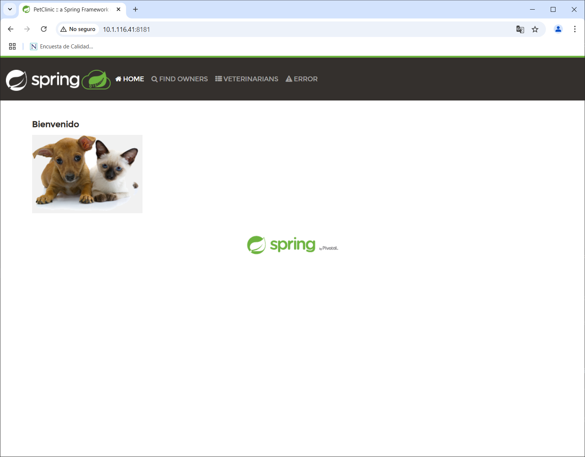

Dedica unos minutos a explorar la aplicación y familiarizarte con su funcionamiento.

##### Detención de la Aplicación

Para detener la ejecución de la aplicación se debe cerrara la terminal de comandos en la que se encuentre ejecutando o ejecutar `Control + C` en la terminal en cuestión.

### WEBHOOK

En esta actividad se configurará un *webhook* en *GitHub* para notificar a *Jenkins* cuando se realicen cambios en el código fuente.

#### Ngrok

Para poder recibir notificaciones de *GitHub* en *Jenkins* es necesario contar con una URL pública a la que *GitHub* pueda enviar las notificaciones. Para ello se utilizará *ngrok*, una herramienta que permite exponer un servidor local a Internet.

##### Instalación de Ngrok

Para instalar *ngrok* ejecuta:

``` shell
sudo snap install ngrok
```

La salida de la ejecución debe ser similar a:

``` shell
[sudo] password for netec:
2025-02-12T13:23:01-06:00 INFO Waiting for automatic snapd restart...
ngrok (v3/stable) 3.19.1 from Ngrok (ngrok-publisher) installed
```

##### Token

Para obtener el token de utilización se requiere crear una cuenta en <https://dashboard.ngrok.com/signup>. Se recomienda autenticarse con GitHub (Sign up with GitHub).

Una vez autenticado, se procede a activar ngrok ejecutando en una terminal de comandos:

``` shell
ngrok config add-authtoken TOKEN_PERSONAL
```

Con una salida similar a:

``` shell
Authtoken saved to configuration file: /home/netec/snap/ngrok/245/.config/ngrok/ngrok.yml
```

##### Inicio de Ngrok

En una terminal de comandos que se quedará activa hasta que se ejecuta Control+C se procede a iniciar `ngrok`.

``` shell
ngrok http 8080
```

Con una salida similar a:

``` shell
ngrok                                                                               (Ctrl+C to quit)
👋 Goodbye tunnels, hello Agent Endpoints: https://ngrok.com/r/aep

Session Status                online
Account                       Pedro Cazu (Plan: Free)
Version                       3.19.1
Region                        United States (us)
Latency                       57ms
Web Interface                 http://127.0.0.1:4040
Forwarding                    https://1490-201-163-221-156.ngrok-free.app -> http://localhost:8080

Connections                   ttl     opn     rt1     rt5     p50     p90
                              0       0       0.00    0.00    0.00    0.00
```

En la parte inferior, en la sección Connections irán apareciendo las notificaciones enviadas por GitHub.

#### GitHub

Para configurar el *webhook* en *GitHub* se requiere tener un repositorio en el que se realizarán los cambios. En este caso se utilizará el repositorio personal bifurcado.

##### Creación del Webhook

Selecciona la opción Settings y Webhooks en tu repositorio de trabajo.

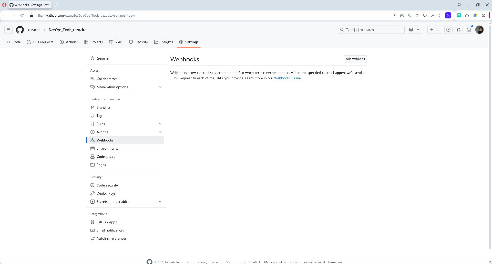

En esa pantalla da clic en el botón `Add webhook` y provee la siguiente información:

- Webhooks / Add webhook
  - Payload URL: <https://56de-187-188-11-60.ngrok.io/github-webhook/>

    - La dirección proporcionada por la herramienta ngrok más el sufijo /github-webhook/.

  - Content type: application/json

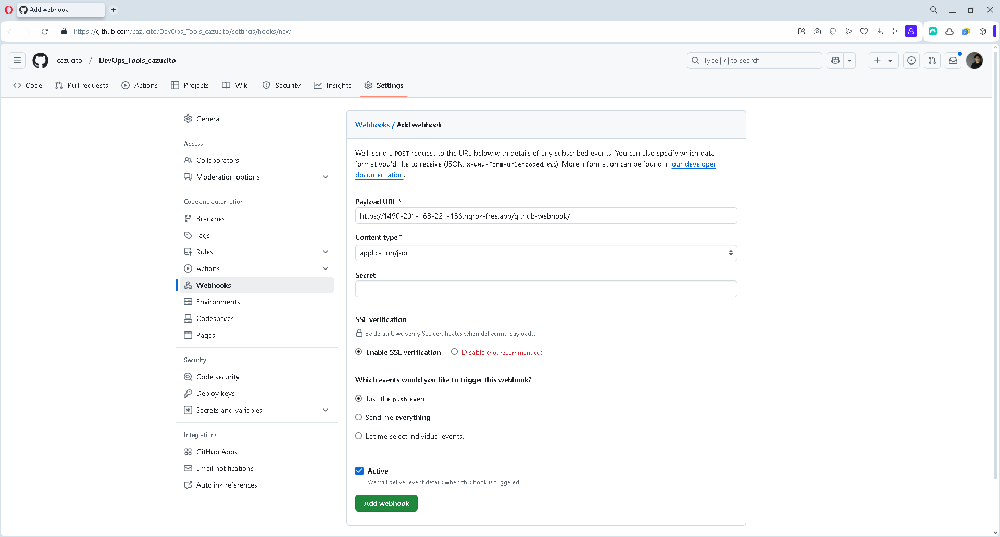

Para guardar las modificaciones, da clic en `Add webhook`.

Verifica en la ventana de *ngrok* que el *webhook* se ha comunicado correctamente.

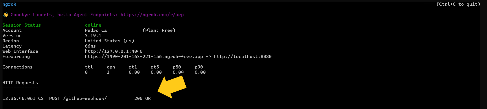

<div class="note">

Al estar utilizando el plan gratuito de *ngrok*, la URL generada es temporal y se desactivará al cerrar la terminal de comandos.

</div>

### JOB

#### Jenkins y GitHub

En esta actividad se creará un proyecto en Jenkins que escuche *webhooks* de GitHub. === Credenciales

Como se realizarán diferentes acciones sobre el repositorio en GitHub se debe crear una credencial para Jenkins.

Da cic en el botón Add Credentials en la siguiente pantalla en Jenkins: <http://10.1.116.41:8080/manage/credentials/store/system/domain/_/>

- Recuerda que la IP debe ser la de tu servidor de Jenkins.

Datos para `Add Credentials`:

- Kind: Secret Text

  - Secret: PEGAR EL TOKEN DE GITHUB

  - ID: githubToken

  - Description: githubToken

  - Clic en el botón Create

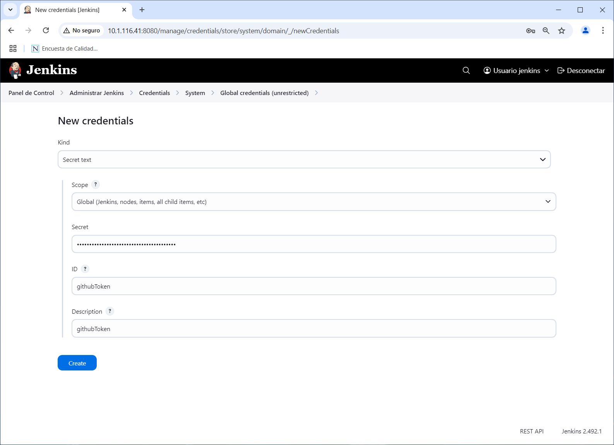

##### GitHub Server

Para configurar el servidor de GitHub en Jenkins, realiza los siguientes pasos:

En el enlace <http://10.1.116.41:8080/manage/configure> localiza la sección *GitHub* y provee la información siguiente:

- GitHub
  - GitHub Server
  - Add GitHub Server
    - Name: GitHub Cuenta Personal
    - Credentials: githubToken

Da clic en el botón `Test Connection` para validar la conexión con GitHub:

- Credentials verified for user cazucito, rate limit: 4994

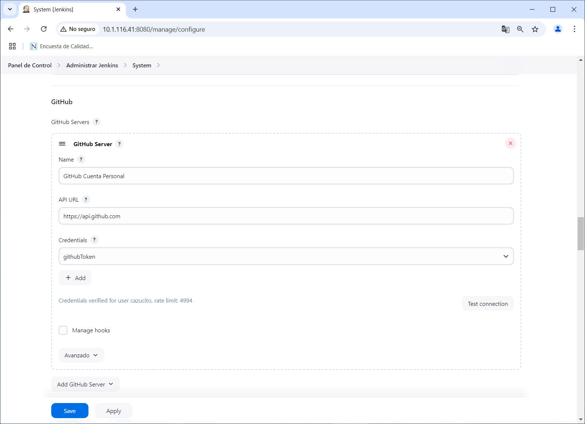

Da clic en el botón `Save` para guardar los cambios.

##### Creación de un nuevo proyecto

Para la creación del *job* se debe realizar lo siguiente:

1. En el *Dashboard* de *Jenkins* dar clic en el botón `New Item`.
2. Ingresar el nombre del *job* como `SpringPetclinic-Webhook` y seleccionar la opción `Freestyle project`.
3. Dar clic en el botón `OK`.

En la pantalla de configuración del *job* realizar lo siguiente:

Sección general:

- **General**
  - **Description**: `Job para la descarga y construcción de la aplicación Spring Pet Clinic activado por un evento push en el repositorio en GitHub.`
  - **GitHub project**: [Marcado]
  - **Project url**: `https://github.com/cazucito/DevOps_Tools_cazucito.git`
    - Sustituye el valor por el de su *fork*.

Sección de SCM:

- **Source Code Management**
  - Selecciona: `Git`
    - **Repositories**
      - **Repository URL**: `https://github.com/cazucito/DevOps_Tools_cazucito.git`
        - Sustituye el valor por el de su fork.
        - Inicialmente aparece un mensaje que indica problemas de autenticación: "Failed to connect to repository …​ fatal: Authentication failed for …​"
      - **Credentials**: githubCred
    - **Branches to build**
      - **Branch Specifier (blank for 'any')**: `labs/spring-petclinic_cazucito`
        - Sustituye el valor por el de su rama.

Sección de disparadores:

- **Build Triggers**
  - **GitHub hook trigger for GITScm polling**: [Marcado]

Sección de construcción y ejecución:

- **Build steps**
  - Selecciona de la lista: `Execute shell`
    - **Command**:
      - `git stash`
      - `git switch labs/spring-petclinic`
      - `git merge origin/labs/spring-petclinic_cazucito`
- Este paso debe ir al final de la sección.

Sección de acciones post construcción:

- **Post-build Actions**
  - Selecciona de la lista: `Git Publisher`
    - **Push Only If Build Succeeds**: [Marcada]
  - **Branches**
    - **Add Branch**
      - **Branch to push**:
        - `labs/spring-petclinic`
      - **Target remote name**
        - `origin`

Este paso debe ir al final de la sección.

Para guardar los cambios de clic en el botón `Apply` y luego en `Save`.

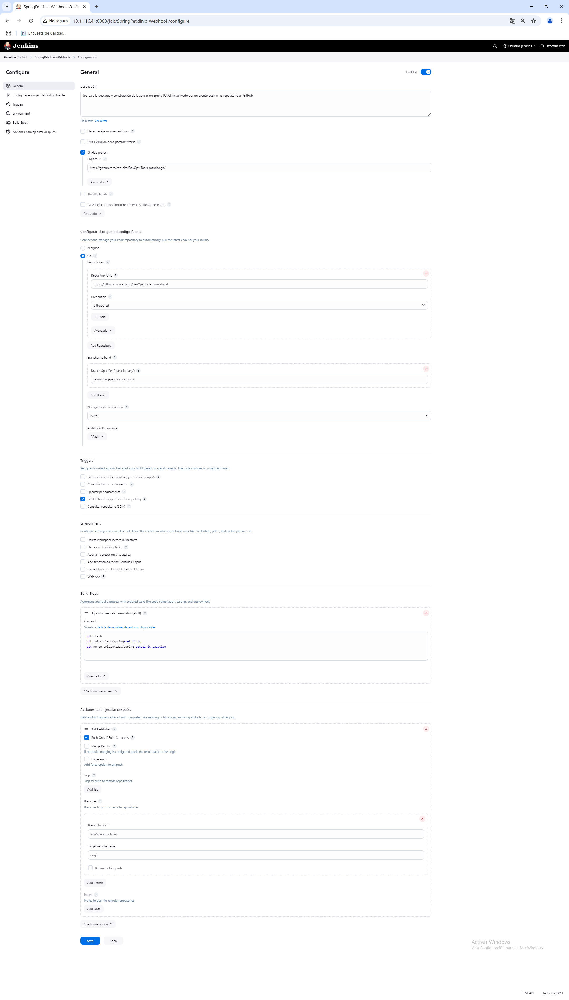

#### Repositorio local

En la terminal de comando (en el repositorio de trabajo) realiza lo siguiente:

- Actualiza el repositorio local
  - `git switch labs/spring-petclinic_cazucito`
- Crea un nuevo archivo llamado `NuevaFeature.md` y adiciona un texto.
  - Sí el archivo existe, agrega contenido
- Adiciona los cambios al área de *stage*
  - `git add NuevaFeature.md`
- Confirma los cambios
  - `git commit --message="Nueva feature 01"`
- Sube los cambios al repositorio remoto
  - `git push --set-upstream origin labs/spring-petclinic_cazucito`

#### Jenkins Job

Después de la ejecución de los comandos previos, ir a la página de job en Jenkins.

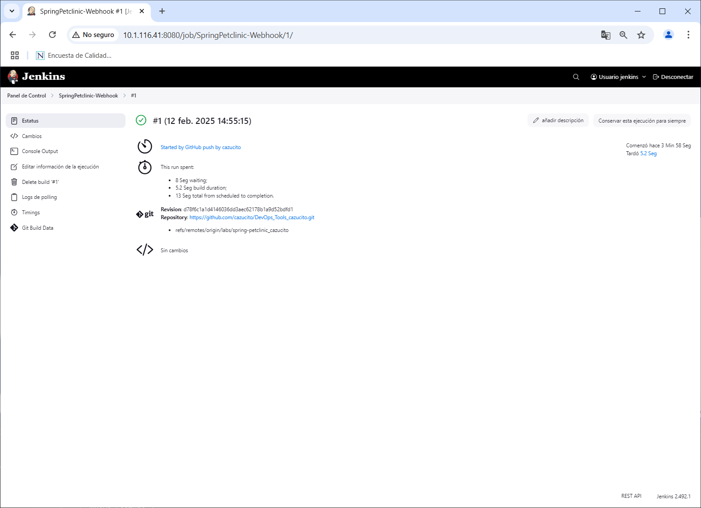

El job debe ejecutarse automáticamente y mostrar un resultado en consola similar a:

``` shell
Started by GitHub push by cazucito
Running as SYSTEM
Building in workspace /var/lib/jenkins/workspace/SpringPetclinic-Webhook
The recommended git tool is: NONE
using credential githubCred
Cloning the remote Git repository
Cloning repository https://github.com/cazucito/DevOps_Tools_cazucito.git
 > git init /var/lib/jenkins/workspace/SpringPetclinic-Webhook # timeout=10
Fetching upstream changes from https://github.com/cazucito/DevOps_Tools_cazucito.git
 > git --version # timeout=10
 > git --version # 'git version 2.25.1'
using GIT_ASKPASS to set credentials githubCred
 > git fetch --tags --force --progress -- https://github.com/cazucito/DevOps_Tools_cazucito.git +refs/heads/*:refs/remotes/origin/* # timeout=10
 > git config remote.origin.url https://github.com/cazucito/DevOps_Tools_cazucito.git # timeout=10
 > git config --add remote.origin.fetch +refs/heads/*:refs/remotes/origin/* # timeout=10
Avoid second fetch
 > git rev-parse refs/remotes/origin/labs/spring-petclinic_cazucito^{commit} # timeout=10
 > git rev-parse labs/spring-petclinic_cazucito^{commit} # timeout=10
Checking out Revision d78f6c1a1d4146036dd3aec62178b1a9d52bdfd1 (refs/remotes/origin/labs/spring-petclinic_cazucito)
 > git config core.sparsecheckout # timeout=10
 > git checkout -f d78f6c1a1d4146036dd3aec62178b1a9d52bdfd1 # timeout=10
Commit message: "Nueva feature 20250212"
First time build. Skipping changelog.
[SpringPetclinic-Webhook] $ /bin/sh -xe /tmp/jenkins373588862582415375.sh
+ git stash
No local changes to save
+ git switch labs/spring-petclinic
Previous HEAD position was d78f6c1 Nueva feature 20250212
Switched to a new branch 'labs/spring-petclinic'
Branch 'labs/spring-petclinic' set up to track remote branch 'labs/spring-petclinic' from 'origin'.
+ git merge origin/labs/spring-petclinic_cazucito
Updating 5b0cfe8..d78f6c1
Fast-forward
 NuevaFeature.md | 3 ++-
 1 file changed, 2 insertions(+), 1 deletion(-)
The recommended git tool is: NONE
using credential githubCred
Pushing HEAD to branch labs/spring-petclinic at repo origin
 > git --version # timeout=10
 > git --version # 'git version 2.25.1'
using GIT_ASKPASS to set credentials githubCred
 > git push https://github.com/cazucito/DevOps_Tools_cazucito.git HEAD:labs/spring-petclinic # timeout=10
Finished: SUCCESS
```

Y el repositorio remoto debe ser actualizado incluyendo la nueva _feature_.

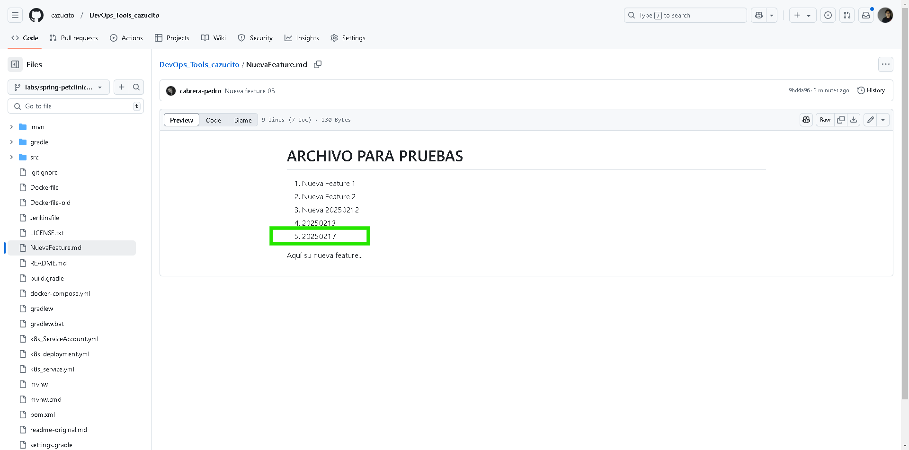

## RESULTADO

Al finalizar serás capaz de crear y ejecutar un proyecto en Jenkins que escuche \_webhooks\_ de GitHub.


