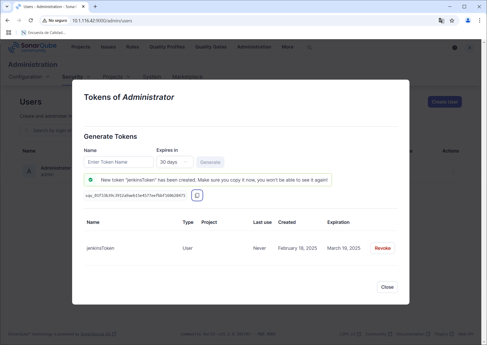
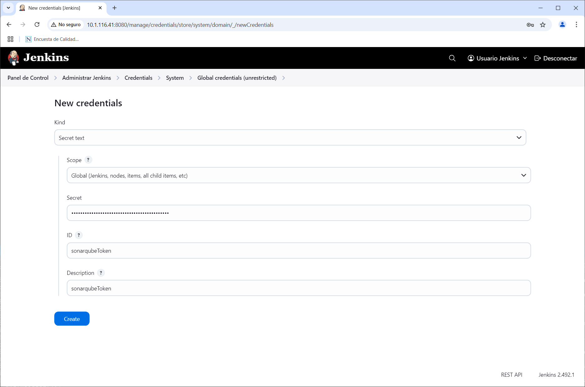
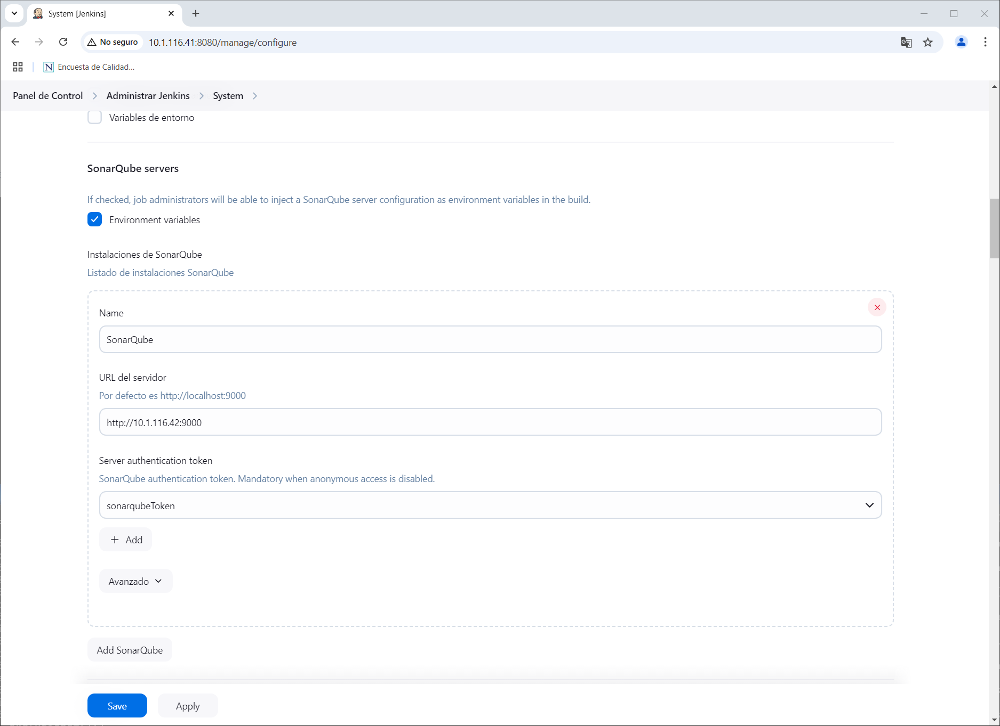
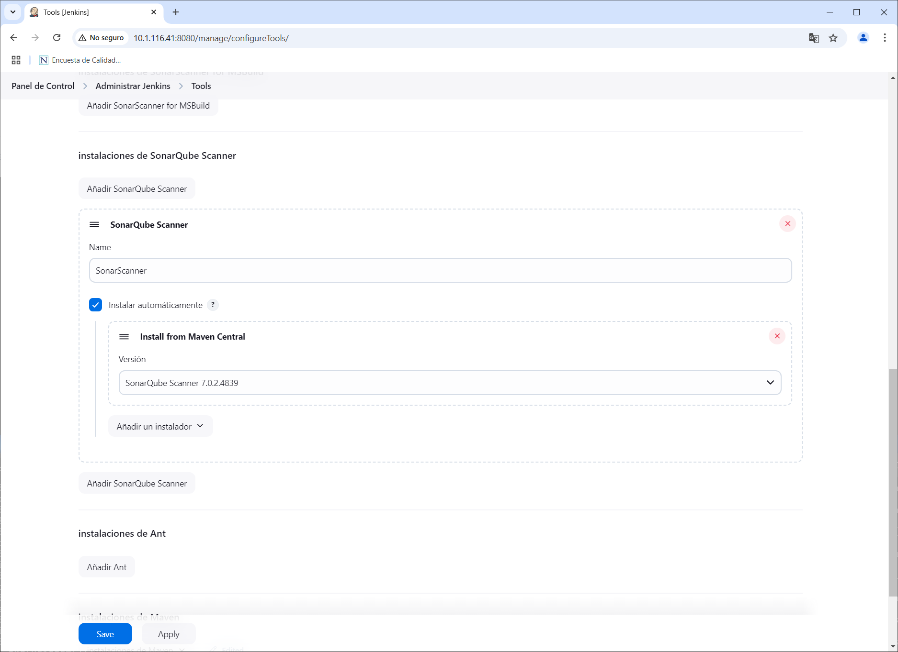
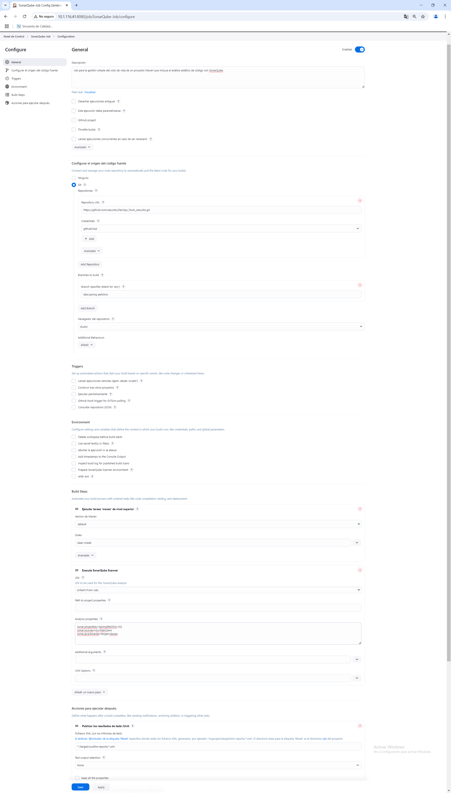
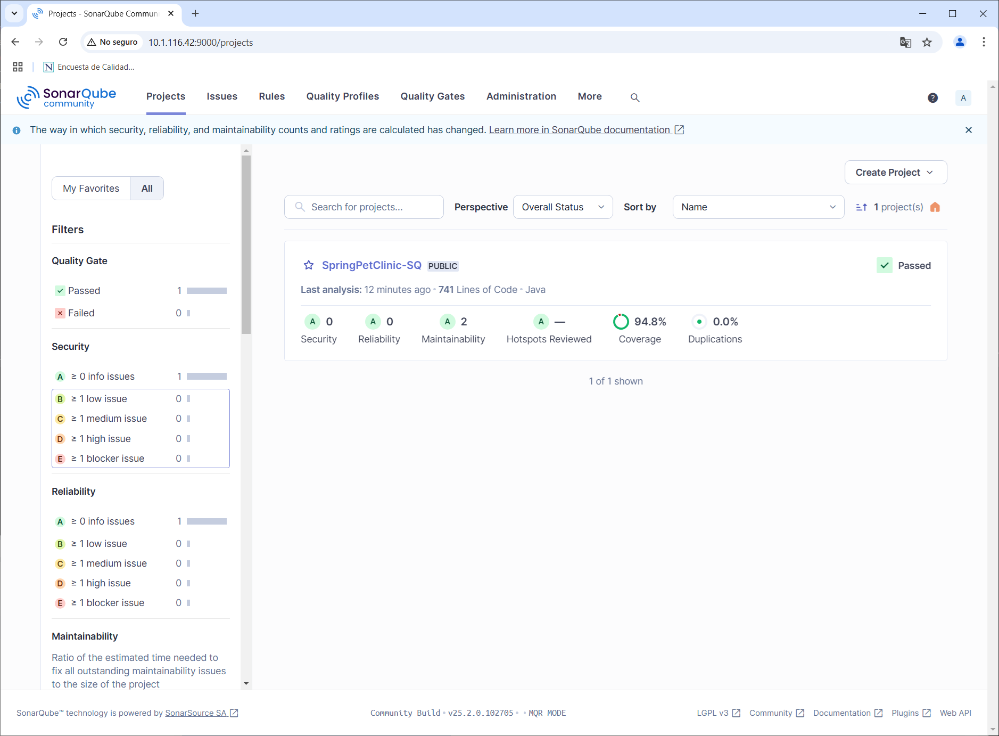
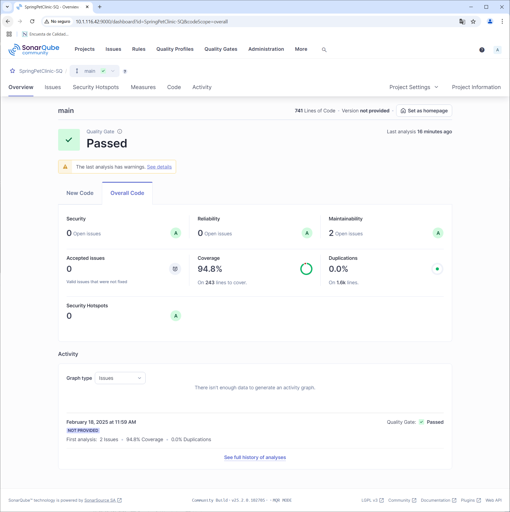
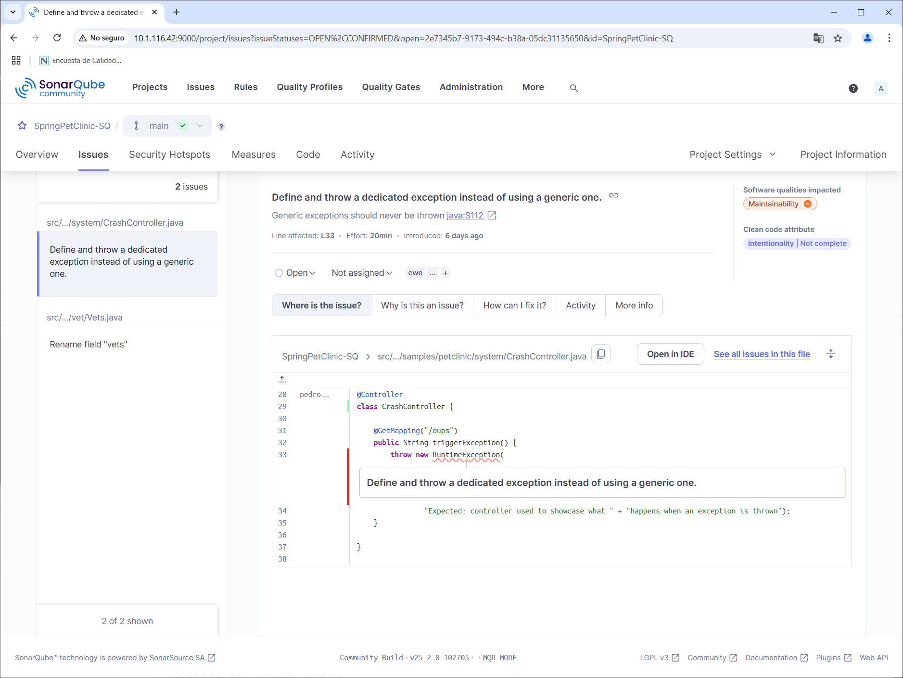
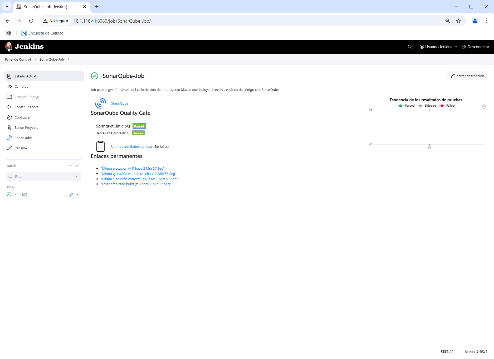

# SONARQUBE / INTEGRACIÓN CON JENKINS

## OBJETIVOS

Al termino de este capítulo, serás capaz de:

- Al finalizar serás capaz crear y ejecutar un Free Style Job en Jenkins que realize un análisis de código estático con SonarQube.

## DURACIÓN

Tiempo aproximado para esta actividad:

- 40 minutos.

## PRERREQUISITOS

Para esta actividad se requiere:

- Acceso a Internet.

- Acceso mediante SSH a un servidor Linux.

- Actividad anterior completada.

## INSTRUCCIONES

En esta actividad, creará un trabajo en Jenkins que realice un análisis de código estático con SonarQube.

### CONFIGURACIÓN

#### TOKEN EN SONARQUBE

Para poder integrar SonarQube con Jenkins es necesario generar un token de acceso.

En el enlace <http://10.1.116.42:9000/admin/users> da clic en la opción de actualizar tokens localizada en la columna `Tokens` del usuario `Administrator` (en los tres puntos verticales).

En la ventana contextual `Tokens of Administrator` ingresa:

- Name: `jenkinsToken`
- Expiration: `30 days`
- Da clic en el botón `Generate`.

Guarda el token en un lugar seguro ya que no se mostrará nuevamente.
- `squ_01f53b39c3912a9aeb15e4577eefbbf160628475`

Para concluir este paso da clic en el enlace `Done`.



#### CONFIGURACIÓN EN JENKINS

##### Credenciales

Para la comunicación de **Jenkins** y **SonarQube** se debe crear una credencial.

Da clic en el botón `Add Credentials` en la siguiente pantalla en Jenkins: <http://10.1.116.41:8080/manage/credentials/store/system/domain/_/>

- Kind: Secret text
- Secret: `squ_e0a5d6ece69066f4768ae30a2ad2615ad80e803e`
  - PEGAR EL TOKEN DE PASO ANTERIOR.
- ID: `sonarqubeToken`
- Description: `SonarQubeToken`
- Clic en el botón `Create`



Ahora puede verse la credencial recién creada.

##### Complemento de SonarQube

En un navegador web ingresa el enlace <http://10.1.116.41:8080/manage/pluginManager/available> para configurar el complemento de **SonarQube** en **Jenkins**.

En el campo de búsqueda ingresa `SonarQube Scanner`, de la lista selecciona el componente localizado. Marca la opción de `Install` y da clic en el botón `Install`.

Marca la opción `Restart Jenkins when installation is complete and no jobs are running` y espera a que el proceso termine la instalación y reinicie *Jenkins*.

Después de reiniciar, verifica que el complemento de **SonarQube** se haya instalado correctamente.

##### Servidor SonarQube

En la opción `Configure System` de **Jenkins** en el enlace: <http://10.1.116.41:8080/manage/configure>, localiza la sección `SonarQube servers` e ingresa la información:

- SonarQube servers
  - Environment variables: [SELECCIONADO]
  - Add SonarQube
    - Name: `SonarQube`
    - Server URL: `http://10.1.116.42:9000`
      - Sustituir la IP por la dirección IP de tu servidor de SonarQube.
    - Server authentication token: `SonarQube Token`

Da clic en `Apply` y `Save`.



##### Herramientas: SonarQube Scanner

En la ventana de configuración de herramientas globales (<http://10.11.116.41:8080/manage/configureTools/>) realizar la siguiente configuración:

- SonarQube Scanner installations
  - Add SonarQube Scanner
    - Name: `SonarScanner`
    - Install automatically: [SELECCIONADO]
      - Install from Maven Central
        - Version: `SonarQube Scanner 7.0.2.4839`

Da clic en `Apply` y `Save`.



### FREE STYLE JOB & SONARQUBE

En esta actividad, se crea un proyecto estilo libre para la gestión simple del ciclo de vida de un proyecto Maven que incluye el análisis de código estático con SonarQube.

#### JOB

En la pantalla principal (<http://10.11.116.41:8080/>) de Jenkins crea un nuevo proyecto dando clic en [+ New Item](<http://10.11.116.41:8080/view/all/newJob>) con los siguientes datos:

- Nombre: `SonarQube-Job`
- Tipo de proyecto: `Freestyle project`

Después de ingresar la información da clic en `OK`.

##### Configuración

A continuación, se indica la información a añadir en cada sección.

###### General

En la sección de `Configuration/General` ingresa la siguiente información:

- Descripción: `Job para la gestión simple del ciclo de vida de un proyecto Maven que incluye el análisis estático de código con SonarQube.`

###### Source Code Management

- Git
  - Repositories
    - Repository URL: `{course-repository-fork}.git`
      - Recuerda que debe ser la URL a tu repositorio. La indicada es de ejemplo y la tuya debe ser similar ésta.
        - Credentials: `githubCred`
        - Branches to build:
        - Branch Specifier (blank for 'any'): `{spring-petclinic-branchname}`
        - Sustituir por tu rama de trabajo.

###### Build Steps

En la opción `Configuration/Build Steps/Add build step/Invoke top-level Maven targets` ingresa la siguiente información:

- Invoke top-level Maven targets
  - Maven Version: `default`
  - Goals: `clean install`

En la opción `Configuration/Build Steps/Add build step/Execute SonarQube Scanner` ingresa la siguiente información:

- Execute SonarQube Scanner
  - Task to run: `scan`
    - *Esta opción puede no aparecer.*
    - Analysis properties:

``` properties
sonar.projectKey=SpringPetClinic-SQ
sonar.sources=src/main/java
sonar.java.binaries=target/classes
```

###### Post-Build Actions

En la sección de acciones posteriores a la construcción adicionar la acción `Publish JUnit test result report` con la siguiente información:

- Add post-build action / Publish JUnit test result report
- Test report XMLs: `*/target/surefire-reports/.xml`

###### Save

Da clic en el botón de guardado ( `Save` )



### EJECUCIÓN

Para comprobar el funcionamiento, ejecuta el **job** dando clic en la opción `Build Now` del menú lateral.

Adicionalmente comprueba los cambios en la interfaz del **job** y del **build**.


#### Salida en Consola

En la parte inferior de la barra lateral izquierda, en la sección `Build History` se puede apreciar el historial de ejecución (**build**) del **job**.

Al dar clic en alguno de los enlaces (en cada renglón) se puede observar la información general del **build**.

Para observar la salida en consola de la construcción se debe seleccionar la opción `Console Output` del menú lateral.

Dedica un momento a analizar la salida, para localizar las secciones donde se interactúa con **SonarQube**.

A continuación, se muestra un fragmento de la salida en consola.

``` text
    Unpacking https://repo1.maven.org/maven2/org/sonarsource/scanner/cli/sonar-scanner-cli/7.0.2.4839/sonar-scanner-cli-7.0.2.4839.zip to /var/lib/jenkins/tools/hudson.plugins.sonar.SonarRunnerInstallation/SonarScanner on Jenkins
    [SonarQube-Job] $ /var/lib/jenkins/tools/hudson.plugins.sonar.SonarRunnerInstallation/SonarScanner/bin/sonar-scanner -Dsonar.host.url=http://10.1.116.42:9000 ******** -Dsonar.projectKey=SpringPetClinic-SQ -Dsonar.sources=src/main/java -Dsonar.java.binaries=target/classes -Dsonar.projectBaseDir=/var/lib/jenkins/workspace/SonarQube-Job
    11:58:55.886 INFO  Scanner configuration file: /var/lib/jenkins/tools/hudson.plugins.sonar.SonarRunnerInstallation/SonarScanner/conf/sonar-scanner.properties
    11:58:55.893 INFO  Project root configuration file: NONE
    11:58:55.921 INFO  SonarScanner CLI 7.0.2.4839
    11:58:55.924 INFO  Java 17.0.14 Ubuntu (64-bit)
    11:58:55.926 INFO  Linux 5.4.0-204-generic amd64
    11:58:55.991 INFO  User cache: /var/lib/jenkins/.sonar/cache
    11:58:57.477 INFO  JRE provisioning: os[linux], arch[x86_64]
    11:59:09.945 INFO  Communicating with SonarQube Community Build 25.2.0.102705
    11:59:10.543 INFO  Starting SonarScanner Engine...
    11:59:10.547 INFO  Java 17.0.13 Eclipse Adoptium (64-bit)
    11:59:12.649 INFO  Load global settings
    11:59:12.825 INFO  Load global settings (done) | time=175ms
    11:59:12.832 INFO  Server id: 86E1FA4D-AZUW1iNqn5kHejx765fO
    11:59:12.868 INFO  Loading required plugins
    11:59:12.873 INFO  Load plugins index
    11:59:12.946 INFO  Load plugins index (done) | time=73ms
    11:59:12.946 INFO  Load/download plugins
    11:59:15.270 INFO  Load/download plugins (done) | time=2324ms
    11:59:15.921 INFO  Process project properties
    11:59:15.944 INFO  Process project properties (done) | time=23ms
    11:59:15.960 INFO  Project key: SpringPetClinic-SQ
    11:59:15.961 INFO  Base dir: /var/lib/jenkins/workspace/SonarQube-Job
    11:59:15.962 INFO  Working dir: /var/lib/jenkins/workspace/SonarQube-Job/.scannerwork
    11:59:15.979 INFO  Load project settings for component key: 'SpringPetClinic-SQ'
    11:59:16.044 INFO  Load quality profiles
    11:59:16.214 INFO  Load quality profiles (done) | time=170ms
    11:59:16.240 INFO  Auto-configuring with CI 'Jenkins'
    11:59:16.288 INFO  Load active rules
    11:59:17.035 INFO  Load active rules (done) | time=746ms
    11:59:17.045 INFO  Load analysis cache
    11:59:17.053 INFO  Load analysis cache (404) | time=9ms
    11:59:17.157 INFO  Preprocessing files...
    11:59:17.424 INFO  1 language detected in 23 preprocessed files
    11:59:17.425 INFO  0 files ignored because of scm ignore settings
    11:59:17.428 INFO  Loading plugins for detected languages
    11:59:17.429 INFO  Load/download plugins
    11:59:20.189 INFO  Load/download plugins (done) | time=2760ms
    11:59:20.401 INFO  Load project repositories
    11:59:20.419 INFO  Load project repositories (done) | time=18ms
    11:59:20.442 INFO  Indexing files...
    11:59:20.443 INFO  Project configuration:
    11:59:20.463 INFO  23 files indexed
    11:59:20.465 INFO  Quality profile for java: Sonar way
    11:59:20.466 INFO  ------------- Run sensors on module SpringPetClinic-SQ
    11:59:20.639 INFO  Load metrics repository
    11:59:20.670 INFO  Load metrics repository (done) | time=31ms
    11:59:22.062 INFO  Sensor JavaSensor [java]
    11:59:22.097 INFO  Server-side caching is enabled. The Java analyzer will not try to leverage data from a previous analysis.
    11:59:22.102 INFO  Using ECJ batch to parse 23 Main java source files with batch size 130 KB.
    11:59:22.423 INFO  Starting batch processing.
    11:59:23.367 INFO  The Java analyzer cannot skip unchanged files in this context. A full analysis is performed for all files.
    11:59:25.960 INFO  100% analyzed
    11:59:25.961 INFO  Batch processing: Done.
    11:59:25.962 INFO  Did not optimize analysis for any files, performed a full analysis for all 23 files.
    11:59:25.966 WARN  Dependencies/libraries were not provided for analysis of SOURCE files. The 'sonar.java.libraries' property is empty. Verify your configuration, as you might end up with less precise results.
    11:59:25.971 WARN  Unresolved imports/types have been detected during analysis. Enable DEBUG mode to see them.
    11:59:25.971 WARN  Use of preview features have been detected during analysis. Enable DEBUG mode to see them.
    11:59:25.972 INFO  No "Test" source files to scan.
    11:59:25.972 INFO  No "Generated" source files to scan.
    11:59:25.973 INFO  Sensor JavaSensor [java] (done) | time=3911ms
    11:59:25.973 INFO  Sensor JaCoCo XML Report Importer [jacoco]
    11:59:25.975 INFO  'sonar.coverage.jacoco.xmlReportPaths' is not defined. Using default locations: target/site/jacoco/jacoco.xml,target/site/jacoco-it/jacoco.xml,build/reports/jacoco/test/jacocoTestReport.xml
    11:59:25.980 INFO  Importing 1 report(s). Turn your logs in debug mode in order to see the exhaustive list.
    11:59:26.073 INFO  Sensor JaCoCo XML Report Importer [jacoco] (done) | time=100ms
    11:59:26.073 INFO  Sensor Java Config Sensor [iac]
    11:59:26.118 INFO  0 source files to be analyzed
    11:59:26.130 INFO  0/0 source files have been analyzed
    11:59:26.131 INFO  Sensor Java Config Sensor [iac] (done) | time=58ms
    11:59:26.131 INFO  Sensor SurefireSensor [java]
    11:59:26.136 INFO  parsing [/var/lib/jenkins/workspace/SonarQube-Job/target/surefire-reports]
    11:59:26.265 INFO  Sensor SurefireSensor [java] (done) | time=134ms
    11:59:26.265 INFO  Sensor IaC Docker Sensor [iac]
    11:59:26.411 INFO  0 source files to be analyzed
    11:59:26.412 INFO  0/0 source files have been analyzed
    11:59:26.412 INFO  Sensor IaC Docker Sensor [iac] (done) | time=147ms
    11:59:26.413 INFO  Sensor TextAndSecretsSensor [text]
    11:59:26.413 INFO  Available processors: 4
    11:59:26.413 INFO  Using 4 threads for analysis.
    11:59:27.150 INFO  The property "sonar.tests" is not set. To improve the analysis accuracy, we categorize a file as a test file if any of the following is true:
      * The filename starts with "test"
      * The filename contains "test." or "tests."
      * Any directory in the file path is named: "doc", "docs", "test" or "tests"
      * Any directory in the file path has a name ending in "test" or "tests"

    11:59:27.183 INFO  Using git CLI to retrieve untracked files
    11:59:27.213 INFO  Analyzing language associated files and files included via "sonar.text.inclusions" that are tracked by git
    11:59:27.259 INFO  23 source files to be analyzed
    11:59:27.440 INFO  23/23 source files have been analyzed
    11:59:27.443 INFO  Sensor TextAndSecretsSensor [text] (done) | time=1031ms
    11:59:27.449 INFO  ------------- Run sensors on project
    11:59:27.665 INFO  Sensor Zero Coverage Sensor
    11:59:27.667 INFO  Sensor Zero Coverage Sensor (done) | time=3ms
    11:59:27.668 INFO  Sensor Java CPD Block Indexer
    11:59:27.737 INFO  Sensor Java CPD Block Indexer (done) | time=70ms
    11:59:27.741 INFO  SCM Publisher SCM provider for this project is: git
    11:59:27.743 INFO  SCM Publisher 23 source files to be analyzed
    11:59:28.143 INFO  SCM Publisher 23/23 source files have been analyzed (done) | time=400ms
    11:59:28.151 INFO  CPD Executor 9 files had no CPD blocks
    11:59:28.151 INFO  CPD Executor Calculating CPD for 14 files
    11:59:28.180 INFO  CPD Executor CPD calculation finished (done) | time=29ms
    11:59:28.188 INFO  SCM revision ID '9bd4a9687919455e8759ee93518b6d599395a476'
    11:59:28.601 INFO  Analysis report generated in 403ms, dir size=313.0 kB
    11:59:28.793 INFO  Analysis report compressed in 190ms, zip size=87.9 kB
    11:59:30.644 INFO  Analysis report uploaded in 1853ms
    11:59:30.646 INFO  ANALYSIS SUCCESSFUL, you can find the results at: http://10.1.116.42:9000/dashboard?id=SpringPetClinic-SQ
    11:59:30.647 INFO  Note that you will be able to access the updated dashboard once the server has processed the submitted analysis report
    11:59:30.647 INFO  More about the report processing at http://10.1.116.42:9000/api/ce/task?id=fca2d746-b7ef-440d-8af5-b5243f364005
    11:59:30.673 INFO  Analysis total time: 15.299 s
    11:59:30.674 INFO  SonarScanner Engine completed successfully
    11:59:30.781 INFO  EXECUTION SUCCESS
    11:59:30.783 INFO  Total time: 34.901s
    Recording test results
    [Checks API] No suitable checks publisher found.
    Finished: SUCCESS
```

#### Sonarqube

Para analizar el resultado del análisis del código se puede visitar directamente la página de **SonarQube** <http://10.11.116.42:9000> y seleccionar el proyecto generado. Incluso desde la página del estado del **job** en **Jenkins** hay un enlace directo con el texto **SonarQube** (<http://10.11.116.42:9000/dashboard?id=SpringPetClinic-SQ>).



A continuación, se muestran algunas pantallas del reporte. Se recomienda dedicar algunos minutos al análisis del reporte generado.





## RESULTADO

Al finalizar esta actividad, el participante será capaz de crear y ejecutar un Free Style Job en Jenkins que realice un análisis de código estático con SonarQube.


