# ARTEFACTOS / INTEGRACIÓN CON JENKINS

## OBJETIVOS

Al termino de este capítulo, serás capaz de:

- Al finalizar serás capaz crear y ejecutar un Job en Jenkins con interacción hacia un repositorio de JFrog Artifactory.

## DURACIÓN

Tiempo aproximado para esta actividad:

- 40 minutos.

## PRERREQUISITOS

Para esta actividad se requiere:

- Acceso a Internet.

- Acceso mediante SSH a un servidor Linux.

- Actividad anterior completada.

## INSTRUCCIONES

En esta actividad, creará un trabajo en Jenkins que publiqué los artefactos en JFrog Artifactory.

### CONFIGURACIÓN

#### JFrog Artifactory

##### Token de Acceso

Para poder integrar JFrog Artifactory con Jenkins es necesario generar un token de acceso.

En el enlace <http://10.1.116.43:8082/ui/user_profile> da clic en el botón `Generate an Identity Token`.

En la ventana contextual ingresa:

- Description: `jenkinsToken`
- Da clic en el botón `Generate`.
  - `cmVmdG...`

Guarda el token en un lugar seguro ya que no se mostrará nuevamente.

Para concluir este paso da clic en el botón `Close`.

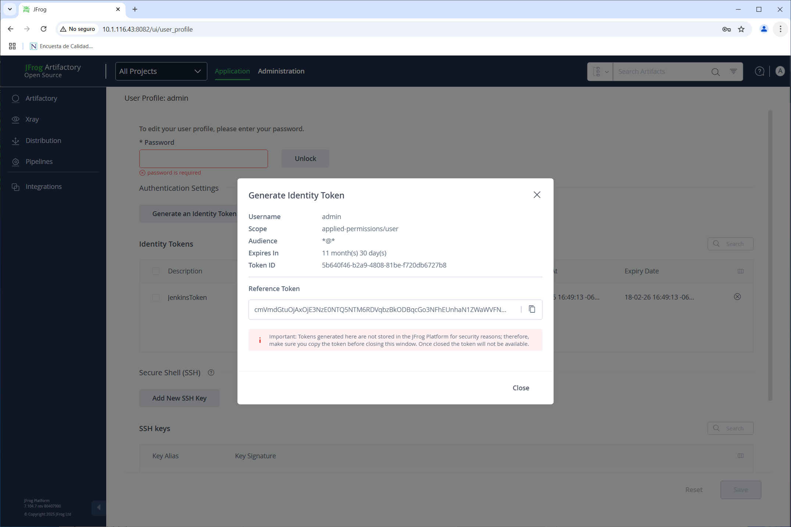

##### Repositorio Local

Para la integración con Jenkins es necesario crear un repositorio local.

En el enlace <http://10.1.116.43:8082/ui/admin/repositories/local> da clic en el botón `Create Repository` y selecciona repositorio y `Maven`.

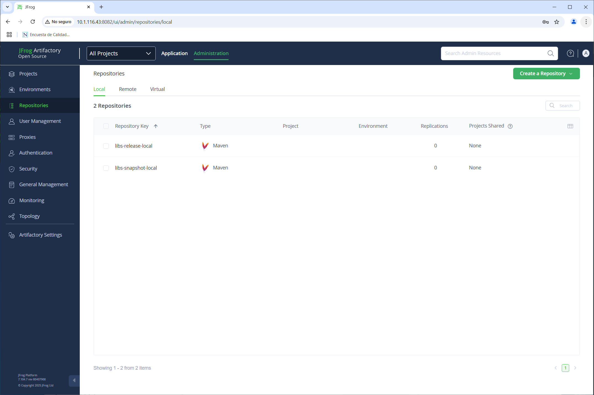

Ingresa la información como se muestra en la imagen siguiente:

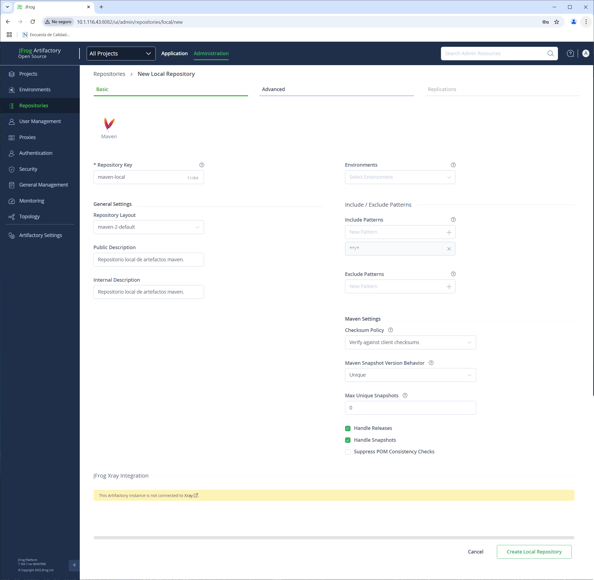

### PUBLICACIÓN MANUAL

En el repositorio previamente bifurcado de GitHub, realiza la compilación del proyecto con el comando `mvn clean install` y publica el artefacto en el repositorio local de JFrog Artifactory.

#### Rama de trabajo

Cámbiate a la rama `labs/clients` y crea la de trabajo `labs/clients_artifactory`.

``` sh
git switch labs/clients
git checkout -b labs/clients_artifactory
```

#### settings.xml

Actualmente el archivo `settings.xml` de Maven no tiene configurado el servidor de JFrog Artifactory. Se está utilizando la configuración por defecto de Maven.

Aunque podemos utilizar un archivo `settings.xml` en el directorio `~/.m2/` para las configuraciones al nivel usuario, para esta actividad se recomienda crear un archivo `settings.xml` un directorio arriba de nuestro proyecto con la configuración del servidor de JFrog Artifactory.

``` sh
ls ..
DevOps_Tools  DevOps_Tools_cazucito  settings.xml
```

Crea un archivo `settings.xml` fuera de la carpeta del proyecto con el siguiente contenido:

``` xml
<settings xmlns="http://maven.apache.org/SETTINGS/1.4.0"
          xmlns:xsi="http://www.w3.org/2001/XMLSchema-instance"
          xsi:schemaLocation="http://maven.apache.org/SETTINGS/1.4.0
                              https://maven.apache.org/xsd/settings-1.4.0.xsd">
    <servers>
        <server>
            <id>maven-local</id>
            <username>admin</username>
            <password>YOUR TOKEN HERE</password>
        </server>
    </servers>
    <mirrors>
        <mirror>
            <id>maven-local-mirror</id>
            <mirrorOf>!central</mirrorOf>
            <url>http://10.1.116.43:8081/artifactory/maven-local</url>
        </mirror>
    </mirrors>
    <profiles>
        <profile>
            <id>maven-local-deploy</id>
            <repositories>
                <repository>
                    <id>maven-local</id>
                    <url>http://10.1.116.43:8081/artifactory/maven-local</url>
                </repository>
            </repositories>
        </profile>
    </profiles>
    <activeProfiles>
        <activeProfile>maven-local-deploy</activeProfile>
    </activeProfiles>
</settings>
```

Nota que el archivo `settings.xml` contiene la configuración del servidor de JFrog Artifactory.

- `id`: `maven-local`: Identificador del servidor.
- `username`: `admin`: Usuario de JFrog Artifactory.
- `password`: `cmVmdGt...`: Token del servidor (previamente generado).

- `id`: `maven-local-mirror`: Identificador del espejo.

- `mirrorOf`: `!central`: Indica que este espejo se aplica a todos los repositorios excepto el repositorio central.

- `url`: `http://10.1.116.43:8081/artifactory/maven-local`: URL del repositorio de JFrog Artifactory.

#### pom.xml

En el archivo `pom.xml` del proyecto, agrega la siguiente configuración para la publicación del artefacto en el repositorio de JFrog Artifactory.

``` xml
    <distributionManagement>
        <repository>
            <id>maven-local</id>
            <url>http://10.1.116.43:8081/artifactory/maven-local</url>
        </repository>
    </distributionManagement>
```

Donde:

- `id`: `maven-local`: Identificador del servidor.

- `url`: `http://10.1.116.43:8081/artifactory/maven-local`: URL del repositorio de JFrog Artifactory.

Este fragmento de código se agrega dentro de la etiqueta `<project>`. Normalmente se coloca antes del bloque `build`.

#### Publicación

Ejecuta el comando `mvn clean deploy` para compilar el proyecto y publicar el artefacto en el repositorio de JFrog Artifactory.

``` sh
mvn clean deploy --settings ../settings.xml
```

La salida del comando debe mostrar que el artefacto se ha publicado correctamente en el repositorio de JFrog Artifactory.

``` text
[INFO] Scanning for projects...
[INFO]
[INFO] -----------------------< com.netec.pocs:clients >-----------------------
[INFO] Building clients 0.1.0-SNAPSHOT
[INFO] --------------------------------[ jar ]---------------------------------
[INFO]
[INFO] --- maven-clean-plugin:3.3.2:clean (default-clean) @ clients ---
[INFO] Deleting /home/netec/jenkins/DevOps_Tools/target
[INFO]
[INFO] --- maven-resources-plugin:3.3.1:resources (default-resources) @ clients ---
[INFO] Copying 1 resource from src/main/resources to target/classes
[INFO] Copying 0 resource from src/main/resources to target/classes
[INFO]
[INFO] --- maven-compiler-plugin:3.8.1:compile (default-compile) @ clients ---
[INFO] Changes detected - recompiling the module!
[INFO] Compiling 4 source files to /home/netec/jenkins/DevOps_Tools/target/classes
[INFO]
[INFO] --- maven-resources-plugin:3.3.1:testResources (default-testResources) @ clients ---
[INFO] skip non existing resourceDirectory /home/netec/jenkins/DevOps_Tools/src/test/resources
[INFO]
[INFO] --- maven-compiler-plugin:3.8.1:testCompile (default-testCompile) @ clients ---
[INFO] Changes detected - recompiling the module!
[INFO] Compiling 1 source file to /home/netec/jenkins/DevOps_Tools/target/test-classes
[INFO]
[INFO] --- maven-surefire-plugin:3.1.2:test (default-test) @ clients ---
[INFO] Using auto detected provider org.apache.maven.surefire.junitplatform.JUnitPlatformProvider
[INFO]
[INFO] -------------------------------------------------------
[INFO]  T E S T S
[INFO] -------------------------------------------------------
[INFO] Running com.netec.pocs.clients.CrudClientsApplicationTests
20:34:09.905 [main] INFO org.springframework.test.context.support.AnnotationConfigContextLoaderUtils -- Could not detect default configuration classes for test class [com.netec.pocs.clients.CrudClientsApplicationTests]: CrudClientsApplicationTests does not declare any static, non-private, non-final, nested classes annotated with @Configuration.
20:34:10.103 [main] INFO org.springframework.boot.test.context.SpringBootTestContextBootstrapper -- Found @SpringBootConfiguration com.netec.pocs.clients.CrudClientsApplication for test class com.netec.pocs.clients.CrudClientsApplicationTests

  .   ____          _            __ _ _
 /\\ / ___'_ __ _ _(_)_ __  __ _ \ \ \ \
( ( )\___ | '_ | '_| | '_ \/ _` | \ \ \ \
 \\/  ___)| |_)| | | | | || (_| |  ) ) ) )
  '  |____| .__|_| |_|_| |_\__, | / / / /
 =========|_|==============|___/=/_/_/_/
 :: Spring Boot ::                (v3.2.2)

2025-02-18T20:34:10.819-06:00  INFO 417237 --- [           main] c.n.p.c.CrudClientsApplicationTests      : Starting CrudClientsApplicationTests using Java 17.0.14 with PID 417237 (started by netec in /home/netec/jenkins/DevOps_Tools)
2025-02-18T20:34:10.823-06:00  INFO 417237 --- [           main] c.n.p.c.CrudClientsApplicationTests      : No active profile set, falling back to 1 default profile: "default"
2025-02-18T20:34:13.029-06:00  INFO 417237 --- [           main] c.n.p.c.CrudClientsApplicationTests      : Started CrudClientsApplicationTests in 2.685 seconds (process running for 4.296)
OpenJDK 64-Bit Server VM warning: Sharing is only supported for boot loader classes because bootstrap classpath has been appended
[INFO] Tests run: 1, Failures: 0, Errors: 0, Skipped: 0, Time elapsed: 4.709 s -- in com.netec.pocs.clients.CrudClientsApplicationTests
[INFO]
[INFO] Results:
[INFO]
[INFO] Tests run: 1, Failures: 0, Errors: 0, Skipped: 0
[INFO]
[INFO]
[INFO] --- maven-jar-plugin:3.3.0:jar (default-jar) @ clients ---
[INFO] Building jar: /home/netec/jenkins/DevOps_Tools/target/clients-0.1.0-SNAPSHOT.jar
[INFO]
[INFO] --- spring-boot-maven-plugin:3.2.2:repackage (repackage) @ clients ---
[INFO] Replacing main artifact /home/netec/jenkins/DevOps_Tools/target/clients-0.1.0-SNAPSHOT.jar with repackaged archive, adding nested dependencies in BOOT-INF/.
[INFO] The original artifact has been renamed to /home/netec/jenkins/DevOps_Tools/target/clients-0.1.0-SNAPSHOT.jar.original
[INFO]
[INFO] --- maven-install-plugin:3.1.1:install (default-install) @ clients ---
[INFO] Installing /home/netec/jenkins/DevOps_Tools/pom.xml to /home/netec/.m2/repository/com/netec/pocs/clients/0.1.0-SNAPSHOT/clients-0.1.0-SNAPSHOT.pom
[INFO] Installing /home/netec/jenkins/DevOps_Tools/target/clients-0.1.0-SNAPSHOT.jar to /home/netec/.m2/repository/com/netec/pocs/clients/0.1.0-SNAPSHOT/clients-0.1.0-SNAPSHOT.jar
[INFO]
[INFO] --- maven-deploy-plugin:3.1.1:deploy (default-deploy) @ clients ---
Downloading from maven-local: http://10.1.116.43:8081/artifactory/maven-local/com/netec/pocs/clients/0.1.0-SNAPSHOT/maven-metadata.xml
Uploading to maven-local: http://10.1.116.43:8081/artifactory/maven-local/com/netec/pocs/clients/0.1.0-SNAPSHOT/clients-0.1.0-20250219.023416-1.pom
Uploaded to maven-local: http://10.1.116.43:8081/artifactory/maven-local/com/netec/pocs/clients/0.1.0-SNAPSHOT/clients-0.1.0-20250219.023416-1.pom (2.9 kB at 4.8 kB/s)
Uploading to maven-local: http://10.1.116.43:8081/artifactory/maven-local/com/netec/pocs/clients/0.1.0-SNAPSHOT/clients-0.1.0-20250219.023416-1.jar
Uploaded to maven-local: http://10.1.116.43:8081/artifactory/maven-local/com/netec/pocs/clients/0.1.0-SNAPSHOT/clients-0.1.0-20250219.023416-1.jar (20 MB at 9.9 MB/s)
Downloading from maven-local: http://10.1.116.43:8081/artifactory/maven-local/com/netec/pocs/clients/maven-metadata.xml
Downloaded from maven-local: http://10.1.116.43:8081/artifactory/maven-local/com/netec/pocs/clients/maven-metadata.xml (374 B at 5.5 kB/s)
Uploading to maven-local: http://10.1.116.43:8081/artifactory/maven-local/com/netec/pocs/clients/0.1.0-SNAPSHOT/maven-metadata.xml
Uploaded to maven-local: http://10.1.116.43:8081/artifactory/maven-local/com/netec/pocs/clients/0.1.0-SNAPSHOT/maven-metadata.xml (771 B at 28 kB/s)
Uploading to maven-local: http://10.1.116.43:8081/artifactory/maven-local/com/netec/pocs/clients/maven-metadata.xml
Uploaded to maven-local: http://10.1.116.43:8081/artifactory/maven-local/com/netec/pocs/clients/maven-metadata.xml (317 B at 6.2 kB/s)
[INFO] ------------------------------------------------------------------------
[INFO] BUILD SUCCESS
[INFO] ------------------------------------------------------------------------
[INFO] Total time:  14.827 s
[INFO] Finished at: 2025-02-18T20:34:19-06:00
[INFO] ------------------------------------------------------------------------
```

##### Verificación

En el enlace 10.11.116.43:8082 da clic en la opción `Artifacts` y verifica que el artefacto se haya publicado correctamente en el repositorio local.

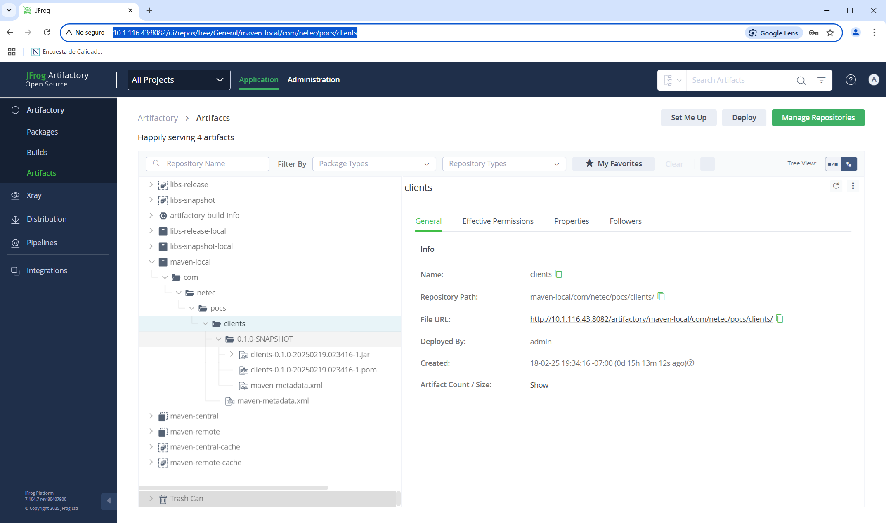

La imagen anterior es de el enlace: <http://10.1.116.43:8082/ui/repos/tree/General/maven-local/com/netec/pocs/clients>

### FLUJO JENKINS

Para la integración de JFrog Artifactory con Jenkins es necesario realizar las siguientes configuraciones.

#### Complemento de JFrog Artifactory

En un navegador web ingresa el enlace <http://10.1.116.41:8080/manage/pluginManager/available> para configurar el complemento de JFrog Artifactory en Jenkins.

En el campo de búsqueda ingresa `Artifactory`, de la lista selecciona el componente localizado. Marca la opción de `Install` y da clic en el botón `Restart Jenkins…​`.

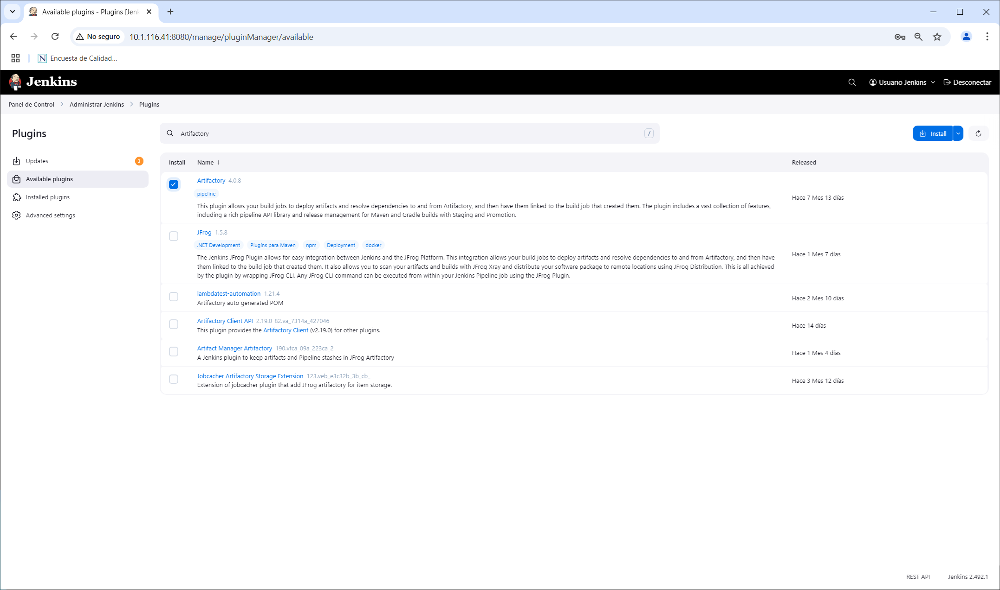

Espera a que el proceso termine la instalación y verifica que el complemento de **JFrog Artifactory** se haya instalado correctamente.

#### Servidor JFrog Artifactory

En la opción `Configure System` de **Jenkins** en el enlace: <http://10.1.116.41:8080/manage/configure>, localiza la sección `JFrog` e ingresa la información:

- Add JFrog Platform Instance

  - Server ID: `artifactory`

  - URL: `http://10.1.116.43:8082`

    - Sustituir la IP por la dirección IP de tu servidor de JFrog Artifactory.

  - Username: `admin`
  - Password: `cmVm....`

    - Sustituir el token por el token generado en JFrog Artifactory.

  - Clic en `Test Connection`: Para verificar la conexión con el servidor.

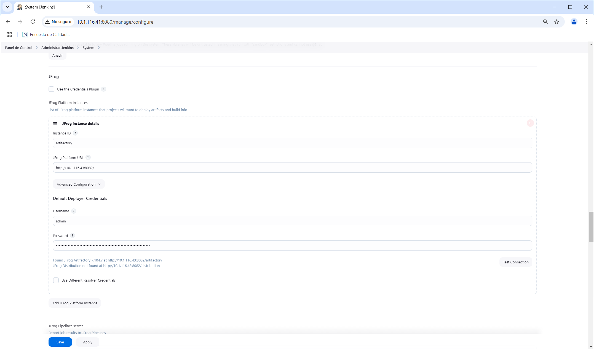

Da clic en `Apply` y `Save`.

#### Jenkins Job

En la pantalla principal (<http://10.11.116.41:8080/>) de Jenkins crea un nuevo proyecto dando clic en \[+ New Item\](<http://10.11.116.41:8080/view/all/newJob>) con los siguientes datos:

- Nombre: `Artifactory-Job`

- Tipo de proyecto: `Freestyle project`

Después de ingresar la información da clic en `OK`.

##### Configuración

A continuación, se indica la información a añadir en cada sección.

###### General

En la sección de `Configuration/General` ingresa la siguiente información:

- Descripción: `Job para la gestión simple del ciclo de vida de un proyecto Maven con publicación en Artifactory.`

###### Source Code Management

- Git

  - Repositories

    - Repository URL: `https://github.com/cazucito/DevOps_Tools_cazucito.git`

      - Recuerda que debe ser la URL a tu repositorio. La indicada es de ejemplo y la tuya debe ser similar ésta.

        - Credentials: `githubCred`

        - Branches to build:

        - Branch Specifier (blank for 'any'): `labs/clients_artifactory`

        - Sustituir por tu rama de trabajo.

###### Triggers

En la sección de `Configuration/Build Triggers` selecciona la opción `Maven3-Artifactory` con la siguiente información:

- Artifactory Configuration

  - Artifactory Server: `artifactory http://10.1.116.43:8082/artifactory`

    - Target Repository: `libs-release-local`

    - Target Snapshot Repository: `libs-snapshot-local`

  - Deploy artifacts to Artifactory: `Seleccionado`

    - Filter excluded artifacts from build: `Seleccionado`

  - Capture and publish build info: `Seleccionado`

###### Build Steps

En la opción `Configuration/Build Steps/Add build step/Invoke Artifactory Maven 3` ingresa la siguiente información:

- Invoke Artifactory Maven 3

  - Maven Version: `default`

  - Goals and options: `clean install -DskipTests -B -ntp`

    - **clean**: Limpia los archivos de compilación generados anteriormente.

    - **install**: Compila, empaqueta y publica el artefacto en el repositorio local de Maven.

    - **-DskipTests**: Omite la ejecución de pruebas unitarias.

    - **-B** (*batch mode*): Ejecuta Maven sin interacción, útil para entornos de CI/CD.

    - **-ntp** (*no transfer progress*): Evita mostrar la barra de progreso durante la descarga de dependencias.

###### Save

Da clic en el botón de guardado ( `Save` )

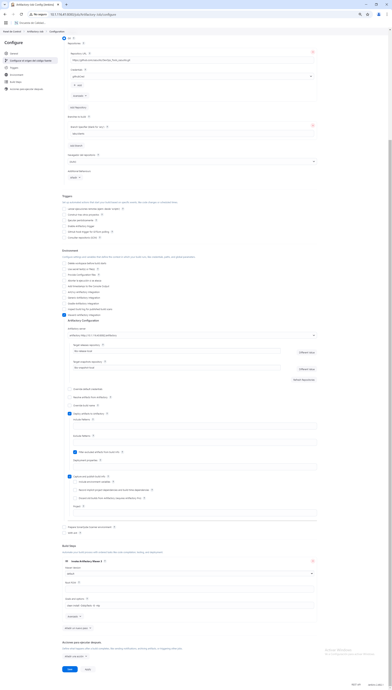

#### Ejecución

Para comprobar el funcionamiento, ejecuta el **job** dando clic en la opción `Build Now` del menú lateral.

Adicionalmente comprueba los cambios en la interfaz del **job** y del **build**.

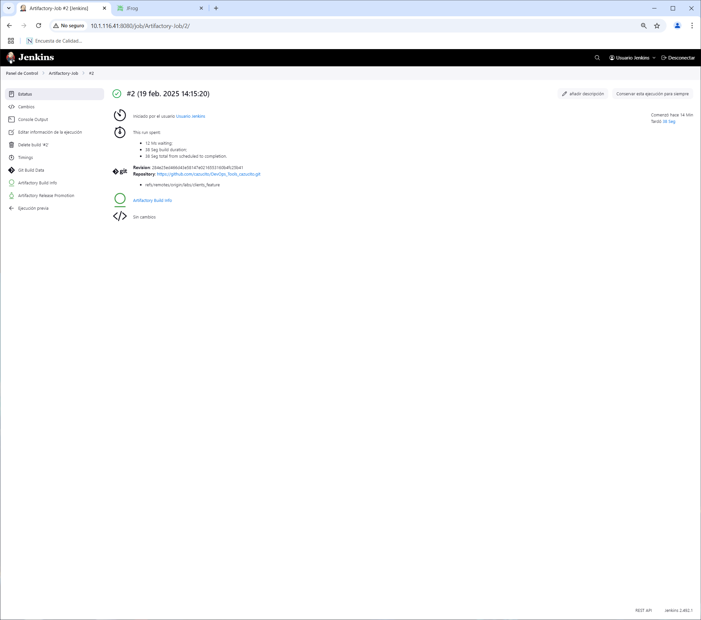

##### Salida en Consola

En la parte inferior de la barra lateral izquierda, en la sección `Build History` se puede apreciar el historial de ejecución (**build**) del **job**.

Al dar clic en alguno de los enlaces (en cada renglón) se puede observar la información general del **build**.

Para observar la salida en consola de la construcción se debe seleccionar la opción `Console Output` del menú lateral.

Dedica un momento a analizar la salida, para localizar las secciones donde se interactúa con **JFrog Artifactory**.

A continuación, se muestra un fragmento de la salida en consola.

``` text
    Started by user Usuario Jenkins
    Running as SYSTEM
    Building in workspace /var/lib/jenkins/workspace/Artifactory-Job
    The recommended git tool is: NONE
    using credential githubCred
     > git rev-parse --resolve-git-dir /var/lib/jenkins/workspace/Artifactory-Job/.git # timeout=10
    Fetching changes from the remote Git repository
     > git config remote.origin.url https://github.com/cazucito/DevOps_Tools_cazucito.git # timeout=10
    Fetching upstream changes from https://github.com/cazucito/DevOps_Tools_cazucito.git
     > git --version # timeout=10
     > git --version # 'git version 2.25.1'
    using GIT_ASKPASS to set credentials githubCred
     > git fetch --tags --force --progress -- https://github.com/cazucito/DevOps_Tools_cazucito.git +refs/heads/*:refs/remotes/origin/* # timeout=10
     > git rev-parse refs/remotes/origin/labs/clients_feature^{commit} # timeout=10
     > git rev-parse labs/clients_feature^{commit} # timeout=10
    Checking out Revision 284e25ed466d43e58147e0216553160b4fc25b41 (refs/remotes/origin/labs/clients_feature)
     > git config core.sparsecheckout # timeout=10
     > git checkout -f 284e25ed466d43e58147e0216553160b4fc25b41 # timeout=10
    Commit message: "Refactoring"
    First time build. Skipping changelog.
    Jenkins Artifactory Plugin version: 4.0.8
    Artifactory integration is enabled
    [Artifactory-Job] $ /usr/lib/jvm/java-17-openjdk-amd64/bin/java -classpath /usr/share/maven/boot/* -Dmaven.home=/usr/share/maven -Dmaven.conf=/usr/share/maven/conf -DbuildInfoConfig.propertiesFile=/var/lib/jenkins/workspace/Artifactory-Job@tmp/artifactory/buildInfo9661441968112836366.properties -Dm3plugin.lib=/var/lib/jenkins/workspace/Artifactory-Job/cache/artifactory-plugin/4.0.8 -Dclassworlds.conf=/var/lib/jenkins/workspace/Artifactory-Job/classworlds2766710636024429301conf -Dmaven.multiModuleProjectDirectory=/var/lib/jenkins/workspace/Artifactory-Job org.codehaus.plexus.classworlds.launcher.Launcher clean install -DskipTests -B -ntp
    SLF4J: Class path contains multiple SLF4J bindings.
    SLF4J: Found binding in [jar:file:/usr/share/maven/lib/maven-slf4j-provider-3.x.jar!/org/slf4j/impl/StaticLoggerBinder.class]
    SLF4J: Found binding in [jar:file:/var/lib/jenkins/workspace/Artifactory-Job/cache/artifactory-plugin/4.0.8/slf4j-simple-1.7.36.jar!/org/slf4j/impl/StaticLoggerBinder.class]
    SLF4J: See http://www.slf4j.org/codes.html#multiple_bindings for an explanation.
    SLF4J: Actual binding is of type [org.slf4j.impl.MavenSimpleLoggerFactory]
    SLF4J: Class path contains multiple SLF4J bindings.
    SLF4J: Found binding in [jar:file:/usr/share/maven/lib/maven-slf4j-provider-3.x.jar!/org/slf4j/impl/StaticLoggerBinder.class]
    SLF4J: Found binding in [jar:file:/var/lib/jenkins/workspace/Artifactory-Job/cache/artifactory-plugin/4.0.8/slf4j-simple-1.7.36.jar!/org/slf4j/impl/StaticLoggerBinder.class]
    SLF4J: See http://www.slf4j.org/codes.html#multiple_bindings for an explanation.
    SLF4J: Actual binding is of type [org.slf4j.impl.MavenSimpleLoggerFactory]
    [main] INFO org.apache.maven.cli.event.ExecutionEventLogger - Scanning for projects...
    [main] INFO org.jfrog.build.extractor.maven.BuildInfoRecorder - Initializing Artifactory Build-Info Recording
    [main] INFO org.apache.maven.cli.event.ExecutionEventLogger -
    [main] INFO org.apache.maven.cli.event.ExecutionEventLogger - -----------------------< com.netec.pocs:clients >-----------------------
    [main] INFO org.apache.maven.cli.event.ExecutionEventLogger - Building clients 0.1.0-SNAPSHOT
    [main] INFO org.apache.maven.cli.event.ExecutionEventLogger - --------------------------------[ jar ]---------------------------------
    [main] INFO org.apache.maven.cli.event.ExecutionEventLogger -
    [main] INFO org.apache.maven.cli.event.ExecutionEventLogger - --- maven-clean-plugin:3.3.2:clean (default-clean) @ clients ---
    [main] INFO org.apache.maven.cli.event.ExecutionEventLogger -
    [main] INFO org.apache.maven.cli.event.ExecutionEventLogger - --- maven-resources-plugin:3.3.1:resources (default-resources) @ clients ---
    [main] INFO org.apache.maven.shared.filtering.DefaultMavenResourcesFiltering - Copying 1 resource from src/main/resources to target/classes
    [main] INFO org.apache.maven.shared.filtering.DefaultMavenResourcesFiltering - Copying 0 resource from src/main/resources to target/classes
    [main] INFO org.apache.maven.cli.event.ExecutionEventLogger -
    [main] INFO org.apache.maven.cli.event.ExecutionEventLogger - --- maven-compiler-plugin:3.8.1:compile (default-compile) @ clients ---
    [main] INFO org.apache.maven.plugin.compiler.CompilerMojo - Changes detected - recompiling the module!
    [main] INFO org.codehaus.plexus.compiler.javac.JavacCompiler - Compiling 4 source files to /var/lib/jenkins/workspace/Artifactory-Job/target/classes
    [main] INFO org.apache.maven.cli.event.ExecutionEventLogger -
    [main] INFO org.apache.maven.cli.event.ExecutionEventLogger - --- maven-resources-plugin:3.3.1:testResources (default-testResources) @ clients ---
    [main] INFO org.apache.maven.shared.filtering.DefaultMavenResourcesFiltering - skip non existing resourceDirectory /var/lib/jenkins/workspace/Artifactory-Job/src/test/resources
    [main] INFO org.apache.maven.cli.event.ExecutionEventLogger -
    [main] INFO org.apache.maven.cli.event.ExecutionEventLogger - --- maven-compiler-plugin:3.8.1:testCompile (default-testCompile) @ clients ---
    [main] INFO org.apache.maven.plugin.compiler.TestCompilerMojo - Changes detected - recompiling the module!
    [main] INFO org.codehaus.plexus.compiler.javac.JavacCompiler - Compiling 1 source file to /var/lib/jenkins/workspace/Artifactory-Job/target/test-classes
    [main] INFO org.apache.maven.cli.event.ExecutionEventLogger -
    [main] INFO org.apache.maven.cli.event.ExecutionEventLogger - --- maven-surefire-plugin:3.1.2:test (default-test) @ clients ---
    [main] INFO org.apache.maven.plugin.surefire.SurefirePlugin - Tests are skipped.
    [main] INFO org.apache.maven.cli.event.ExecutionEventLogger -
    [main] INFO org.apache.maven.cli.event.ExecutionEventLogger - --- maven-jar-plugin:3.3.0:jar (default-jar) @ clients ---
    [main] INFO org.codehaus.plexus.archiver.jar.JarArchiver - Building jar: /var/lib/jenkins/workspace/Artifactory-Job/target/clients-0.1.0-SNAPSHOT.jar
    [main] INFO org.apache.maven.cli.event.ExecutionEventLogger -
    [main] INFO org.apache.maven.cli.event.ExecutionEventLogger - --- spring-boot-maven-plugin:3.2.2:repackage (repackage) @ clients ---
    [main] INFO org.springframework.boot.maven.RepackageMojo - Replacing main artifact /var/lib/jenkins/workspace/Artifactory-Job/target/clients-0.1.0-SNAPSHOT.jar with repackaged archive, adding nested dependencies in BOOT-INF/.
    [main] INFO org.springframework.boot.maven.RepackageMojo - The original artifact has been renamed to /var/lib/jenkins/workspace/Artifactory-Job/target/clients-0.1.0-SNAPSHOT.jar.original
    [main] INFO org.apache.maven.cli.event.ExecutionEventLogger -
    [main] INFO org.apache.maven.cli.event.ExecutionEventLogger - --- maven-install-plugin:3.1.1:install (default-install) @ clients ---
    [main] INFO org.codehaus.plexus.PlexusContainer - Installing /var/lib/jenkins/workspace/Artifactory-Job/pom.xml to /var/lib/jenkins/.m2/repository/com/netec/pocs/clients/0.1.0-SNAPSHOT/clients-0.1.0-SNAPSHOT.pom
    [main] INFO org.codehaus.plexus.PlexusContainer - Installing /var/lib/jenkins/workspace/Artifactory-Job/target/clients-0.1.0-SNAPSHOT.jar to /var/lib/jenkins/.m2/repository/com/netec/pocs/clients/0.1.0-SNAPSHOT/clients-0.1.0-SNAPSHOT.jar
    [main] INFO org.jfrog.build.extractor.maven.BuildDeploymentHelper - Artifactory Build Info Recorder: Saving Build Info to '/var/lib/jenkins/workspace/Artifactory-Job/target/build-info.json'
    [main] INFO org.jfrog.build.extractor.maven.ArtifactoryManagerBuilder - Deploying artifact: http://10.1.116.43:8082/artifactory/libs-snapshot-local/com/netec/pocs/clients/0.1.0-SNAPSHOT/clients-0.1.0-SNAPSHOT.jar
    [main] INFO org.jfrog.build.extractor.maven.ArtifactoryManagerBuilder - Deploying artifact: http://10.1.116.43:8082/artifactory/libs-snapshot-local/com/netec/pocs/clients/0.1.0-SNAPSHOT/clients-0.1.0-SNAPSHOT.pom
    [main] INFO org.jfrog.build.extractor.maven.BuildDeploymentHelper - Artifactory Build Info Recorder: Deploying build info ...
    [main] INFO org.jfrog.build.extractor.maven.ArtifactoryManagerBuilder - Deploying build info...
    [main] INFO org.jfrog.build.extractor.maven.ArtifactoryManagerBuilder - Build-info successfully deployed. Browse it in Artifactory under http://10.1.116.43:8082/artifactory/webapp/builds/Artifactory-Job/2
    [main] INFO org.apache.maven.cli.event.ExecutionEventLogger - ------------------------------------------------------------------------
    [main] INFO org.apache.maven.cli.event.ExecutionEventLogger - BUILD SUCCESS
    [main] INFO org.apache.maven.cli.event.ExecutionEventLogger - ------------------------------------------------------------------------
    [main] INFO org.apache.maven.cli.event.ExecutionEventLogger - Total time:  35.325 s
    [main] INFO org.apache.maven.cli.event.ExecutionEventLogger - Finished at: 2025-02-19T14:15:58-06:00
    [main] INFO org.apache.maven.cli.event.ExecutionEventLogger - ------------------------------------------------------------------------
    Finished: SUCCESS
```

##### JFrog Artifactory

Para verificar la publicación del artefacto en Jartifactory, accede a la interfaz de JFrog Artifactory (<http://10.11.116.43:8082/artifactory>) y navega a la sección `Artifacts`.

En la lista de artefactos, localiza el artefacto `clients-0.1.0-SNAPSHOT.jar` y da clic en él para visualizar los detalles.

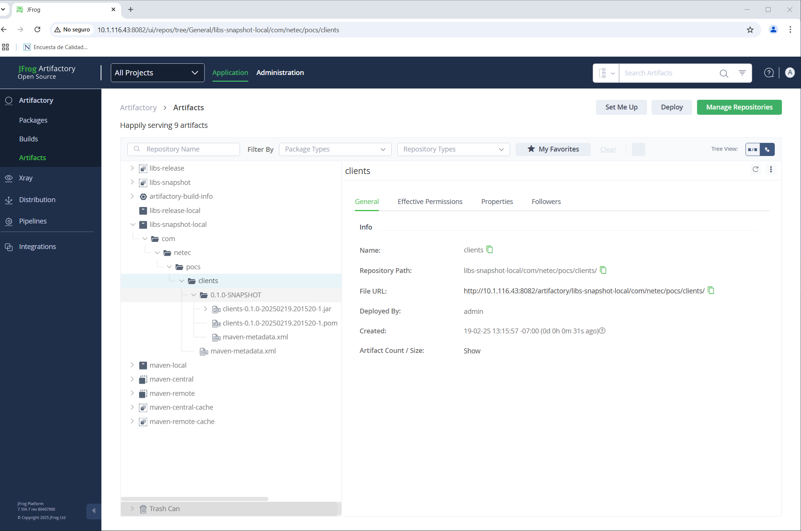

Incluso puedes visualizar la información del **build** en la sección `Builds`.

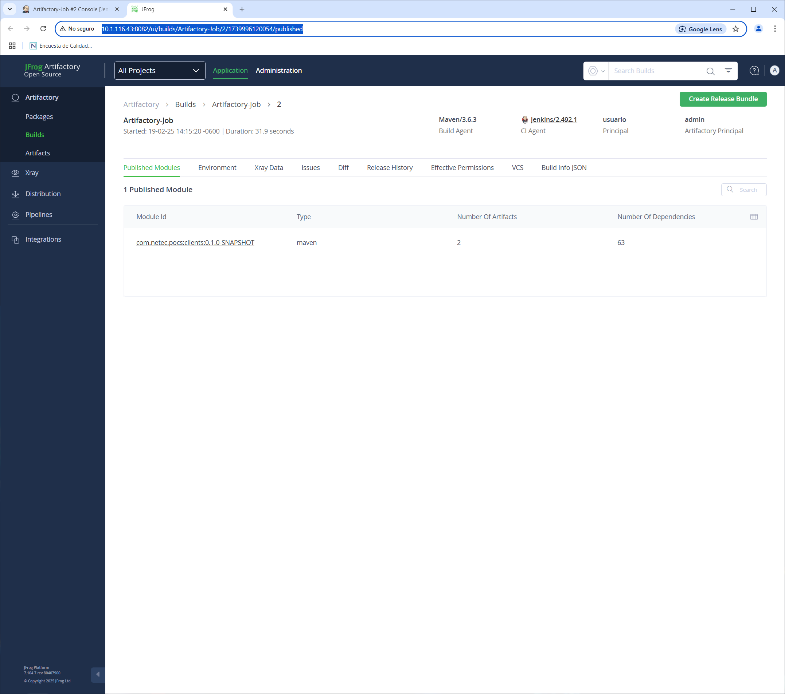

## RESULTADO

Al finalizar esta actividad, habrás creado y ejecutado un Job en Jenkins con interacción hacia un repositorio de JFrog Artifactory.

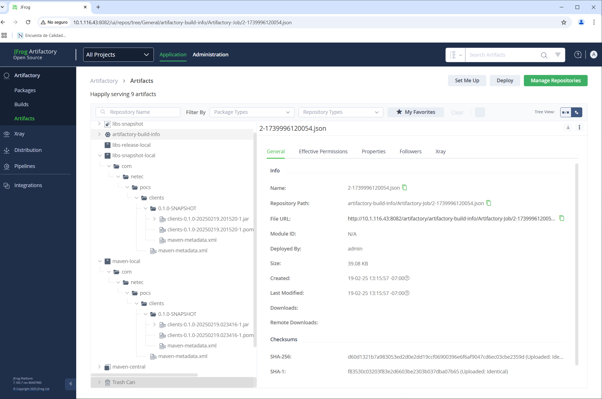
