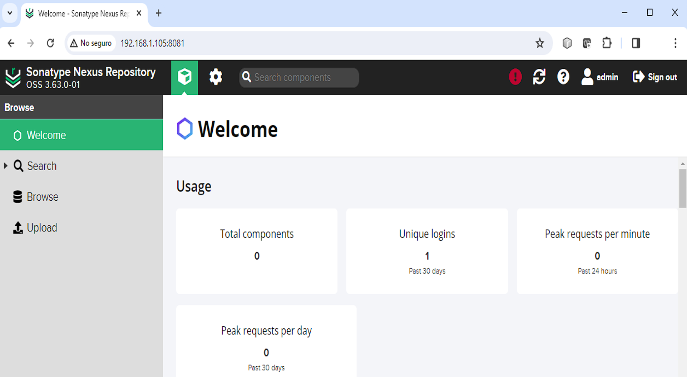

# ARTEFACTOS / INSTALACIÓN DE SONARTYPE NEXUS REPOSITORY

**ESTA ACTIVIDAD ES OPCIONAL**

**SOLO DEBE REALIZARSE DE TENER UN NODO ADICIONAL DISPONIBLE (4 nodos o más)**

## OBJETIVOS

Al termino de esta actividad, serás capaz de:

- Al finalizar serás capaz de instalar Sonartype Nexus Repository en sistemas basados en Linux Ubuntu.

## DURACIÓN

Tiempo aproximado para esta actividad:

- **Extra curso.**

## PRERREQUISITOS

Para esta actividad se requiere:

- Acceso a Internet.
- Acceso mediante SSH a un servidor Linux.

## INSTRUCCIONES

A continuación se bosquejan los pasos típicos de instalación.

Para instrucciones detalladas, por favor; visita: <https://help.sonatype.com/en/installation-methods.html>

1. Prerrequisitos Ubuntu.
2. Actualización APT.
3. Instalación de Java.
4. Usuario dedicado `nexus`.
5. Descargar Nexus del sitio oficial.
6. Instalación.
7. Creación de un servicio para Nexus.
8. Verificación de Instalación.
9. Configuración inicial.

## RESULTADO

Al finalizar esta actividad, habrás instalado Sonartype Nexus Repository en un servidor Linux Ubuntu.

