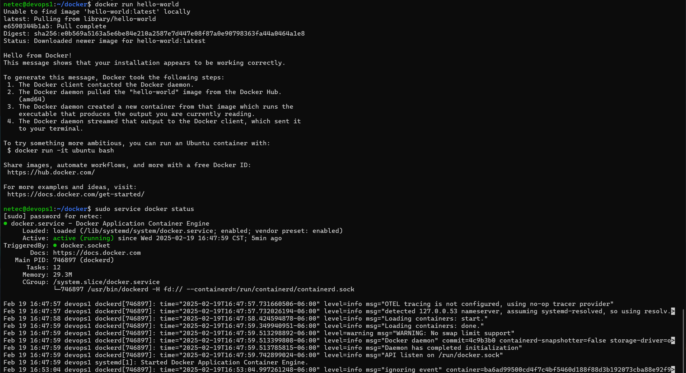

# DOCKER / INSTALACIÓN

## OBJETIVOS

Al termino de este capítulo, serás capaz de:

- Al finalizar serás capaz de instalar Docker en sistemas basados en Linux Ubuntu.

## DURACIÓN

Tiempo aproximado para esta actividad:

- 20 minutos.

## PRERREQUISITOS

Para esta actividad se requiere:

- Acceso a Internet.
- Acceso mediante SSH a un servidor Linux.

## INSTRUCCIONES

### REQUERIMIENTOS PREVIOS

En está guía se considera el nodo identificado por `10.11.116.41` como el servidor Ubuntu donde se instalará Docker.

#### Consideraciones

Los procesos de instalación varían de versión a versión y dependen del sistema operativo, por lo que te recomendamos se visite el sitio oficial para los detalles de instalación particulares.

- <https://docs.docker.com/get-docker/>

##### Guías Oficiales

En esta actividad se instala **Docker** en su equipo de trabajo.

Sigue el proceso de descarga/instalación para tu sistema operativo según las guías oficiales:

- Windows
  - <https://docs.docker.com/desktop/install/windows-install/>
- Mac OS
  - <https://docs.docker.com/desktop/install/mac-install/>
- Linux
  - <https://docs.docker.com/engine/install/>

#### Desinstalación de Versiones Anteriores

Para evitar conflictos con versiones previamente instaladas se recomienda desinstalar los componentes de **Docker** con el siguiente comando:

``` shell
for pkg in docker.io docker-doc docker-compose docker-compose-v2 podman-docker containerd runc; do sudo apt-get remove $pkg; done
```

Con una salida semejante a:

``` shell
[sudo] password for netec:
Reading package lists... Done
Building dependency tree
Reading state information... Done
Package 'docker.io' is not installed, so not removed
0 upgraded, 0 newly installed, 0 to remove and 28 not upgraded.
Reading package lists... Done
Building dependency tree
Reading state information... Done
Package 'docker-doc' is not installed, so not removed
0 upgraded, 0 newly installed, 0 to remove and 28 not upgraded.
Reading package lists... Done
Building dependency tree
Reading state information... Done
Package 'docker-compose' is not installed, so not removed
0 upgraded, 0 newly installed, 0 to remove and 28 not upgraded.
Reading package lists... Done
Building dependency tree
Reading state information... Done
Package 'docker-compose-v2' is not installed, so not removed
0 upgraded, 0 newly installed, 0 to remove and 28 not upgraded.
Reading package lists... Done
Building dependency tree
Reading state information... Done
E: Unable to locate package podman-docker
Reading package lists... Done
Building dependency tree
Reading state information... Done
Package 'containerd' is not installed, so not removed
0 upgraded, 0 newly installed, 0 to remove and 28 not upgraded.
Reading package lists... Done
Building dependency tree
Reading state information... Done
Package 'runc' is not installed, so not removed
0 upgraded, 0 newly installed, 0 to remove and 28 not upgraded.
```

#### Repositorios de Paquetes

Actualización de paquetes y adición de llaves:

``` shell
# Add Docker's official GPG key:
# Actualización de paquetes.
sudo apt-get update
# Instalación de paquetes.
sudo apt-get install ca-certificates curl gnupg
# Creación de directorio para llaves.
sudo install -m 0755 -d /etc/apt/keyrings
# Descarga de llave.
curl -fsSL https://download.docker.com/linux/ubuntu/gpg | sudo gpg --dearmor -o /etc/apt/keyrings/docker.gpg
# Permisos de lectura.
sudo chmod a+r /etc/apt/keyrings/docker.gpg
```

- En caso de solicitar la confirmación indicar "Y" como opción y digitar la tecla "enter".

La salida será semejante a:

``` shell
Ign:1 https://pkg.jenkins.io/debian-stable binary/ InRelease
Hit:2 https://pkg.jenkins.io/debian-stable binary/ Release
Hit:3 http://mx.archive.ubuntu.com/ubuntu focal InRelease
Get:4 http://security.ubuntu.com/ubuntu focal-security InRelease [128 kB]
Get:5 http://mx.archive.ubuntu.com/ubuntu focal-updates InRelease [128 kB]
Get:7 http://mx.archive.ubuntu.com/ubuntu focal-backports InRelease [128 kB]
Fetched 383 kB in 2s (244 kB/s)
Reading package lists... Done

...

Reading package lists... Done
Building dependency tree
Reading state information... Done
ca-certificates is already the newest version (20240203~20.04.1).
curl is already the newest version (7.68.0-1ubuntu2.25).
gnupg is already the newest version (2.2.19-3ubuntu2.2).
0 upgraded, 0 newly installed, 0 to remove and 28 not upgraded.
```

Adición del repositorio:

``` shell
# Add the repository to Apt sources:
echo "deb [arch=$(dpkg --print-architecture) signed-by=/etc/apt/keyrings/docker.gpg] https://download.docker.com/linux/ubuntu $(. /etc/os-release && echo "$VERSION_CODENAME") stable" | sudo tee /etc/apt/sources.list.d/docker.list > /dev/null
sudo apt-get update
```

La salida será semejante a:

``` shell
Get:1 https://download.docker.com/linux/ubuntu focal InRelease [57.7 kB]
Hit:2 http://mx.archive.ubuntu.com/ubuntu focal InRelease
Hit:3 http://mx.archive.ubuntu.com/ubuntu focal-updates InRelease
Hit:4 http://mx.archive.ubuntu.com/ubuntu focal-backports InRelease
Get:5 https://download.docker.com/linux/ubuntu focal/stable amd64 Packages [54.9 kB]
Hit:6 http://security.ubuntu.com/ubuntu focal-security InRelease
Ign:7 https://pkg.jenkins.io/debian-stable binary/ InRelease
Hit:8 https://pkg.jenkins.io/debian-stable binary/ Release
Fetched 113 kB in 4s (31.5 kB/s)
Reading package lists... Done
```

### DOCKER

#### Paquetes Docker

Para instalar Docker en Ubuntu ejecute el comando mostrado a continuación:

- En caso de solicitar la confirmación indicar "Y" como opción y teclear la tecla "enter".

``` shell
sudo apt-get install docker-ce docker-ce-cli containerd.io docker-buildx-plugin docker-compose-plugin
```

Donde:

- **docker-ce**: Motor de Docker Community Edition.
- **docker-ce-cli**: Herramientas de línea de comandos de Docker.
- **containerd.io**: Servicio para ejecutar contenedores, separado de Docker.
- **docker-buildx-plugin**: Extensión para compilar imágenes en múltiples arquitecturas.
- **docker-compose-plugin**: Extensión para usar docker-compose con el comando “docker compose”.

La salida será semejante a:

``` shell
Reading package lists... Done
Building dependency tree
Reading state information... Done
The following additional packages will be installed:
  docker-ce-rootless-extras pigz slirp4netns
Suggested packages:
  aufs-tools cgroupfs-mount | cgroup-lite
The following NEW packages will be installed:
  containerd.io docker-buildx-plugin docker-ce docker-ce-cli docker-ce-rootless-extras docker-compose-plugin pigz slirp4netns
0 upgraded, 8 newly installed, 0 to remove and 28 not upgraded.
Need to get 127 MB of archives.
After this operation, 458 MB of additional disk space will be used.
Do you want to continue? [Y/n] Y
Get:1 https://download.docker.com/linux/ubuntu focal/stable amd64 containerd.io amd64 1.7.25-1 [29.6 MB]
Get:2 http://mx.archive.ubuntu.com/ubuntu focal/universe amd64 pigz amd64 2.4-1 [57.4 kB]
Get:3 http://mx.archive.ubuntu.com/ubuntu focal/universe amd64 slirp4netns amd64 0.4.3-1 [74.3 kB]
Get:4 https://download.docker.com/linux/ubuntu focal/stable amd64 docker-buildx-plugin amd64 0.20.0-1~ubuntu.20.04~focal [33.2 MB]
Get:5 https://download.docker.com/linux/ubuntu focal/stable amd64 docker-ce-cli amd64 5:27.5.1-1~ubuntu.20.04~focal [15.2 MB]
Get:6 https://download.docker.com/linux/ubuntu focal/stable amd64 docker-ce amd64 5:27.5.1-1~ubuntu.20.04~focal [26.1 MB]
Get:7 https://download.docker.com/linux/ubuntu focal/stable amd64 docker-ce-rootless-extras amd64 5:27.5.1-1~ubuntu.20.04~focal [9,612 kB]
Get:8 https://download.docker.com/linux/ubuntu focal/stable amd64 docker-compose-plugin amd64 2.32.4-1~ubuntu.20.04~focal [12.8 MB]
Fetched 127 MB in 4s (31.6 MB/s)
Selecting previously unselected package pigz.
(Reading database ... 141102 files and directories currently installed.)
Preparing to unpack .../0-pigz_2.4-1_amd64.deb ...
Unpacking pigz (2.4-1) ...
Selecting previously unselected package containerd.io.
Preparing to unpack .../1-containerd.io_1.7.25-1_amd64.deb ...
Unpacking containerd.io (1.7.25-1) ...
Selecting previously unselected package docker-buildx-plugin.
Preparing to unpack .../2-docker-buildx-plugin_0.20.0-1~ubuntu.20.04~focal_amd64.deb ...
Unpacking docker-buildx-plugin (0.20.0-1~ubuntu.20.04~focal) ...
Selecting previously unselected package docker-ce-cli.
Preparing to unpack .../3-docker-ce-cli_5%3a27.5.1-1~ubuntu.20.04~focal_amd64.deb ...
Unpacking docker-ce-cli (5:27.5.1-1~ubuntu.20.04~focal) ...
Selecting previously unselected package docker-ce.
Preparing to unpack .../4-docker-ce_5%3a27.5.1-1~ubuntu.20.04~focal_amd64.deb ...
Unpacking docker-ce (5:27.5.1-1~ubuntu.20.04~focal) ...
Selecting previously unselected package docker-ce-rootless-extras.
Preparing to unpack .../5-docker-ce-rootless-extras_5%3a27.5.1-1~ubuntu.20.04~focal_amd64.deb ...
Unpacking docker-ce-rootless-extras (5:27.5.1-1~ubuntu.20.04~focal) ...
Selecting previously unselected package docker-compose-plugin.
Preparing to unpack .../6-docker-compose-plugin_2.32.4-1~ubuntu.20.04~focal_amd64.deb ...
Unpacking docker-compose-plugin (2.32.4-1~ubuntu.20.04~focal) ...
Selecting previously unselected package slirp4netns.
Preparing to unpack .../7-slirp4netns_0.4.3-1_amd64.deb ...
Unpacking slirp4netns (0.4.3-1) ...
Setting up slirp4netns (0.4.3-1) ...
Setting up docker-buildx-plugin (0.20.0-1~ubuntu.20.04~focal) ...
Setting up containerd.io (1.7.25-1) ...
Created symlink /etc/systemd/system/multi-user.target.wants/containerd.service → /lib/systemd/system/containerd.service.
Setting up docker-compose-plugin (2.32.4-1~ubuntu.20.04~focal) ...
Setting up docker-ce-cli (5:27.5.1-1~ubuntu.20.04~focal) ...
Setting up pigz (2.4-1) ...
Setting up docker-ce-rootless-extras (5:27.5.1-1~ubuntu.20.04~focal) ...
Setting up docker-ce (5:27.5.1-1~ubuntu.20.04~focal) ...
Created symlink /etc/systemd/system/multi-user.target.wants/docker.service → /lib/systemd/system/docker.service.
Created symlink /etc/systemd/system/sockets.target.wants/docker.socket → /lib/systemd/system/docker.socket.
Processing triggers for man-db (2.9.1-1) ...
Processing triggers for systemd (245.4-4ubuntu3.24) ...
```

#### Configuración Adicional

Para no adicionar `sudo` en cada ejecución de comandos **docker** se puede crear el grupo **docker** y adicionárselo al usuario.

``` shell
# Cree el grupo docker
sudo groupadd docker

# Agregue el usuario al grupo
sudo usermod -aG docker ${USER}

# Para aplicar los cambios
newgrp docker

# De tener problemas salir e ingresar.
```

Es necesario salir e ingresar al sistema para que aplique la configuración.

#### Validación

Para verificar que la instalación ha sido exitosa ejecute la imagen `hello-world`:

``` shell
docker run hello-world
```

La salida será similar a:

``` shell
Unable to find image 'hello-world:latest' locally
latest: Pulling from library/hello-world
e6590344b1a5: Pull complete
Digest: sha256:e0b569a5163a5e6be84e210a2587e7d447e08f87a0e90798363fa44a0464a1e8
Status: Downloaded newer image for hello-world:latest

Hello from Docker!
This message shows that your installation appears to be working correctly.

To generate this message, Docker took the following steps:
 1. The Docker client contacted the Docker daemon.
 2. The Docker daemon pulled the "hello-world" image from the Docker Hub.
    (amd64)
 3. The Docker daemon created a new container from that image which runs the
    executable that produces the output you are currently reading.
 4. The Docker daemon streamed that output to the Docker client, which sent it
    to your terminal.

To try something more ambitious, you can run an Ubuntu container with:
 $ docker run -it ubuntu bash

Share images, automate workflows, and more with a free Docker ID:
 https://hub.docker.com/

For more examples and ideas, visit:
 https://docs.docker.com/get-started/
```

#### Estado

Para conocer el estatus del demonio docker ejecute:

``` shell
sudo service docker status
```

La salida de la ejecución debe ser similar a:

``` shell
[sudo] password for netec:
● docker.service - Docker Application Container Engine
     Loaded: loaded (/lib/systemd/system/docker.service; enabled; vendor preset: enabled)
     Active: active (running) since Wed 2025-02-19 16:47:59 CST; 5min ago
TriggeredBy: ● docker.socket
       Docs: https://docs.docker.com
   Main PID: 746897 (dockerd)
      Tasks: 12
     Memory: 29.3M
     CGroup: /system.slice/docker.service
             └─746897 /usr/bin/dockerd -H fd:// --containerd=/run/containerd/containerd.sock

Feb 19 16:47:57 devops1 dockerd[746897]: time="2025-02-19T16:47:57.731660506-06:00" level=info msg="OTEL tracing is not configured, using no-op tracer provider"
Feb 19 16:47:57 devops1 dockerd[746897]: time="2025-02-19T16:47:57.732026194-06:00" level=info msg="detected 127.0.0.53 nameserver, assuming systemd-resolved, so using resolv.>
Feb 19 16:47:58 devops1 dockerd[746897]: time="2025-02-19T16:47:58.424594878-06:00" level=info msg="Loading containers: start."
Feb 19 16:47:59 devops1 dockerd[746897]: time="2025-02-19T16:47:59.349940951-06:00" level=info msg="Loading containers: done."
Feb 19 16:47:59 devops1 dockerd[746897]: time="2025-02-19T16:47:59.513298892-06:00" level=warning msg="WARNING: No swap limit support"
Feb 19 16:47:59 devops1 dockerd[746897]: time="2025-02-19T16:47:59.513399808-06:00" level=info msg="Docker daemon" commit=4c9b3b0 containerd-snapshotter=false storage-driver=o>
Feb 19 16:47:59 devops1 dockerd[746897]: time="2025-02-19T16:47:59.513785815-06:00" level=info msg="Daemon has completed initialization"
Feb 19 16:47:59 devops1 dockerd[746897]: time="2025-02-19T16:47:59.742899024-06:00" level=info msg="API listen on /run/docker.sock"
Feb 19 16:47:59 devops1 systemd[1]: Started Docker Application Container Engine.
Feb 19 16:53:04 devops1 dockerd[746897]: time="2025-02-19T16:53:04.997261248-06:00" level=info msg="ignoring event" container=ba6ad99500cd4f7c4bf5460d188f88d3b192073cba88e92f9>
```

## RESULTADO

Al finalizar esta actividad, habrás instalado Docker en un servidor Linux Ubuntu.


