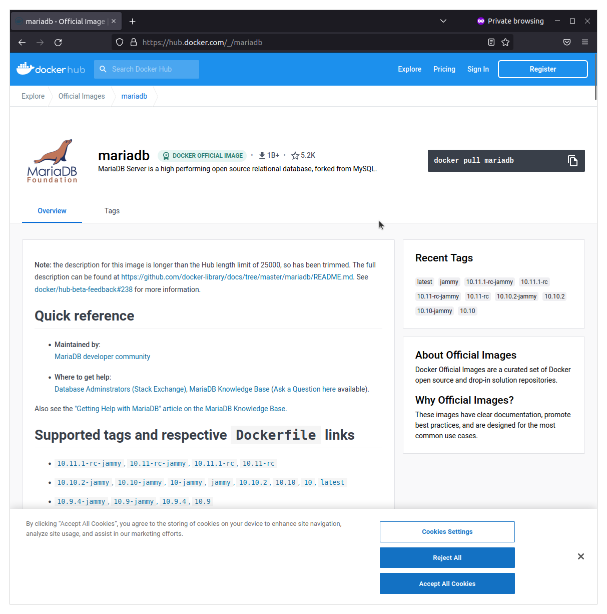
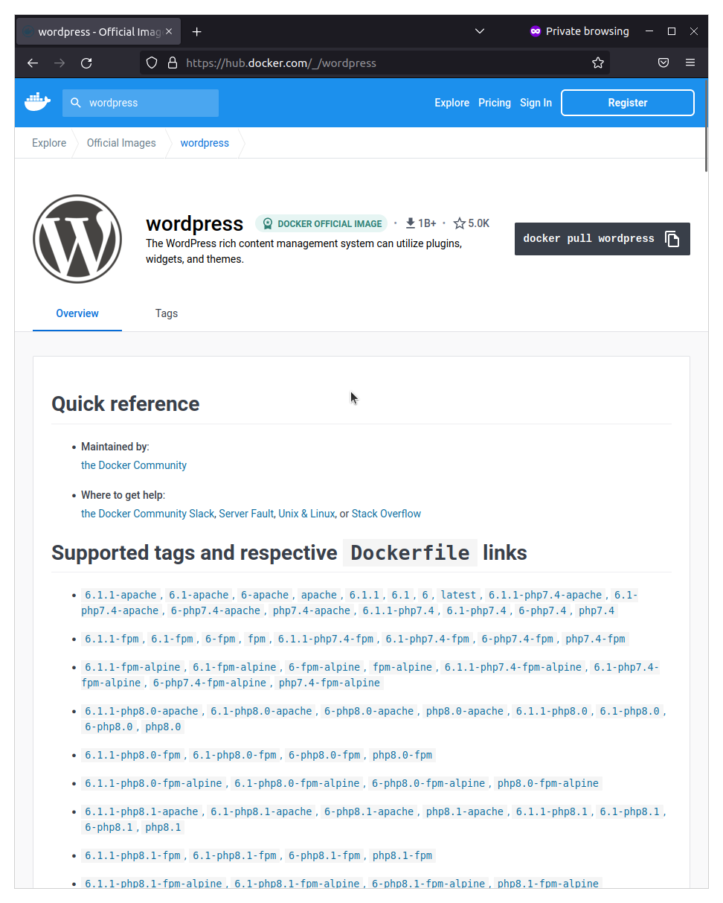
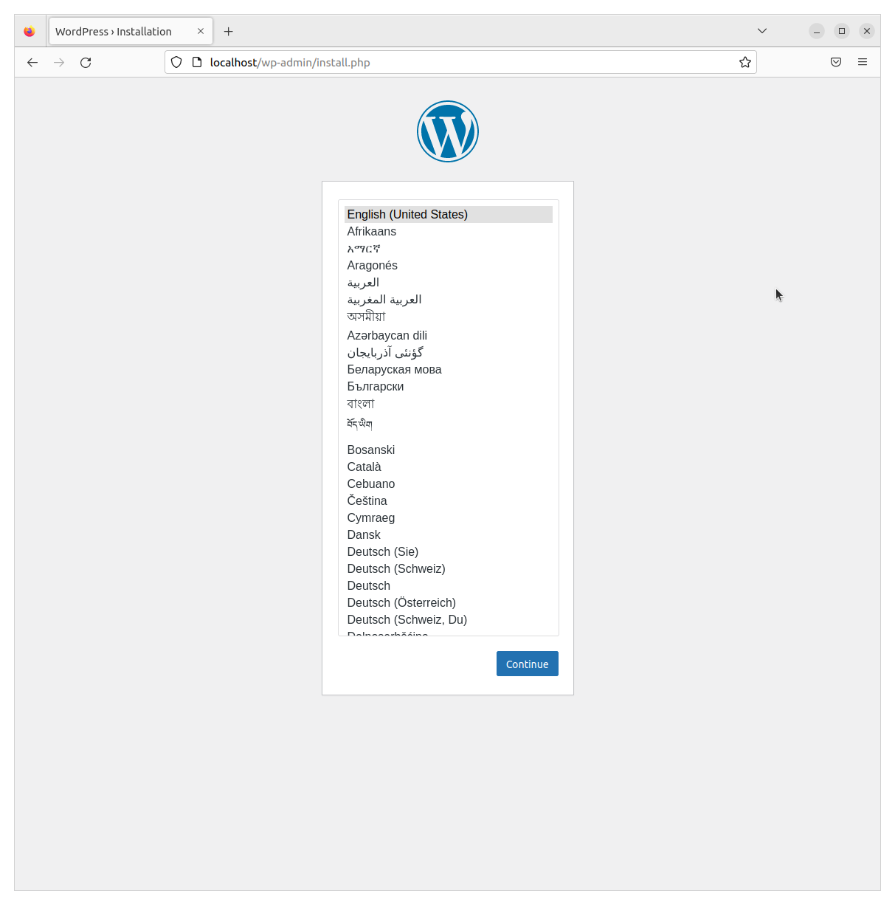
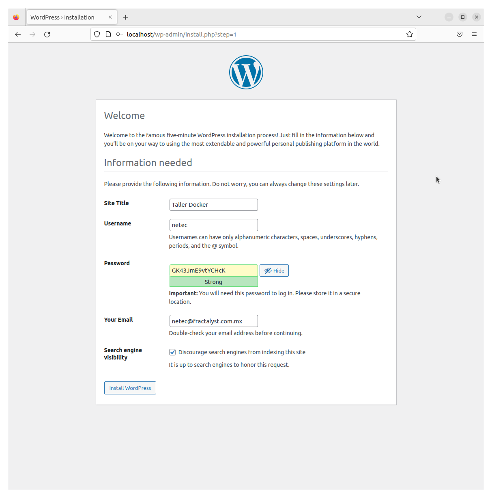
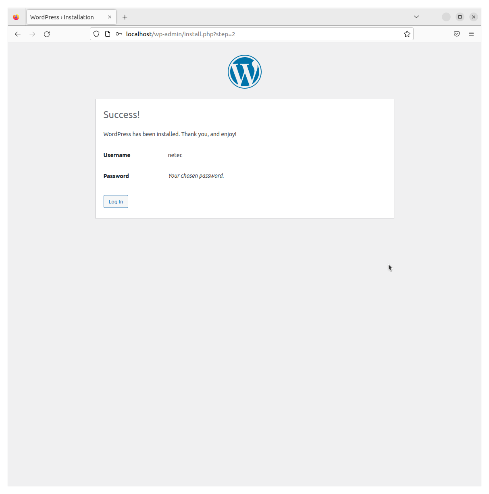
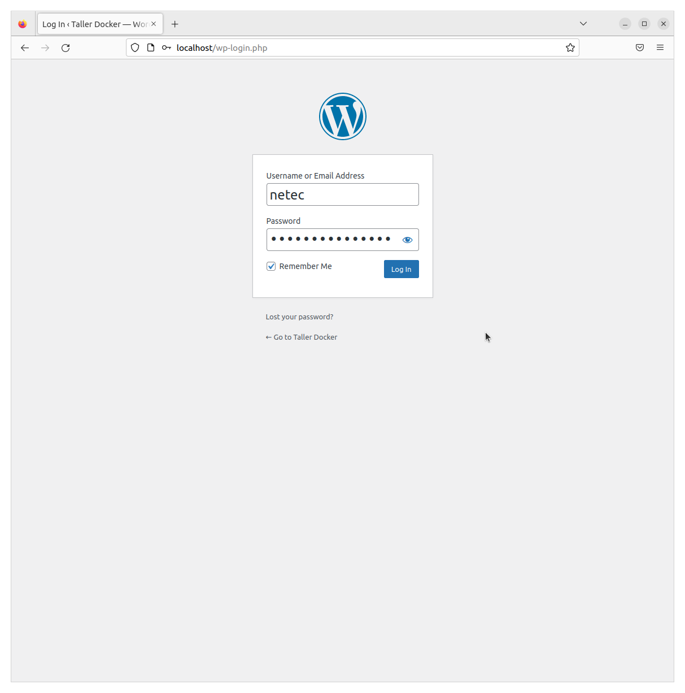
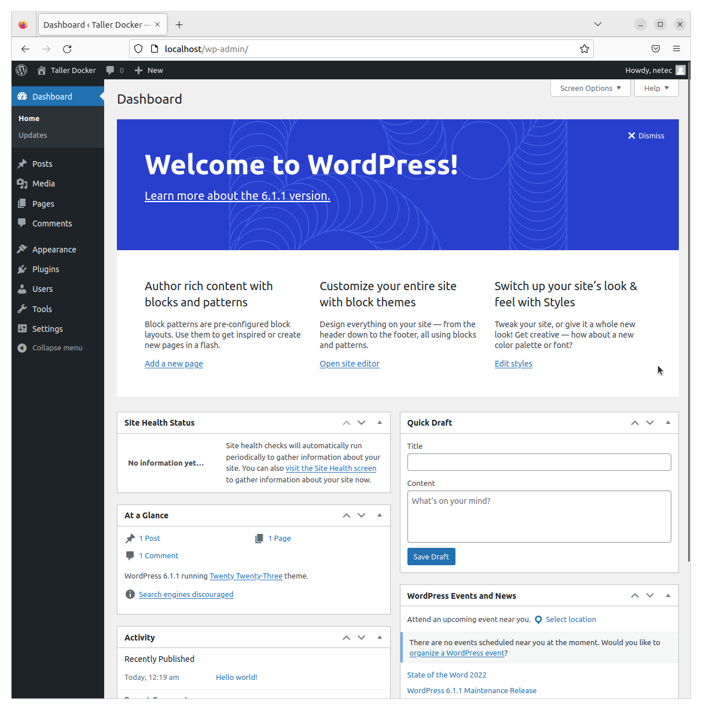
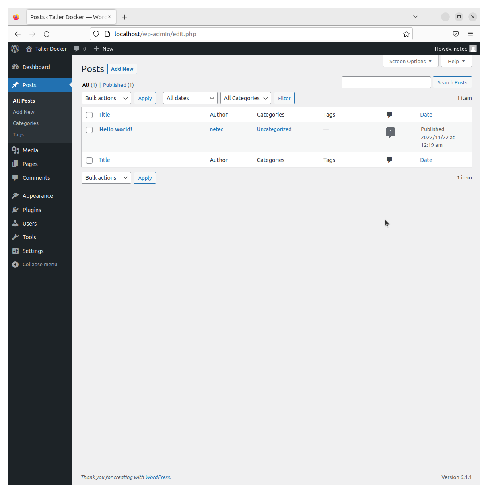
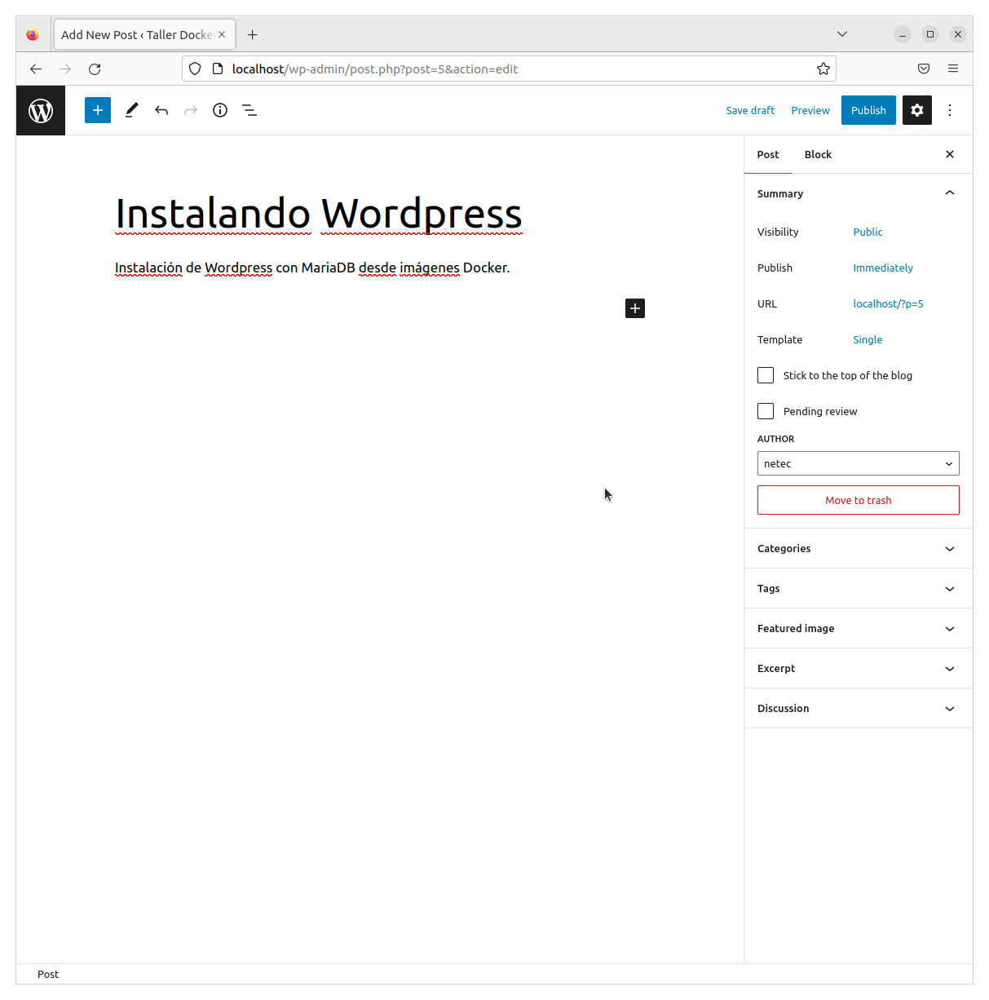
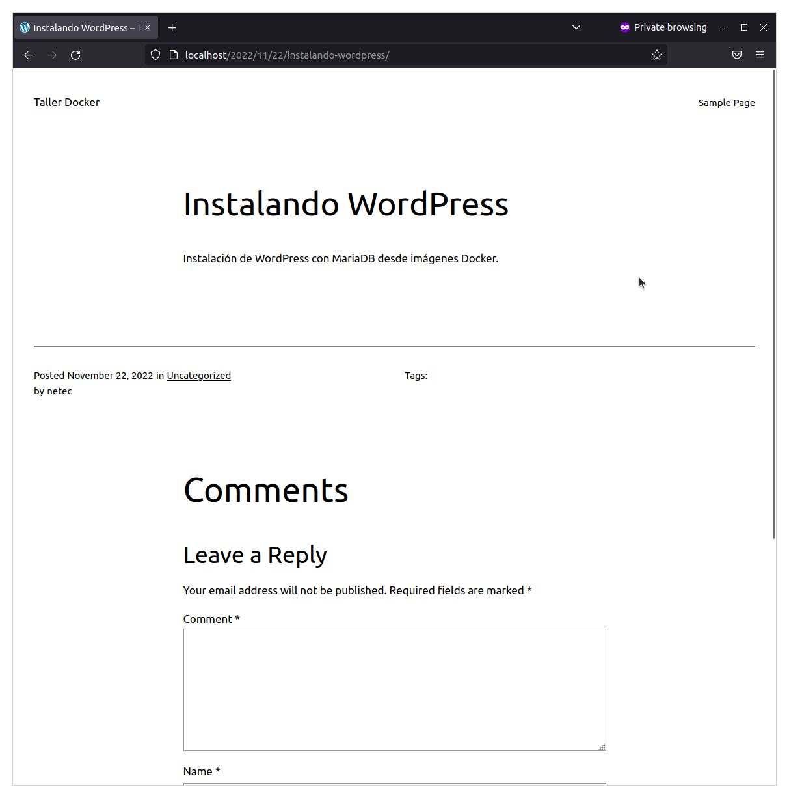

# DOCKER / IMÁGENES PRECONSTRUIDAS

## OBJETIVOS

Al termino de este capítulo, serás capaz de:

- Al finalizar serás capaz utilizar imágenes pre construidas de DockerHub para crear soluciones de negocios completas.

## DURACIÓN

Tiempo aproximado para esta actividad:

- 20 minutos.

## PRERREQUISITOS

Para esta actividad se requiere:

- Acceso a Internet.
- Acceso mediante SSH a un servidor Linux.
- Actividades anteriores del capítulo completadas.

## INSTRUCCIONES

### DOCKERHUB

En esta actividad se explora DockerHub con la intención de conceptualizar claramente a las "imágenes preconstruidas".

#### Sitio Web

En Docker Hub <https://hub.docker.com/> busca algunas de las marcas populares de herramientas de software (MySql, Mongo, WordPress, Nginx, Python, Java, OpenJdk, etcétera).

- Se requiere una cuenta de usuario.

##### Comandos

Utiliza la línea de comandos para realizar algunas búsquedas de imágenes.

Puede auxiliarse en la documentación oficial para conocer las opciones del comando `docker search`:

- <https://docs.docker.com/engine/reference/commandline/search/>

``` shell
docker search mysql
```

La salida de este comando mostrará una lista de imágenes relacionadas con MySQL.

``` text
NAME                   DESCRIPTION                                     STARS     OFFICIAL
mysql                  MySQL is a widely used, open-source relation…   15648     [OK]
bitnami/mysql          Bitnami container image for MySQL               130
circleci/mysql         MySQL is a widely used, open-source relation…   31
cimg/mysql                                                             3
bitnamicharts/mysql    Bitnami Helm chart for MySQL                    0
ubuntu/mysql           MySQL open source fast, stable, multi-thread…   67
linuxserver/mysql      A Mysql container, brought to you by LinuxSe…   41
google/mysql           MySQL server for Google Compute Engine          25
elestio/mysql          Mysql, verified and packaged by Elestio         1
docksal/mysql          MySQL service images for Docksal - https://d…   0
alpine/mysql           mysql client                                    3
mysql/mysql-server     Optimized MySQL Server Docker images. Create…   1026
jumpserver/mysql                                                       1
datajoint/mysql        MySQL image pre-configured to work smoothly …   2
mysql/mysql-router     MySQL Router provides transparent routing be…   28
ilios/mysql            Mysql configured for running Ilios              1
mirantis/mysql                                                         0
corpusops/mysql        https://github.com/corpusops/docker-images/     0
mysql/mysql-cluster    Experimental MySQL Cluster Docker images. Cr…   100
vulhub/mysql                                                           1
mysql/mysql-operator   MySQL Operator for Kubernetes                   1
vitess/mysql           Lightweight image to run MySQL with Vitess      1
nasqueron/mysql                                                        1
cbioportal/mysql       This repository hosts MySQL database images …   0
encoflife/mysql                                                        0
```

### CMS - WORDPRESS

A continuación se instalará el sistema de gestión de contenido WordPress mediante imágenes Docker (WordPress y MariaDB).

Antes de comenzar ejecute los siguientes comandos para crear (y posicionarse) la carpeta en la que se almacenará el contenido de este laboratorio.

``` shell
mkdir wordpress && cd wordpress
```

Ya en el directorio recientemente creado realice los pasos que se detallan en las siguientes secciones.

#### MariaDB

WordPress requiere un sistema de gestión de base de datos para la gestión de los datos. En esta actividad se utilizará MariaDB, un sistema de gestión de bases de datos relacionales de código abierto desarrollado por la comunidad. Para más información visite su sitio oficial <https://mariadb.org/>.


La imagen docker de MariaDB en Docker Hub está localizada en: <https://hub.docker.com/_/mariadb>. Ahi se puede encontrar, además de la imagen; la documentación necesaria para su utilización.



##### Descarga y Configuración

En la documentación de la imagen de MariaDB en Docker Hub se indican las configuraciones necesarias para su correcta utilización. En esta actividad solo se indicaran las requeridas para el escenario de tener MariaDB com oel backend del sistema de gestión de contenido *WordPress*.

A continuación se indican las opciones que se le deben pasar al comando docker run para la creación de un contenedor con *MariaDB*.

|                        |                                  |                                                                         |         |
|------------------------|----------------------------------|-------------------------------------------------------------------------|---------|
| Nombre                 | Valor                            | Descripción                                                             |         |
| -e MYSQL_ROOT_PASSWORD | `Welcome_1`                      | Contraseña                                                              | MariaDB |
| -e MYSQL_DATABASE      | `wordpress`                      | Nombre de la BD                                                         | MariaDB |
| -name                  | `wordpressdb`                    | Nombre del contenedor                                                   | Docker  |
| -v                     | `"$PWD/database":/var/lib/mysql` | Crea un directorio enlazado al contenedor para asegurar la persistencia | Docker  |
| -d                     |                                  | Ejecuta el contenedor en modo *detached*                                | Docker  |
| mariadb:latest         |                                  | Imagen:tag a utilizar                                                   | Docker  |

El comando completo es el siguiente:

``` shell
docker run -e MYSQL_ROOT_PASSWORD=Welcome_1 -e MYSQL_DATABASE=wordpress --name wordpressdb -v "$PWD/database":/var/lib/mysql -d mariadb:latest
```

La salida de la ejecución debe ser similar a:

``` shell
Unable to find image 'mariadb:latest' locally
latest: Pulling from library/mariadb
e96e057aae67: Pull complete
13360dd5ccba: Pull complete
dd5c4b73b925: Pull complete
7f870965a3fa: Pull complete
fd3f1ea3ff32: Pull complete
a57a6862e470: Pull complete
039ecd174df7: Pull complete
f9e5f484f6bc: Pull complete
Digest: sha256:940985c1cf37812ffb3bb6c7b34b4e40233e0907fc786ec7d63c49553d7d1454
Status: Downloaded newer image for mariadb:latest
f29fa699771876f6a06cc7583fe1347b393bc52c1886d5ea00e4ec816d9070a2
```

Si la ejecución fue exitosa se ha descargado la imagen y creado un contenedor.

Para confirmar lo mencionado ejecute el siguiente comando:

``` shell
docker ps
```

Verifique en la salida que el contenedor con nombre `wordpressdb` tiene el valor `UP` en la columna `STATUS`.

La salida de la ejecución debe ser similar a:

``` shell
CONTAINER ID   IMAGE            COMMAND                  CREATED              STATUS              PORTS      NAMES
f29fa6997718   mariadb:latest   "docker-entrypoint.s…"   About a minute ago   Up About a minute   3306/tcp   wordpressdb
```

#### WordPress

WordPress es un sistema de gestión de contenidos (en inglés, Content Management System o CMS) lanzado el 27 de mayo de 2003, enfocado a la creación de cualquier tipo de página web. Originalmente alcanzó una gran popularidad en la creación de blogs, para luego convertirse en una de las principales herramientas para la creación de páginas web comerciales.

WordPress está desarrollado en el lenguaje PHP para entornos que ejecuten MySQL y Apache, bajo licencia GPL y es software libre. Sus fundadores son Matt Mullenweg y Mike Little. WordPress fue creado a partir del desaparecido b2/cafelog y se ha convertido en el CMS más popular de la *blogosfera* y en el más popular con respecto a cualquier otro CMS de uso general.

Las causas de su enorme crecimiento son, entre otras; su licencia GPLv2, su facilidad de uso y sus características como gestor de contenidos.

Aunque la mayor parte de la documentación existente se basa en la utilización del motor de bases de datos MySQL sobre el servidor web Apache, este sistema de gestión de contenidos puede también instalarse en entornos que ejecuten PostgreSQL, MariaDB y Nginx. Otro punto a considerar sobre su éxito y extensión es la enorme comunidad de desarrolladores y diseñadores, encargados de programarlo en su núcleo o creando complementos (llamados plugins) y plantillas (llamadas temas) para la comunidad. Hasta septiembre de 2022 era usado por el 43 % de todos los sitios en Internet y un 64,2 % de todos los sitios basados en gestores de contenido. (más detalles <http://www.wordpress.org>, [Wikipedia](https://es.wikipedia.org/wiki/WordPress))


La imagen docker de *WordPress* en Docker Hub está localizada en: <https://hub.docker.com/_/wordpress>. Ahi se puede encontrar, además de la imagen; la documentación necesaria para su utilización.



##### Descarga

La comunidad de *WordPress* publica y mantiene la imagen oficial en Docker Hub. Para su instalación y configuración en el contexto de esta actividad realice los siguientes pasos.

####### Descarga

Para descargar la imagen del registro público Docker Hub ejecute:

``` shell
docker pull wordpress
```

La salida de la ejecución debe ser similar a:

``` shell
Using default tag: latest
latest: Pulling from library/wordpress
a603fa5e3b41: Pull complete
c428f1a49423: Pull complete
156740b07ef8: Pull complete
fb5a4c8af82f: Pull complete
25f85b498fd5: Pull complete
9b233e420ac7: Pull complete
fe42347c4ecf: Pull complete
d14eb2ed1e17: Pull complete
66d98f73acb6: Pull complete
d2c43c5efbc8: Pull complete
ab590b48ea47: Pull complete
80692ae2d067: Pull complete
05e465aaa99a: Pull complete
5e1d260f5864: Pull complete
1f1b92fc1af4: Pull complete
ef98b4d7e310: Pull complete
b8532900ff77: Pull complete
34541aa160dd: Pull complete
179671110bb5: Pull complete
c75ef74dd73f: Pull complete
df68d832c77c: Pull complete
Digest: sha256:7e46cf3373751b6d62b7a0fc3a7d6686f641a34a2a0eb18947da5375c55fd009
Status: Downloaded newer image for wordpress:latest
docker.io/library/wordpress:latest
```

###### Configuración

Aunque existen una gran variedad de opciones y maneras de configurar *WordPress*, para esta actividad se le pasaran las opciones y variables de medioambiente requeridas para su correcta ejecución.

A continuación se indican las opciones que se le deben pasar al comando `docker run` para la creación de un contenedor con *WordPress*.

|                          |                             |                                                                                                                            |           |
|--------------------------|-----------------------------|----------------------------------------------------------------------------------------------------------------------------|-----------|
| Nombre                   | Valor                       | Descripción                                                                                                                |           |
| -e WORDPRESS_DB_PASSWORD | `Welcome_1`                 | Contraseña de la BD                                                                                                        | WordPress |
| -name                    | `wordpress`                 | Nombre del contenedor                                                                                                      | Docker    |
| -link                    | `wordpressdb:mysql`         | Enlaza los contenedores `wordpress` y `wordpressdb` para que las aplicaciones puedan interactuar                           | Docker    |
| -p                       | 80:80                       | Le indica a Docker que las peticiones del anfitrión en el puerto 80, sean entregadas dentro del contenedor en el puerto 80 | Docker    |
| -v                       | `"$PWD/html":/var/www/html` | Hace que los archivos de WordPress sean accedidos desde fuera del contenedor                                               |           |
| -d                       |                             | Ejecuta el contenedor en modo *detatch*                                                                                    | Docker    |
| wordpress                |                             | Imagen:tag a utilizar                                                                                                      | Docker    |

El comando con todas las opciones es el siguiente:

``` shell
docker run -e WORDPRESS_DB_USER=root -e WORDPRESS_DB_PASSWORD=Welcome_1 --name wordpress --link wordpressdb:mysql -p 80:80 -v "$PWD/html":/var/www/html -d wordpress
```

La salida de la ejecución debe ser similar a:

``` shell
735b0499005b5a2cc115dcb4870531d2acb290c13b7221e5b93111050770da17
```

Si la ejecución fue exitosa se ha creado un contenedor.

Para confirmar lo mencionado ejecute el siguiente comando:

``` shell
docker ps
```

Verifique en la salida que el contenedor con nombre `wordpress` tiene el valor `UP` en la columna `STATUS`.

La salida de la ejecución debe ser similar a:

``` shell
CONTAINER ID   IMAGE            COMMAND                  CREATED          STATUS          PORTS                               NAMES
735b0499005b   wordpress        "docker-entrypoint.s…"   52 seconds ago   Up 51 seconds   0.0.0.0:80->80/tcp, :::80->80/tcp   wordpress
f29fa6997718   mariadb:latest   "docker-entrypoint.s…"   5 minutes ago    Up 5 minutes    3306/tcp                            wordpressdb
```

##### Últimos Pasos

Para terminar de instalar *WordPress* se requiere ingresar la información del CMS que se desee publicar mediante el seguimiento del asistente que se ejecuta en la primara ocasión que se ingresa al enlace: <http://localhost/wp-admin/install.php>



|                    |                  |
|--------------------|------------------|
| Propiedad          | Valor            |
| Título del Sitio   | Docker           |
| Usuario            | netec            |
| Contraseña         | GK43JmE9vtYCHcK  |
| Correo Electrónico | <info@netec.com> |
|                    | No search        |

















#### Conclusión

Con los breves pasos anteriores se ha creado un despliegue simple del CMS *WordPress* con un sistema de gestión de bases de datos *MariaDB*.

## RESULTADO

Al finalizar serás capaz de utilizar imágenes pre construidas de DockerHub para crear soluciones de negocios completas.


## RESTABLECIMIENTO

``` shell
docker stop wordpress wordpressdb
```

La salida de la ejecución debe ser similar a:

``` shell
wordpress
wordpressdb
```
