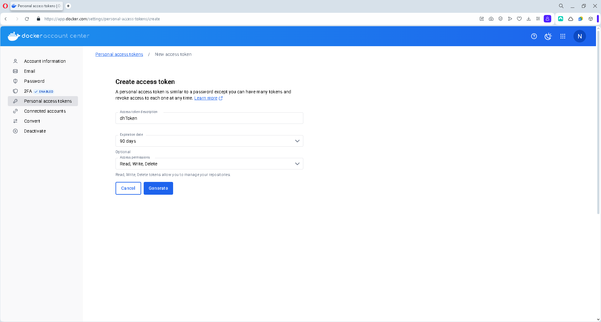
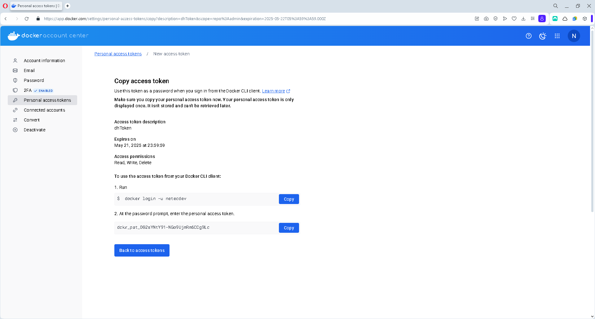
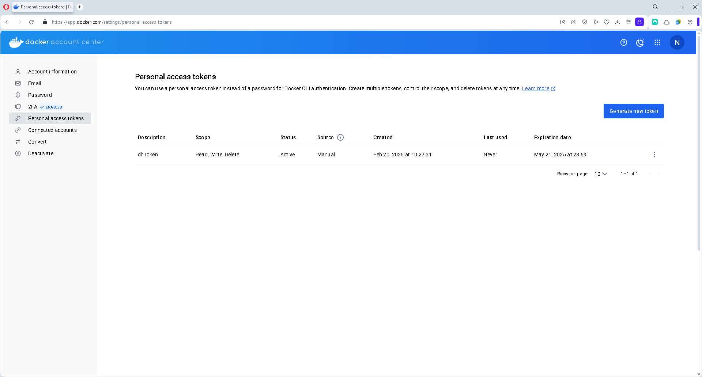
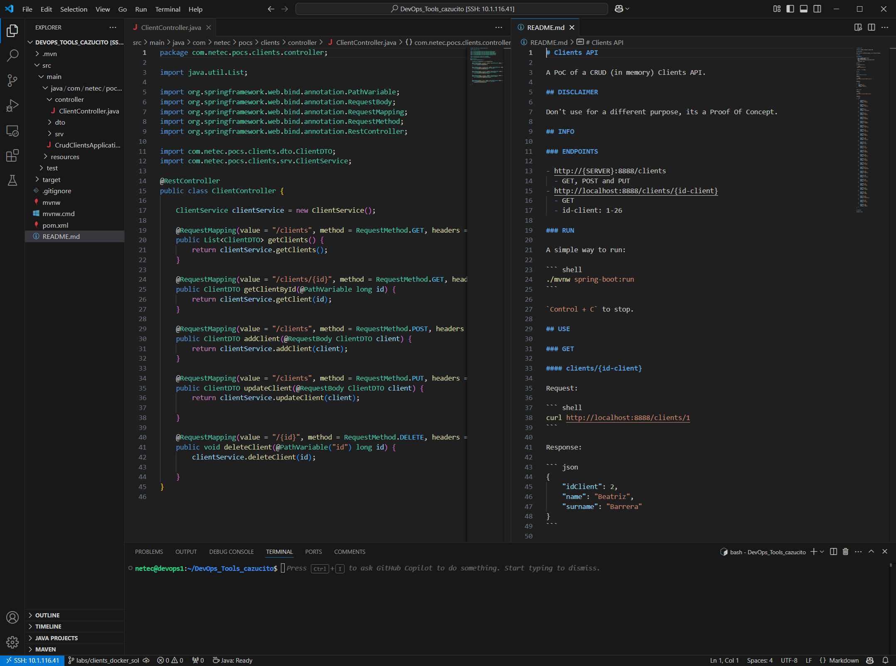
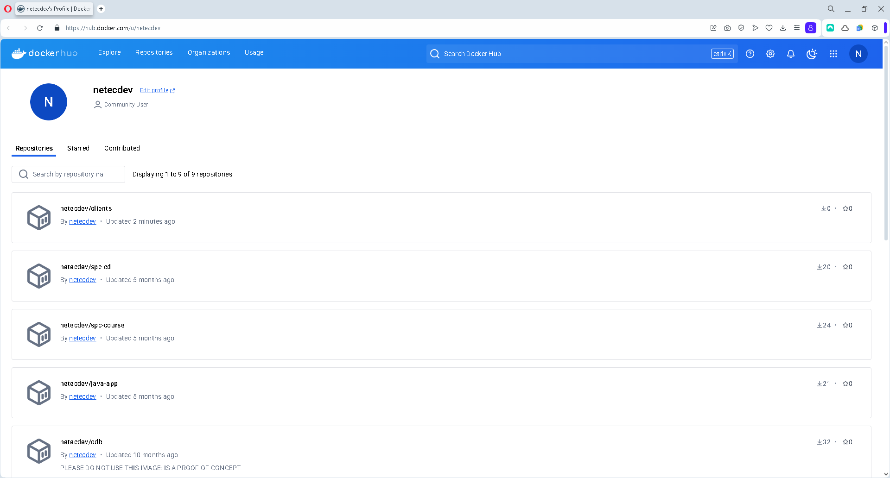

# DOCKER / _CONTENERIZACIÓN_ DE UNA APLICACIÓN JAVA

## OBJETIVOS

Al termino de este capítulo, serás capaz de:

- Al finalizar serás capaz _contenerizar_ una aplicación Java.

## DURACIÓN

Tiempo aproximado para esta actividad:

- 30 minutos.

## PRERREQUISITOS

Para esta actividad se requiere:

- Acceso a Internet.
- Acceso mediante SSH a un servidor Linux.
- Actividades anteriores del capítulo completadas.

## INSTRUCCIONES

### DOCKERHUB

DockerHub es un servicio en la nube que permite almacenar y distribuir imágenes de contenedores. En este laboratorio se utilizará para almacenar las imágenes de los contenedores que se construyan en el laboratorio.

Se requiere una cuenta de usuario en:

- <https://hub.docker.com/signup>

- Se recomienda utilizar un coreo personal en la creación de la cuenta.

#### Token de Acceso

Para permitir la comunicación a **DockerHub** se recomienda crear un token de acceso en la siguiente dirección <https://app.docker.com/settings/personal-access-tokens> con los siguientes datos:

- Access Token Description: `dhToken`

- Expiration date: `30 days`

- Access permissions: `Read, Write, Delete`



Guarda el valor del token en un lugar seguro, ya que no existe manera de verlo nuevamente. \* En este ejemplo el valor es: `dckr_…​`



Ahora, en la sección de tokens de acceso se puede apreciar el recién generado:



### _CONTENERIZACIÓN_

#### Aplicación Java

Para este laboratorio se utilizará una aplicación Java ubicada en la rama `labs/clients`.

En la carpeta de tu repositorio del trabajo (`DevOps_Tools_cazucito`, el repositorio bifurcado), cambia a la rama `labs/clients` con:

``` shell
git switch labs/clients
```

La salida de la ejecución debe ser similar a:

``` text
Switched to branch 'labs/clients'
Your branch is up to date with 'origin/labs/clients'.
```

Crea la rama de trabajo `labs/clients_docker` con:

``` shell
git switch -c labs/clients_docker
```

La salida de la ejecución debe ser similar a:

``` text
Switched to a new branch 'labs/clients_docker'
```

##### Análisis

Utilizando algún editor de texto o IDE de tu preferencia, analiza el proyecto `clients`. Revisa la estructura de directorios, archivos, dependencias, configuraciones y código fuente.



##### Ejecución

Después de analizar el proyecto, ejecuta la aplicación con el siguiente comando:

``` shell
mvn spring-boot:run
```

- La primera vez que se ejecute la aplicación, Maven descargará las dependencias necesarias para compilar y ejecutar la aplicación. Por lo que el proceso puede tardar varios minutos.

La salida de la ejecución debe ser similar a:

``` text
[INFO] Scanning for projects...
[INFO]
[INFO] -----------------------< com.netec.pocs:clients >-----------------------
[INFO] Building clients 0.1.0-SNAPSHOT
[INFO] --------------------------------[ jar ]---------------------------------
[INFO]
[INFO] >>> spring-boot-maven-plugin:3.2.2:run (default-cli) > test-compile @ clients >>>
[INFO]
[INFO] --- maven-resources-plugin:3.3.1:resources (default-resources) @ clients ---
[INFO] Copying 1 resource from src/main/resources to target/classes
[INFO] Copying 0 resource from src/main/resources to target/classes
[INFO]
[INFO] --- maven-compiler-plugin:3.8.1:compile (default-compile) @ clients ---
[INFO] Changes detected - recompiling the module!
[INFO] Compiling 4 source files to /home/netec/DevOps_Tools_cazucito/target/classes
[INFO]
[INFO] --- maven-resources-plugin:3.3.1:testResources (default-testResources) @ clients ---
[INFO] skip non existing resourceDirectory /home/netec/DevOps_Tools_cazucito/src/test/resources
[INFO]
[INFO] --- maven-compiler-plugin:3.8.1:testCompile (default-testCompile) @ clients ---
[INFO] Changes detected - recompiling the module!
[INFO] Compiling 1 source file to /home/netec/DevOps_Tools_cazucito/target/test-classes
[INFO]
[INFO] <<< spring-boot-maven-plugin:3.2.2:run (default-cli) < test-compile @ clients <<<
[INFO]
[INFO]
[INFO] --- spring-boot-maven-plugin:3.2.2:run (default-cli) @ clients ---
[INFO] Attaching agents: []

  .   ____          _            __ _ _
 /\\ / ___'_ __ _ _(_)_ __  __ _ \ \ \ \
( ( )\___ | '_ | '_| | '_ \/ _` | \ \ \ \
 \\/  ___)| |_)| | | | | || (_| |  ) ) ) )
  '  |____| .__|_| |_|_| |_\__, | / / / /
 =========|_|==============|___/=/_/_/_/
 :: Spring Boot ::                (v3.2.2)

2025-02-20T11:15:13.110-06:00  INFO 1037826 --- [           main] c.n.pocs.clients.CrudClientsApplication  : Starting CrudClientsApplication using Java 17.0.14 with PID 1037826 (/home/netec/DevOps_Tools_cazucito/target/classes started by netec in /home/netec/DevOps_Tools_cazucito)
2025-02-20T11:15:13.116-06:00  INFO 1037826 --- [           main] c.n.pocs.clients.CrudClientsApplication  : No active profile set, falling back to 1 default profile: "default"
2025-02-20T11:15:14.496-06:00  INFO 1037826 --- [           main] o.s.b.w.embedded.tomcat.TomcatWebServer  : Tomcat initialized with port 8888 (http)
2025-02-20T11:15:14.515-06:00  INFO 1037826 --- [           main] o.apache.catalina.core.StandardService   : Starting service [Tomcat]
2025-02-20T11:15:14.516-06:00  INFO 1037826 --- [           main] o.apache.catalina.core.StandardEngine    : Starting Servlet engine: [Apache Tomcat/10.1.18]
2025-02-20T11:15:14.639-06:00  INFO 1037826 --- [           main] o.a.c.c.C.[Tomcat].[localhost].[/]       : Initializing Spring embedded WebApplicationContext
2025-02-20T11:15:14.642-06:00  INFO 1037826 --- [           main] w.s.c.ServletWebServerApplicationContext : Root WebApplicationContext: initialization completed in 1447 ms
2025-02-20T11:15:15.159-06:00  INFO 1037826 --- [           main] o.s.b.w.embedded.tomcat.TomcatWebServer  : Tomcat started on port 8888 (http) with context path ''
2025-02-20T11:15:15.176-06:00  INFO 1037826 --- [           main] c.n.pocs.clients.CrudClientsApplication  : Started CrudClientsApplication in 2.65 seconds (process running for 3.117)
2025-02-20T11:15:47.918-06:00  INFO 1037826 --- [nio-8888-exec-1] o.a.c.c.C.[Tomcat].[localhost].[/]       : Initializing Spring DispatcherServlet 'dispatcherServlet'
2025-02-20T11:15:47.919-06:00  INFO 1037826 --- [nio-8888-exec-1] o.s.web.servlet.DispatcherServlet        : Initializing Servlet 'dispatcherServlet'
2025-02-20T11:15:47.920-06:00  INFO 1037826 --- [nio-8888-exec-1] o.s.web.servlet.DispatcherServlet        : Completed initialization in 1 ms
```

##### Utilización

Para utilizar la aplicación se deben realizar peticiones HTTP al *endpoint* principal: `http://localhost:8888/clients`.

Por ejemplo, utilizando `curl`:

``` shell
curl http://localhost:8888/clients/7
```

Produce la salida:

``` text
{
    "idClient": 7,
    "name": "Gerardo",
    "surname": "González"
}
```

O la petición:

``` shell
curl http://localhost:8888/clients
```

Produce una salida semejante a:

``` text
[
    {
        "idClient": 1,
        "name": "Alberto",
        "surname": "Alonso"
    },
    {
        "idClient": 2,
        "name": "Beatriz",
        "surname": "Barrera"
    },
    {
        "idClient": 3,
        "name": "Carlos",
        "surname": "Castañeda"
    },
...
]
```

##### Detención

Para detener la aplicación presiona `Ctrl + C` en la terminal donde se ejecutó la aplicación.

#### Aplicación Java Dockerizada

##### DOCKERFILE

En la carpeta raíz del proyecto crea el archivo llamado `Dockerfile` con el contenido mostrado a continuación:

``` dockerfile
FROM eclipse-temurin:17-jdk-jammy
# Usa un contenedor base con Java 17 (Eclipse Temurin)

WORKDIR /app
# Define el directorio de trabajo como /app

COPY .mvn/ .mvn
# Copia la carpeta de configuración del wrapper de Maven

COPY mvnw pom.xml ./
# Copia el script mvnw y el archivo pom.xml al directorio de trabajo

RUN chmod +x mvnw
# Da permisos de ejecución al script mvnw

RUN ./mvnw dependency:resolve
# Descarga las dependencias del proyecto para aprovechar la caché de Docker

COPY src ./src
# Copia el código fuente de la aplicación

CMD ["./mvnw", "spring-boot:run"]
# Inicia la aplicación Spring Boot usando Maven Wrapper
```

##### .dockerignore

En la carpeta raíz del proyecto crea el archivo llamado `.dockerignore` con el contenido mostrado a continuación:

``` dockerignore
target
```

##### Creación de la imagen docker

En la carpeta raíz del proyecto crea la imagen **docker** con el comando siguiente:

``` shell
docker build --tag netecdev/clients .
```

La salida debe ser similar a:

``` text
[+] Building 56.1s (12/12) FINISHED                                                                                                                                       docker:default
 => [internal] load build definition from Dockerfile                                                                                                                                0.1s
 => => transferring dockerfile: 633B                                                                                                                                                0.0s
 => [internal] load metadata for docker.io/library/eclipse-temurin:17-jdk-jammy                                                                                                     0.8s
 => [internal] load .dockerignore                                                                                                                                                   0.0s
 => => transferring context: 46B                                                                                                                                                    0.0s
 => [1/7] FROM docker.io/library/eclipse-temurin:17-jdk-jammy@sha256:1886bea164fd66274feb2031e5a12be3be830949c57491c51cd3d432dafda89f                                               0.0s
 => [internal] load build context                                                                                                                                                   0.1s
 => => transferring context: 1.49kB                                                                                                                                                 0.0s
 => CACHED [2/7] WORKDIR /app                                                                                                                                                       0.0s
 => CACHED [3/7] COPY .mvn/ .mvn                                                                                                                                                    0.0s
 => CACHED [4/7] COPY mvnw pom.xml ./                                                                                                                                               0.0s
 => [5/7] RUN chmod +x mvnw                                                                                                                                                         1.1s
 => [6/7] RUN ./mvnw dependency:resolve                                                                                                                                            49.9s
 => [7/7] COPY src ./src                                                                                                                                                            0.7s
 => exporting to image                                                                                                                                                              2.4s
 => => exporting layers                                                                                                                                                             2.2s
 => => writing image sha256:41fb3321a011d76dbed2620f251cacfff2cec83bb2455e4f34e3d307033dd525                                                                                        0.0s
 => => naming to docker.io/netecdev/clients
```

Este comando puede tarda unos minutos.

Para validar que la imagen se ha creado y se encuentra en el repositorio local ejecuta:

``` shell
docker image ls
```

La salida debe ser similar a:

``` text
REPOSITORY         TAG       IMAGE ID       CREATED         SIZE
netecdev/clients   latest    41fb3321a011   2 minutes ago   488MB
mariadb            latest    a914eff5d2eb   6 days ago      336MB
wordpress          latest    8a0d05df9d95   8 days ago      701MB
hello-world        latest    74cc54e27dc4   4 weeks ago     10.1kB
```

##### Creación del contenedor

Para crea el contenedor **docker** de la imagen creada ejecuta el comando siguiente:

``` shell
docker run --name clients --detach --publish 8888:8888 netecdev/clients
```

La salida debe ser similar a:

``` text
4e4e96f1d2e18e8145b39552223766bb858104c725f0a886ccc0add48d06cda6
```

Lista los contenedores en ejecución con `docker container ls` y observa que aparece en la lista.

``` text
CONTAINER ID   IMAGE              COMMAND                  CREATED          STATUS          PORTS                                       NAMES
41909000b3a2   netecdev/clients   "/__cacert_entrypoin…"   15 seconds ago   Up 14 seconds   0.0.0.0:8888->8888/tcp, :::8888->8888/tcp   clients
```

##### Consumo

Para utilizar la aplicación se deben realizar peticiones HTTP al *endpoint* principal: `http://localhost:8888/clients`.

Por ejemplo, utilizando `curl`:

``` shell
curl http://10.1.116.41:8888/clients/9
```

Produce la salida:

``` text
{
    "idClient": 9,
    "name": "Isabela",
    "surname": "Ibáñez"
}
```

##### Detención

Para detener la aplicación **contenedorizada** ejecuta el comando siguiente:

``` shell
docker container stop clients
```

La salida debe ser similar a:

``` text
clients
```

### PUBLICACIÓN

Recuerda que DockerHub es un servicio en la nube que permite almacenar y distribuir imágenes de contenedores. En este laboratorio se utilizará para almacenar las imágenes de los contenedores que se construyan en el laboratorio.

#### Login

- Nota: En los comandos siguientes el valor `netecdev` debe ser sustituido por tu nombre de usuario. Lo mismo debe hacerse con el valor del token.

Para publicar la imagen en **DockerHub** debemos estar autenticados para lo cual necesitamos ejecutar:

``` shell
docker login --username netecdev --password TOKEN
```

Lo que produce una salida semejante a:

``` text
WARNING! Using --password via the CLI is insecure. Use --password-stdin.
WARNING! Your password will be stored unencrypted in /home/netec/.docker/config.json.
Configure a credential helper to remove this warning. See
https://docs.docker.com/engine/reference/commandline/login/#credential-stores

Login Succeeded
```

Nos alerta sobre la seguridad de la contraseña, pero en este caso no es relevante. Solo considera que en ambientes de producción se debe considerar la seguridad de las contraseñas y no prporcionarlas en texto plano.

#### Publicación

Para publicar la imagen en **DockerHub** debemos etiquetar la imagen con el nombre de usuario y el nombre del repositorio.

Para ello ejecutamos el siguiente comando:

``` shell
docker push netecdev/clients:latest
```

Lo que produce una salida semejante a:

``` text
The push refers to repository [docker.io/netecdev/clients]
9a9457c70660: Pushed
2c4ed867494c: Pushed
123c7e373d4f: Pushed
9128d3318f29: Pushed
e0fd1f8f6d53: Pushed
f3ebffbff337: Pushed
daa79d160a71: Mounted from library/eclipse-temurin
003cf4d92002: Mounted from library/eclipse-temurin
d59eb20e1514: Mounted from library/eclipse-temurin
84a9f95db1dd: Mounted from library/eclipse-temurin
270a1170e7e3: Mounted from library/eclipse-temurin
latest: digest: sha256:6227c64b4170cf3d34f1d105f7533b1f5f4db6961d2babce32bd99f39ed7d2d1 size: 2621
```

Para visualizar las imágenes actualmente publicados debes ingresar a: <https://hub.docker.com/u/netecdev>.



### ACTUALIZACIÓN REPOSITORIO

Para guardar los cambios realizados a la rama de trabajo realiza los siguientes comandos.

``` shell
git add --all
```

La salida indicará los elementos adicionados para la confirmación.

Ahora confirma los archivos con:

``` shell
git commit --message="Contenerizacion de la aplicacion"
```

Y por último sube los cambios al repositorio remoto con:

``` shell
git push --set-upstream origin labs/clients_docker
```

La salida debe ser similar a:

``` text
Enumerating objects: 5, done.
Counting objects: 100% (5/5), done.
Delta compression using up to 4 threads
Compressing objects: 100% (3/3), done.
Writing objects: 100% (4/4), 701 bytes | 701.00 KiB/s, done.
Total 4 (delta 1), reused 0 (delta 0)
remote: Resolving deltas: 100% (1/1), completed with 1 local object.
remote:
remote: Create a pull request for 'labs/clients_docker' on GitHub by visiting:
remote:      https://github.com/cazucito/DevOps_Tools_cazucito/pull/new/labs/clients_docker
remote:
To github.com:cazucito/DevOps_Tools_cazucito.git
 * [new branch]      labs/clients_docker -> labs/clients_docker
Branch 'labs/clients_docker' set up to track remote branch 'labs/clients_docker' from 'origin'.
```

## RESULTADO

Al finalizar serás capaz de _contenerizar_ una aplicación Java.


