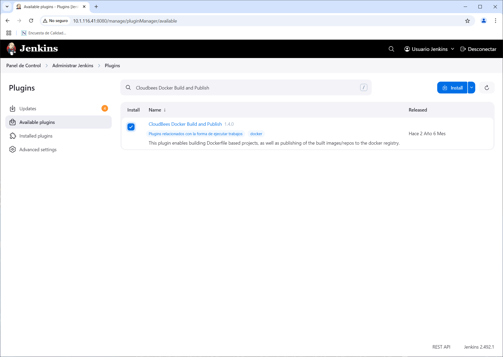
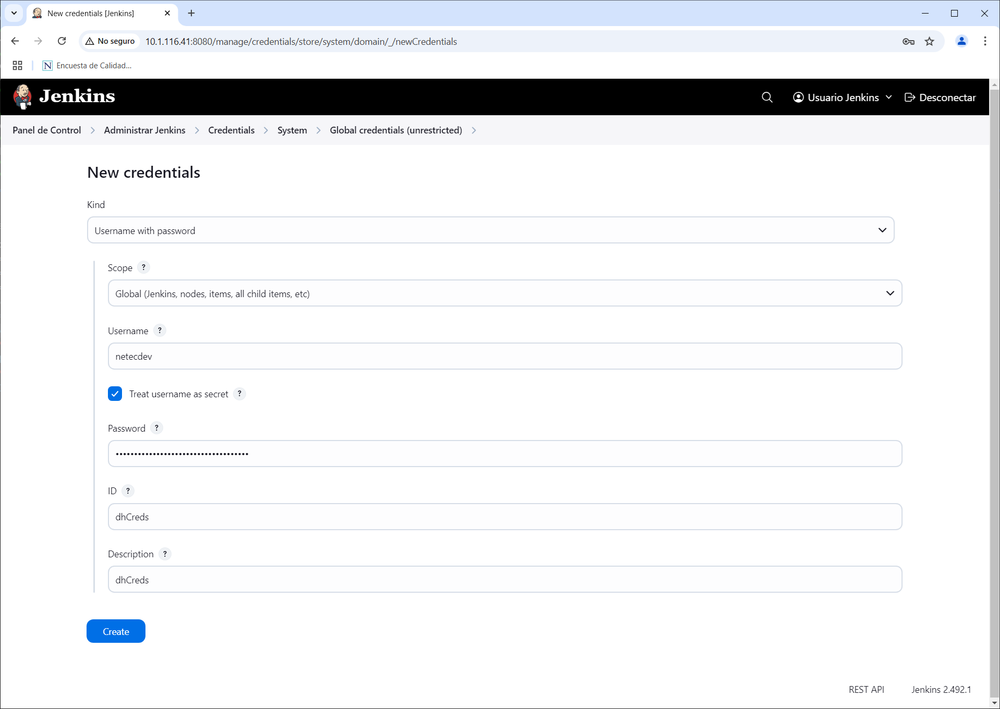
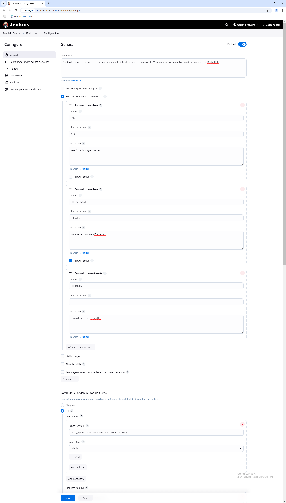
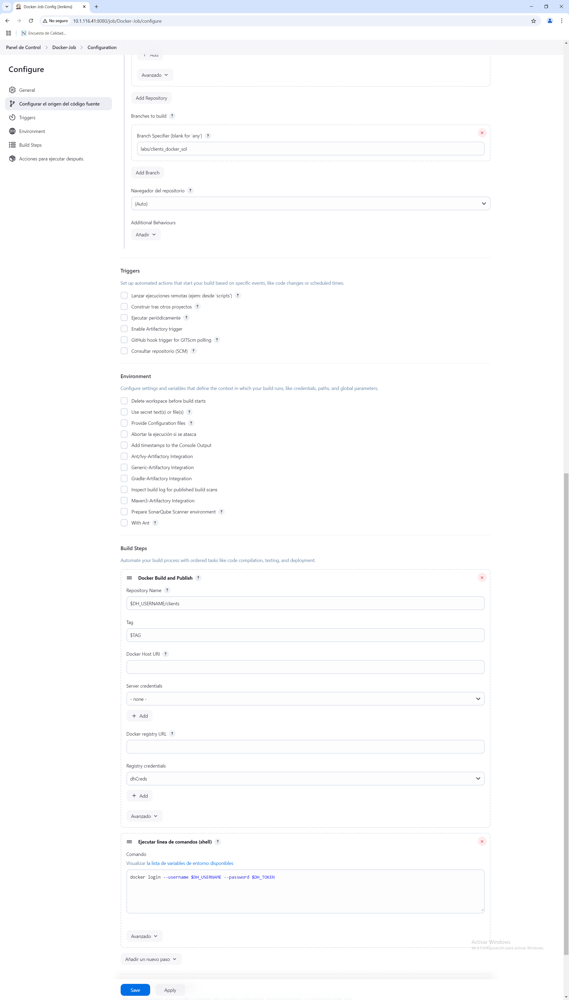
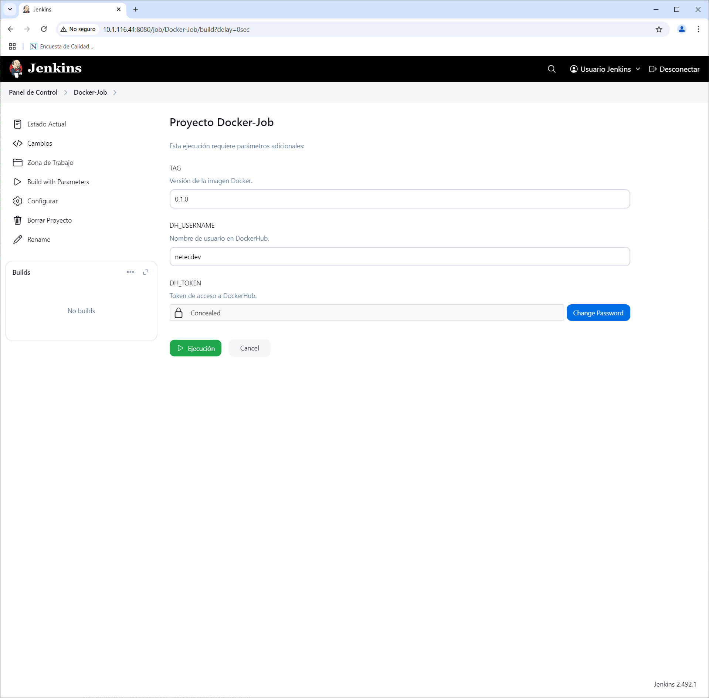
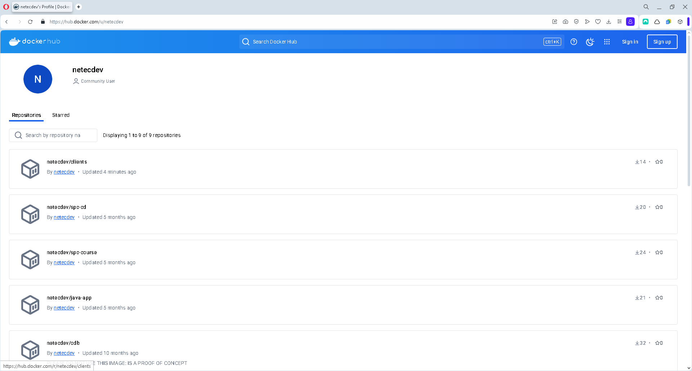
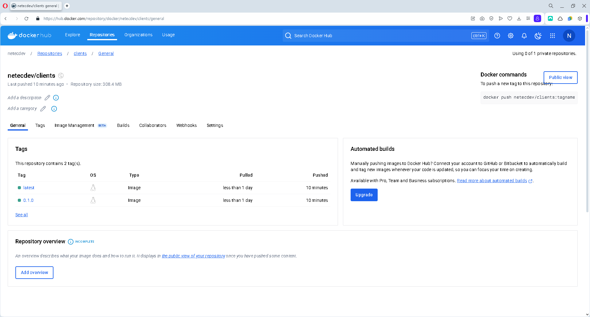

# DOCKER / JENKINS & DOCKER

## OBJETIVOS

Al termino de este capítulo, serás capaz de:

- Al finalizar serás capaz crear un proyecto estilo libre para la gestión simple del ciclo de vida de un proyecto Maven que incluye la publicación de la imagen en DockerHub.

## DURACIÓN

Tiempo aproximado para esta actividad:

- 40 minutos.

## PRERREQUISITOS

Para esta actividad se requiere:

- Acceso a Internet.
- Acceso mediante SSH a un servidor Linux.
- Actividades anteriores del capítulo completadas.

## INSTRUCCIONES

### REQUERIMIENTOS PREVIOS

#### Acceso a DockerHub

Para realizar este laboratorio, es necesario contar con una cuenta en Docker Hub. Si no cuentas con una, puedes registrarte en la siguiente dirección: <https://hub.docker.com/signup>.

#### Grupo Docker

Para que podamos lanzar comandos **Docker** desde **Jenkins** se requiere adicionar el grupo `docker` al usuario `jenkins`.

``` shell
# Agregue el usuario jenkins al grupo docker
sudo usermod -aG docker jenkins
# Para aplicar los cambios
newgrp docker
sudo systemctl restart jenkins
```

- En algunos casos es necesario reiniciar para que la configuración se cargué adecuadamente.

#### Jenkins

##### Complemento de Docker

Existen una gran cantidad de complementos que se pueden instalar en **Jenkins** para interactuar con **Docker**. Cada uno de estos complementos tiene una funcionalidad específica. Por *tradición* y simplicidad se utilizará el complemento `Cloudbees Docker Build and Publish`.

En un navegador web ingresa el enlace <http://10.1.116.41:8080/manage/pluginManager/available> para configurar el **plugin** de **Docker** en **Jenkins**.

En el campo de búsqueda ingrese: `Cloudbees Docker Build and Publish`



Marca la opción de `Install` y da clic en el botón `Download now and install after restart`.

Marca la opción `Restart Jenkins when installation is complete and no jobs are running` y espera hasta que se termine la instalación.

- Después de haber esperado unos 3-5 minutos y no ver cambios recarga la pantalla.

##### Credenciales de DockerHub

Como se realizarán diferentes acciones sobre el repositorio en GitHub se debe crear una credencial para Jenkins.

Da cic en el botón Add Credentials en la siguiente pantalla en Jenkins: <http://10.1.116.41:8080/manage/credentials/store/system/domain/_/>

- Recuerda que la IP debe ser la de tu servidor de Jenkins.

Datos para `Add Credentials`:

- Kind: `Username with password`
  - Username: `netecdev`
    - Sustituye el valor por tu usuario de DockerHub.
  - Treat username as secret: `SELECCIONADO`
  - Password: PEGAR EL TOKEN DE DOCKERHUB
  - ID: dhCreds
  - Description: dhCreds
  - Clic en el botón `Create`



### JOB

#### Creación de un nuevo proyecto

Para la creación del *job* se debe realizar lo siguiente:

- En el *Dashboard* de *Jenkins* dar clic en el botón `New Item`.
- Ingresar el nombre del *job* como `Docker-Job` y seleccionar la opción `Freestyle project`.
- Dar clic en el botón `OK`.

En la pantalla de configuración del *job* realizar lo siguiente:

Sección general:

- **General**

  - **Description**: `Gestión simple del ciclo de vida de un proyecto Maven que incluye la publicación de la aplicación en DockerHub.`

  - **This project is parameterized**: `Marcado`

    - **Add Parameter**

      - **String Parameter**

        - **Name**: `TAG`

        - **Default Value**: `0.1.0`

        - **Description**: `Versión de la imagen Docker.`

        - **Trim Value**: `Marcado`

    - **Add Parameter**

      - **String Parameter**

        - **Name**: `DH_USERNAME`

        - **Default Value**: `netecdev`

          - Sustituye el valor por tu usuario de DockerHub.

        - **Description**: `Nombre de usuario en DockerHub.`

        - **Trim Value**: `Marcado`

    - **Add Parameter**

      - **Password Parameter**

        - **Name**: `DH_TOKEN`

        - **Default Value**: `TU TOKEN`

        - **Description**: `Token de acceso a DockerHub.`

Sección de SCM:

- **Source Code Management**

  - Selecciona: `Git`

    - **Repositories**

      - **Repository URL**: `https://github.com/cazucito/DevOps_Tools_cazucito.git`

        - Sustituye el valor por el de su fork.

        - Inicialmente aparece un mensaje que indica problemas de autenticación: "Failed to connect to repository …​ fatal: Authentication failed for …​"

      - **Credentials**: githubCred

    - **Branches to build**

      - **Branch Specifier (blank for 'any')**: `labs/clients_docker_sol`

        - Sustituye el valor por el de su rama.

Sección de construcción y ejecución:

- **Build steps**

  - **Add build step**

    - **Docker Build and Publish**

      - **Repository Name**: $DH_USERNAME/clients

      - **Tag**: $TAG

      - **Registry Credentials**: `dhCreds`

- *El siguiente paso debe ir al principio de la sección.*

  - **Add build step**

    - **Execute shell**

      - **Command**:

        - `docker login --username $DH_USERNAME --password $DH_TOKEN`

Para guardar los cambios de clic en el botón `Apply` y luego en `Save`.





#### Ejecución del *job*

Para comprobar la publicación de la imagen en DockerHub, ejecuta el **job** dando clic en la opción `Build with Parameter` del menú lateral.

Para ejecutar de manera exitosa el **job** valida que la opciones para los parámetros de entrada son:

- **TAG**: `1.0.0`

- **DH_USERNAME**: `netecdev`

  - El valor debe ser tu usuario en DockerHub.

- **DH_TOKEN**: `TU TOKEN`

  - El valor no está visible, y debe coincidir con tu token en DockerHub.

A continuación, da clic en el botón `Build` y verifica que la construcción ha sido exitosa.

Adicionalmente comprueba los cambios en la interfaz del **job** y del **build**.

- Este proceso puede tardar unos minutos.



#### Salida en Consola

En la parte inferior de la barra lateral izquierda, en la sección `Build History` se puede apreciar el historial de ejecución (**build**) del **job**.

Al dar clic en alguno de los enlaces (en cada renglón) se puede observar la información general del **build**.

Para observar la salida en consola de la construcción se debe seleccionar la opción `Console Output` del menú lateral.

La salida debe ser semejante a:

``` shell
Started by user Usuario Jenkins
Running as SYSTEM
Building in workspace /var/lib/jenkins/workspace/Docker-Job
The recommended git tool is: NONE
using credential githubCred
 > git rev-parse --resolve-git-dir /var/lib/jenkins/workspace/Docker-Job/.git # timeout=10
Fetching changes from the remote Git repository
 > git config remote.origin.url https://github.com/cazucito/DevOps_Tools_cazucito.git # timeout=10
Fetching upstream changes from https://github.com/cazucito/DevOps_Tools_cazucito.git
 > git --version # timeout=10
 > git --version # 'git version 2.25.1'
using GIT_ASKPASS to set credentials githubCred
 > git fetch --tags --force --progress -- https://github.com/cazucito/DevOps_Tools_cazucito.git +refs/heads/*:refs/remotes/origin/* # timeout=10
 > git rev-parse refs/remotes/origin/labs/clients_docker_sol^{commit} # timeout=10
 > git rev-parse labs/clients_docker_sol^{commit} # timeout=10
Checking out Revision 3a8fcd4b7c2ba3e566b5755e8362c270b5b742c4 (refs/remotes/origin/labs/clients_docker_sol)
 > git config core.sparsecheckout # timeout=10
 > git checkout -f 3a8fcd4b7c2ba3e566b5755e8362c270b5b742c4 # timeout=10
Commit message: "Contenederizacion de la aplicacion"
 > git rev-list --no-walk 3a8fcd4b7c2ba3e566b5755e8362c270b5b742c4 # timeout=10
[Docker-Job] $ /bin/sh -xe /tmp/jenkins8350510107924759219.sh
+ docker login --username netecdev --password dckr_TOKEN
WARNING! Using --password via the CLI is insecure. Use --password-stdin.
WARNING! Your password will be stored unencrypted in /var/lib/jenkins/.docker/config.json.
Configure a credential helper to remove this warning. See
https://docs.docker.com/engine/reference/commandline/login/#credential-stores

Login Succeeded
[Docker-Job] $ docker build -t netecdev/clients:0.1.0 --pull=true /var/lib/jenkins/workspace/Docker-Job
#0 building with "default" instance using docker driver

#1 [internal] load build definition from Dockerfile
#1 transferring dockerfile: 633B done
#1 DONE 0.0s

#2 [internal] load metadata for docker.io/library/eclipse-temurin:17-jdk-jammy
#2 ...

#3 [auth] library/eclipse-temurin:pull token for registry-1.docker.io
#3 DONE 0.0s

#2 [internal] load metadata for docker.io/library/eclipse-temurin:17-jdk-jammy
#2 DONE 0.7s

#4 [internal] load .dockerignore
#4 transferring context: 46B done
#4 DONE 0.0s

#5 [1/7] FROM docker.io/library/eclipse-temurin:17-jdk-jammy@sha256:1886bea164fd66274feb2031e5a12be3be830949c57491c51cd3d432dafda89f
#5 DONE 0.0s

#6 [internal] load build context
#6 transferring context: 1.49kB done
#6 DONE 0.1s

#7 [2/7] WORKDIR /app
#7 CACHED

#8 [3/7] COPY .mvn/ .mvn
#8 CACHED

#9 [4/7] COPY mvnw pom.xml ./
#9 CACHED

#10 [5/7] RUN chmod +x mvnw
#10 CACHED

#11 [6/7] RUN ./mvnw dependency:resolve
#11 CACHED

#12 [7/7] COPY src ./src
#12 CACHED

#13 exporting to image
#13 exporting layers done
#13 writing image sha256:a7e6b684687e7c6329268ffa5d278d24d880365cfe9e2b2f8ba2470ef5ba63c9 0.0s done
#13 naming to docker.io/netecdev/clients:0.1.0 0.0s done
#13 DONE 0.1s
[Docker-Job] $ docker build -t netecdev/clients:latest --pull=true /var/lib/jenkins/workspace/Docker-Job
#0 building with "default" instance using docker driver

#1 [internal] load build definition from Dockerfile
#1 transferring dockerfile: 633B done
#1 DONE 0.0s

#2 [internal] load metadata for docker.io/library/eclipse-temurin:17-jdk-jammy
#2 DONE 0.3s

#3 [internal] load .dockerignore
#3 transferring context: 46B done
#3 DONE 0.1s

#4 [1/7] FROM docker.io/library/eclipse-temurin:17-jdk-jammy@sha256:1886bea164fd66274feb2031e5a12be3be830949c57491c51cd3d432dafda89f
#4 DONE 0.0s

#5 [internal] load build context
#5 transferring context: 1.49kB done
#5 DONE 0.1s

#6 [2/7] WORKDIR /app
#6 CACHED

#7 [3/7] COPY .mvn/ .mvn
#7 CACHED

#8 [4/7] COPY mvnw pom.xml ./
#8 CACHED

#9 [5/7] RUN chmod +x mvnw
#9 CACHED

#10 [6/7] RUN ./mvnw dependency:resolve
#10 CACHED

#11 [7/7] COPY src ./src
#11 CACHED

#12 exporting to image
#12 exporting layers done
#12 writing image sha256:a7e6b684687e7c6329268ffa5d278d24d880365cfe9e2b2f8ba2470ef5ba63c9 0.0s done
#12 naming to docker.io/netecdev/clients:latest 0.0s done
#12 DONE 0.1s
[Docker-Job] $ docker push netecdev/clients:0.1.0
The push refers to repository [docker.io/netecdev/clients]
517f80adda44: Preparing
eb4714c2ef25: Preparing
c233a009b615: Preparing
27f571d01865: Preparing
716ad1210cef: Preparing
f3ebffbff337: Preparing
daa79d160a71: Preparing
003cf4d92002: Preparing
d59eb20e1514: Preparing
84a9f95db1dd: Preparing
270a1170e7e3: Preparing
d59eb20e1514: Waiting
f3ebffbff337: Waiting
daa79d160a71: Waiting
003cf4d92002: Waiting
84a9f95db1dd: Waiting
270a1170e7e3: Waiting
27f571d01865: Pushed
716ad1210cef: Pushed
517f80adda44: Pushed
c233a009b615: Pushed
f3ebffbff337: Layer already exists
daa79d160a71: Layer already exists
003cf4d92002: Layer already exists
d59eb20e1514: Layer already exists
84a9f95db1dd: Layer already exists
270a1170e7e3: Layer already exists
eb4714c2ef25: Pushed
0.1.0: digest: sha256:5d698b67ea3dee2cb1a9c81bd1bf5dbb5cde1c6aaea743418d7b8d50fadb477e size: 2621
[Docker-Job] $ docker push netecdev/clients:latest
The push refers to repository [docker.io/netecdev/clients]
517f80adda44: Preparing
eb4714c2ef25: Preparing
c233a009b615: Preparing
27f571d01865: Preparing
716ad1210cef: Preparing
f3ebffbff337: Preparing
daa79d160a71: Preparing
003cf4d92002: Preparing
d59eb20e1514: Preparing
84a9f95db1dd: Preparing
270a1170e7e3: Preparing
f3ebffbff337: Waiting
003cf4d92002: Waiting
d59eb20e1514: Waiting
84a9f95db1dd: Waiting
270a1170e7e3: Waiting
daa79d160a71: Waiting
517f80adda44: Layer already exists
eb4714c2ef25: Layer already exists
716ad1210cef: Layer already exists
27f571d01865: Layer already exists
c233a009b615: Layer already exists
003cf4d92002: Layer already exists
f3ebffbff337: Layer already exists
d59eb20e1514: Layer already exists
84a9f95db1dd: Layer already exists
daa79d160a71: Layer already exists
270a1170e7e3: Layer already exists
latest: digest: sha256:5d698b67ea3dee2cb1a9c81bd1bf5dbb5cde1c6aaea743418d7b8d50fadb477e size: 2621
Finished: SUCCESS
```

### DOCKERHUB

Visita <https://hub.docker.com/repositories/> para validar que la imagen a sido publicada.



## RESULTADO

Al finalizar serás capaz de crear un proyecto estilo libre para la gestión simple del ciclo de vida de un proyecto Maven que incluye la publicación de la imagen en DockerHub.


