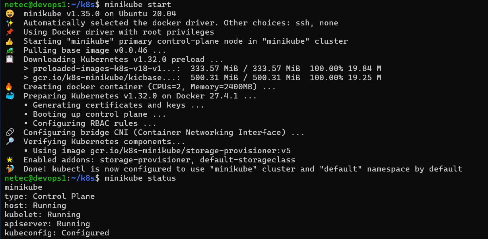

# K8S / INSTALACIÓN DE MINIKUBE

## OBJETIVOS

Al termino de este capítulo, serás capaz de:

- Al finalizar serás capaz de instalar Minikube en sistemas basados en Linux Ubuntu.

## DURACIÓN

Tiempo aproximado para esta actividad:

- 20 minutos.

## PRERREQUISITOS

Para esta actividad se requiere:

- Acceso a Internet.
- Acceso mediante SSH a un servidor Linux.

## INSTRUCCIONES

En está guía se instala Minikube en el nodo identificado por: `10.1.116.41`

- En el que se encuentra instalado Docker y Jenkins.

### REQUERIMIENTOS PREVIOS

Minikube es una herramienta que te permite ejecutar un clúster de Kubernetes local en tu máquina para desarrollo y pruebas.

Antes de instalar Minikube, asegúrate de cumplir con los siguientes requisitos:

- Ubuntu 20.04 LTS o superior.
- CPU de 2 núcleos o más.
  - Con soporte para virtualización (`VTX` o `AMD-V`).
- 4 GB de RAM o más.
- 35 GB de espacio en disco.
- Conexión a Internet.

#### Docker

Kubernetes es una plataforma de código abierto que automatiza las operaciones de contenedores, elimina gran parte de la complejidad de la administración de contenedores y permite a los equipos de desarrollo centrarse en la entrega de software.

Para validar que Docker está instalado en tu máquina, ejecuta el siguiente comando:

``` shell
docker run hello-world
```

La salida será similar a:

``` shell
Hello from Docker!
This message shows that your installation appears to be working correctly.

To generate this message, Docker took the following steps:
 1. The Docker client contacted the Docker daemon.
 2. The Docker daemon pulled the "hello-world" image from the Docker Hub.
    (amd64)
 3. The Docker daemon created a new container from that image which runs the
    executable that produces the output you are currently reading.
 4. The Docker daemon streamed that output to the Docker client, which sent it
    to your terminal.

To try something more ambitious, you can run an Ubuntu container with:
 $ docker run -it ubuntu bash

Share images, automate workflows, and more with a free Docker ID:
 https://hub.docker.com/

For more examples and ideas, visit:
 https://docs.docker.com/get-started/
```

#### Kubectl

Kubectl es una herramienta de línea de comandos que te permite interactuar con clústeres de Kubernetes. Es una herramienta esencial para trabajar con Kubernetes.

Para instalar Kubectl en Ubuntu, ejecuta el siguiente comando:

``` shell
curl -LO "https://dl.k8s.io/release/$(curl -Ls https://dl.k8s.io/release/stable.txt)/bin/linux/amd64/kubectl"
```

La salida será similar a:

``` text
  % Total    % Received % Xferd  Average Speed   Time    Time     Time  Current
                                 Dload  Upload   Total   Spent    Left  Speed
100   138  100   138    0     0   1200      0 --:--:-- --:--:-- --:--:--  1200
100 54.6M  100 54.6M    0     0  24.4M      0  0:00:02  0:00:02 --:--:-- 28.5M
```

Ahora para configurar que `kubectl` quede accesible como comando del sistema, lo copiamos a `/usr/local/bin` como propietario `root`, grupo `root` y con permisos de ejecución (0755):

``` shell
sudo install -o root -g root -m 0755 kubectl /usr/local/bin/kubectl
```

Para verificar que Kubectl ha sido instalado correctamente, ejecuta el siguiente comando:

``` shell
kubectl version --client
```

La salida será similar a:

``` shell
Client Version: v1.32.2
Kustomize Version: v5.5.0
```

### MINIKUBE

Para instalar Minikube en sistemas basados en Linux Ubuntu, sigue estos pasos.

#### Instalación de Minikube

En una terminal y ejecuta el siguiente comando para descargar el binario de Minikube:

``` shell
curl -LO https://storage.googleapis.com/minikube/releases/latest/minikube-linux-amd64
```

La salida será similar a:

``` text
  % Total    % Received % Xferd  Average Speed   Time    Time     Time  Current
                                 Dload  Upload   Total   Spent    Left  Speed
100  119M  100  119M    0     0  29.1M      0  0:00:04  0:00:04 --:--:-- 29.7M
```

Ahora, para configurar que `minikube` quede accesible como comando del sistema, lo copiamos a `/usr/local/bin` como propietario `root`, grupo `root` y con permisos de ejecución (0755):

``` shell
sudo install -o root -g root -m 0755 minikube-linux-amd64 /usr/local/bin/minikube
```

El comando anterior instala Minikube en tu sistema. No genera salida.

#### Verificación de la instalación

Para verificar que Minikube ha sido instalado correctamente, ejecuta el siguiente comando:

``` shell
minikube version
```

La salida será similar a:

``` shell
minikube version: v1.35.0
commit: dd5d320e41b5451cdf3c01891bc4e13d189586ed-dirty
```

Con esto, has instalado Minikube en tu sistema.

#### Inicio de Minikube

Para iniciar Minikube, ejecuta el siguiente comando:

``` shell
miniube start
```

La salida será similar a:

``` text
😄  minikube v1.35.0 on Ubuntu 20.04
✨  Automatically selected the docker driver. Other choices: ssh, none
📌  Using Docker driver with root privileges
👍  Starting "minikube" primary control-plane node in "minikube" cluster
🚜  Pulling base image v0.0.46 ...
💾  Downloading Kubernetes v1.32.0 preload ...
    > preloaded-images-k8s-v18-v1...:  333.57 MiB / 333.57 MiB  100.00% 19.84 M
    > gcr.io/k8s-minikube/kicbase...:  500.31 MiB / 500.31 MiB  100.00% 19.25 M
🔥  Creating docker container (CPUs=2, Memory=2400MB) ...
🐳  Preparing Kubernetes v1.32.0 on Docker 27.4.1 ...
    ▪ Generating certificates and keys ...
    ▪ Booting up control plane ...
    ▪ Configuring RBAC rules ...
🔗  Configuring bridge CNI (Container Networking Interface) ...
🔎  Verifying Kubernetes components...
    ▪ Using image gcr.io/k8s-minikube/storage-provisioner:v5
🌟  Enabled addons: storage-provisioner, default-storageclass
🏄  Done! kubectl is now configured to use "minikube" cluster and "default" namespace by default
```

## RESULTADO

Al finalizar esta actividad, habrás instalado Minikube en un servidor Linux Ubuntu.



## RESTABLECIMIENTO

Es importante que después de realizar las pruebas, se detenga el clúster de Kubernetes para liberar los recursos del sistema.

``` shell
minikube stop
```

La salida de la ejecución debe ser similar a:

``` text
✋  Stopping node "minikube"  ...
🛑  Powering off "minikube" via SSH ...
🛑  1 node stopped.
```
