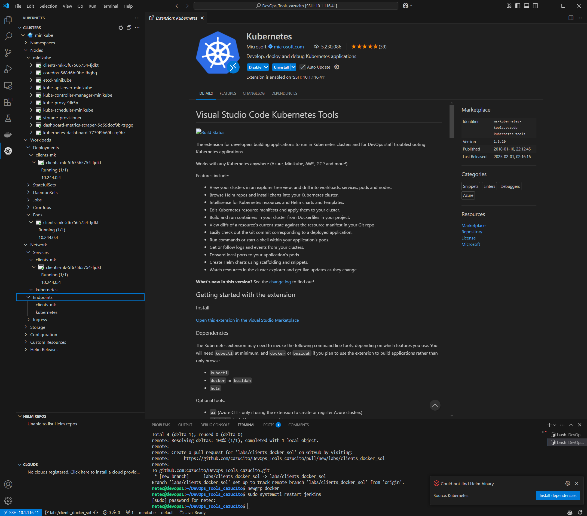
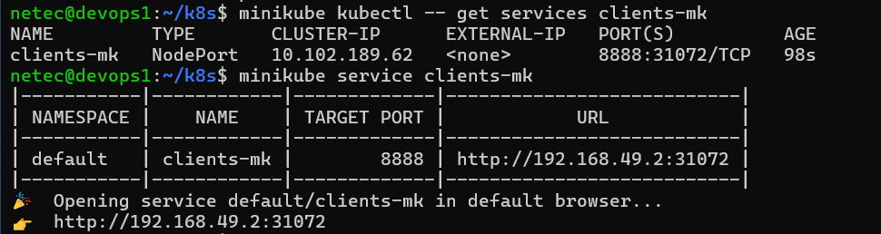

# K8S / DESPLIEGUE DE APLICACIONES

## OBJETIVOS

Al termino de este capítulo, serás capaz de:

-   Al finalizar serás capaz de desplegar aplicaciones en un clúster de Kubernetes.

## DURACIÓN

Tiempo aproximado para esta actividad:

-   40 minutos.

## PRERREQUISITOS

Para esta actividad se requiere:

-   Acceso a Internet.
-   Acceso mediante SSH a un servidor Linux.
-   Actividad anterior completada.

## INSTRUCCIONES

En esta actividad, se adquiere conocimiento sobre los comandos fundamentales de Docker.

### MINIKUBE

Antes de iniciar debemos asegurarnos que Minikube esté en ejecución. Para validar esto, ejecuta el siguiente comando:

``` shell
minikube status
```

El resultado debe ser similar a:

``` text
minikube
type: Control Plane
host: Running
kubelet: Running
apiserver: Running
kubeconfig: Configured
```
De no ser asi, se debe iniciar Minikube con el siguiente comando:

``` shell
minikube start
```

### DESPLIEGUE

Crearemos un despliegue simple en Kubernetes utilizando Minikube y en lo expondremos como un servicio accesible desde tu navegador.

#### Crear un Despliegue

Desde tu terminal, crea un despliegue llamado *clients-mk* con la siguiente imagen de contenedor:

``` shell
minikube kubectl -- create deployment clients-mk --image=netecdev/clients:0.1.0
```

- Recuerda sustituir la imagen a utilizar por la propia (creada en actividades previas).

La salida de la ejecución debe ser similar a:

``` text
    > kubectl.sha256:  64 B / 64 B [-------------------------] 100.00% ? p/s 0s
    > kubectl:  54.67 MiB / 54.67 MiB [------------] 100.00% 32.35 MiB p/s 1.9s
deployment.apps/clients-mk created
```

Verifica que el despliegue se haya creado correctamente ejecutando:

``` shell
minikube kubectl -- get deployments
```

La salida de la ejecución debe ser similar a:

``` text
NAME         READY   UP-TO-DATE   AVAILABLE   AGE
clients-mk   1/1     1            1           36s
```

#### Exponer el Despliegue como un Servicio

Expón el despliegue *clients-mk* como un servicio de tipo *NodePort* en el puerto `8888`:

``` shell
minikube kubectl -- expose deployment clients-mk --type=NodePort --port=8888
```

La salida de la ejecución debe ser similar a:

``` text
service/clients-mk exposed
```

Verifica que el servicio esté en ejecución:

``` shell
minikube kubectl -- get services clients-mk
```

La salida de la ejecución debe ser similar a:

``` text
NAME         TYPE       CLUSTER-IP      EXTERNAL-IP   PORT(S)          AGE
clients-mk   NodePort   10.102.189.62   <none>        8888:31072/TCP   98s
```

#### Acceder al Servicio

Aunque el comando `minikube service` permite abrir un navegador web con la URL del servicio expuesto. En este caso lo necesitamos para que nos cree una IP y puerto para acceder al servicio.

``` shell
minikube service clients-mk
```

La salida de la ejecución debe ser similar a:

``` text
|-----------|------------|-------------|---------------------------|
| NAMESPACE |    NAME    | TARGET PORT |            URL            |
|-----------|------------|-------------|---------------------------|
| default   | clients-mk |        8888 | http://192.168.49.2:31072 |
|-----------|------------|-------------|---------------------------|
🎉  Opening service default/clients-mk in default browser...
👉  http://192.168.49.2:31072
```

#### Probar la Aplicación

Para probar la aplicación, usa la URL generada por el comando anterior y con `curl` realiza una solicitud GET a la ruta `/clients/9`:

``` shell
curl http://192.168.49.2:31072/clients/13
```

La salida de la ejecución debe ser similar a:

``` json
{
    "idClient": 13,
    "name": "Mariana",
    "surname": "Montes"
}
```

#### Extensión Kubernetes para Visual Studio Code

Si tienes instalada la extensión de Kubernetes para Visual Studio Code, puedes visualizar los recursos de Kubernetes en tu clúster local.

Para instalar la extensión, sigue los siguientes pasos:

1. Abre Visual Studio Code.
2. En la barra lateral izquierda, selecciona el icono de extensiones.
3. En el campo de búsqueda, escribe `Kubernetes`.
4. Selecciona la extensión `Kubernetes` de Microsoft.
5. Haz clic en el botón `Instalar`.

Una vez instalada, en la barra lateral izquierda, selecciona el icono de Kubernetes y visualiza los recursos de tu clúster local.



## RESULTADO

Al finalizar esta actividad, el participante será capaz de desplegar aplicaciones en un clúster de Kubernetes.



## RESTABLECIMIENTO

### Aplicación

Para dar de baja el pod, el replicaset, el deployment y el servicio de la aplicación `clients-mk`. PAra el despliegue de la aplicación, Kuberntes crea un deployment, un pod y un servicio. Para eliminar estos recursos, para consultar los recursos creados, se puede ejecutar el siguiente comando:

``` shell
kubectl get all
```

La salida de la ejecución debe ser similar a:

``` text
NAME                              READY   STATUS    RESTARTS   AGE
pod/clients-mk-5f67565754-fjdkt   1/1     Running   0          8h

NAME                 TYPE        CLUSTER-IP      EXTERNAL-IP   PORT(S)          AGE
service/clients-mk   NodePort    10.102.189.62   <none>        8888:31072/TCP   8h
service/kubernetes   ClusterIP   10.96.0.1       <none>        443/TCP          14h

NAME                         READY   UP-TO-DATE   AVAILABLE   AGE
deployment.apps/clients-mk   1/1     1            1           8h

NAME                                    DESIRED   CURRENT   READY   AGE
replicaset.apps/clients-mk-5f67565754   1         1         1       8h
```

#### Servicio

Para eliminar el servicio, se debe ejecutar el siguiente comando:

``` shell
kubectl delete service clients-mk
```

La salida de la ejecución debe ser similar a:

``` text
service "clients-mk" deleted
```

#### Deployment

Para eliminar el deployment (el replicaset y el pod), se debe ejecutar el siguiente comando:

``` shell
kubectl delete deployment clients-mk
```

La salida de la ejecución debe ser similar a:

``` text
deployment.apps "clients-mk" deleted
```

#### Verificación

Para verificar que los recursos fueron eliminados, se puede ejecutar el siguiente comando:

``` shell
kubectl get all
```

La salida de la ejecución debe ser similar a:

``` text
NAME                 TYPE        CLUSTER-IP   EXTERNAL-IP   PORT(S)   AGE
service/kubernetes   ClusterIP   10.96.0.1    <none>        443/TCP   14h
```

### Minikube

Es importante que después de realizar las pruebas, se detenga el clúster de Kubernetes para liberar los recursos del sistema.

``` shell
minikube stop
```

La salida de la ejecución debe ser similar a:

``` text
✋  Stopping node "minikube"  ...
🛑  Powering off "minikube" via SSH ...
🛑  1 node stopped.
```
